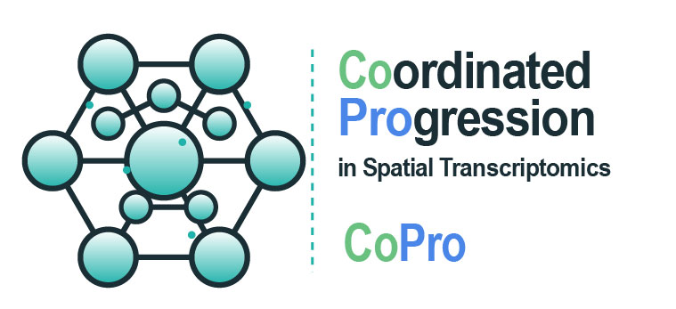

<!-- README.md is generated from README.Rmd. Please edit that file and re-knit. -->

```{r, include = FALSE}
knitr::opts_chunk$set(
  collapse = TRUE,
  comment = "#>",
  fig.path = "man/figures/README-",
  out.width = "100%"
)
```

# CoPro 

<!-- badges: start -->
[](https://github.com/Zhen-Miao/CoPro/actions/workflows/R-CMD-check.yaml)
<!-- badges: end -->

**CoPro** (Co-Progression) is an R package for detecting co-progression between cell types in spatial transcriptomics data. It works in both supervised and unsupervised settings, enabling:

- **Cross-cell-type co-progression**: Identify coordinated gene expression patterns between different cell types based on spatial proximity
- **Within-cell-type spatial patterns**: Detect tissue structure-associated cellular programs within a single cell type
- **Multi-slide analysis**: Analyze patterns consistently across multiple tissue slides

For detailed tutorials, function reference, and worked examples with real datasets, visit the **[CoPro documentation website](https://zhen-miao.github.io/CoPro/)**.

## Installation

You can install CoPro from [GitHub](https://github.com/Zhen-Miao/CoPro) with:

```{r eval=FALSE}
# install.packages("devtools")
devtools::install_github("Zhen-Miao/CoPro")
```

## Quick Start

```{r quick-start, eval=FALSE}
library(CoPro)

# Create a CoPro object from your data
obj <- newCoProSingle(
  normalizedData = your_expression_matrix,  # cells x genes
  locationData = your_location_data,        # data.frame with x, y columns
  metaData = your_metadata,                 # data.frame with cell annotations
  cellTypes = your_cell_type_labels         # character vector
)

# Run the analysis pipeline
obj <- subsetData(obj, cellTypesOfInterest = c("TypeA", "TypeB"))
obj <- computePCA(obj, nPCA = 30)

# Pick sigma from the data. sigma is a distance, so it lives in whatever units
# locationData used; detectSigmaRange() reports the sigmas that give the median
# cell 5-20 effective neighbors.
sigmaRange <- detectSigmaRange(obj)
sigmaRange                       # per-block diagnostics + recommended grid

# No computeDistance() needed: the sparse routes build kernels straight from
# coordinates, and method = "auto" picks float32 for anything large.
obj <- computeKernelMatrix(obj, sigmaValues = sigmaRange$sigmaValues)
obj <- runSkrCCA(obj, scalePCs = TRUE, nCC = 2)
obj <- computeNormalizedCorrelation(obj)
obj <- computeGeneAndCellScores(obj)
obj <- computeRegressionGeneScores(obj)

# Get results
cell_scores <- getCellScores(obj, sigma = obj@sigmaValueChoice, cellType = "TypeA")
```

Gene weights come in two flavors: `@geneScores` (PCA back-projection, from
`computeGeneAndCellScores()`) and `@geneScoresRegression` (from
`computeRegressionGeneScores()`). Prefer the regression weights — they avoid PCA
collinearity, are insensitive to the `nPCA` choice, and reproduce better across
replicates.

For `CoProMulti`, these same calls use the batch-robust defaults: genes are
centered and scaled within each `(slide, cell type)` block before one shared
PCA is fit, and `runSkrCCA()` optimizes equal-slide SUMCOR. Pass
`center_per_slide = FALSE` and `objective = "sumcov"` only when reproducing the
legacy pooled workflow.

See the **[Getting Started vignettes](https://zhen-miao.github.io/CoPro/articles/)** for complete walkthroughs with real spatial transcriptomics datasets, including within-cell-type analysis, cross-cell-type co-progression, and multi-slide experiments.

## API naming

The two naming styles in the API mark two layers. `camelCase` is the object
pipeline — functions that take a `CoProSingle` or `CoProMulti` and return one,
so they chain (`computePCA()`, `computeKernelMatrix()`, `runSkrCCA()`,
`getCellScores()`). `snake_case` is the engine and utility layer — functions
that work on plain matrices and data frames with no CoPro object involved
(`optimize_bilinear()`, `optimize_sumcor_pca()`, `resample_spatial()`,
`quantile_normalize()`). Reach for the latter when you want the numerical core
without the object wrapper. See `?CoPro` for the full rule and its two
documented exceptions.

## Citation

If you use CoPro in your research, please cite:

> Miao Z, Qu Y, Huang S, Laux L, Peters S, Aristel A, Zhang Z,
> Niedernhofer L, McMahon A, Kim J, Zhang NR (2026).
> *Dissecting the coordinated progression of cell states in spatial
> transcriptomics with CoPro.* bioRxiv 2026.04.17.719309.
> doi: [10.64898/2026.04.17.719309](https://doi.org/10.64898/2026.04.17.719309)

## Getting Help

- Report bugs and request features on [GitHub Issues](https://github.com/Zhen-Miao/CoPro/issues)
- Browse the [documentation website](https://zhen-miao.github.io/CoPro/) for function reference and tutorials
