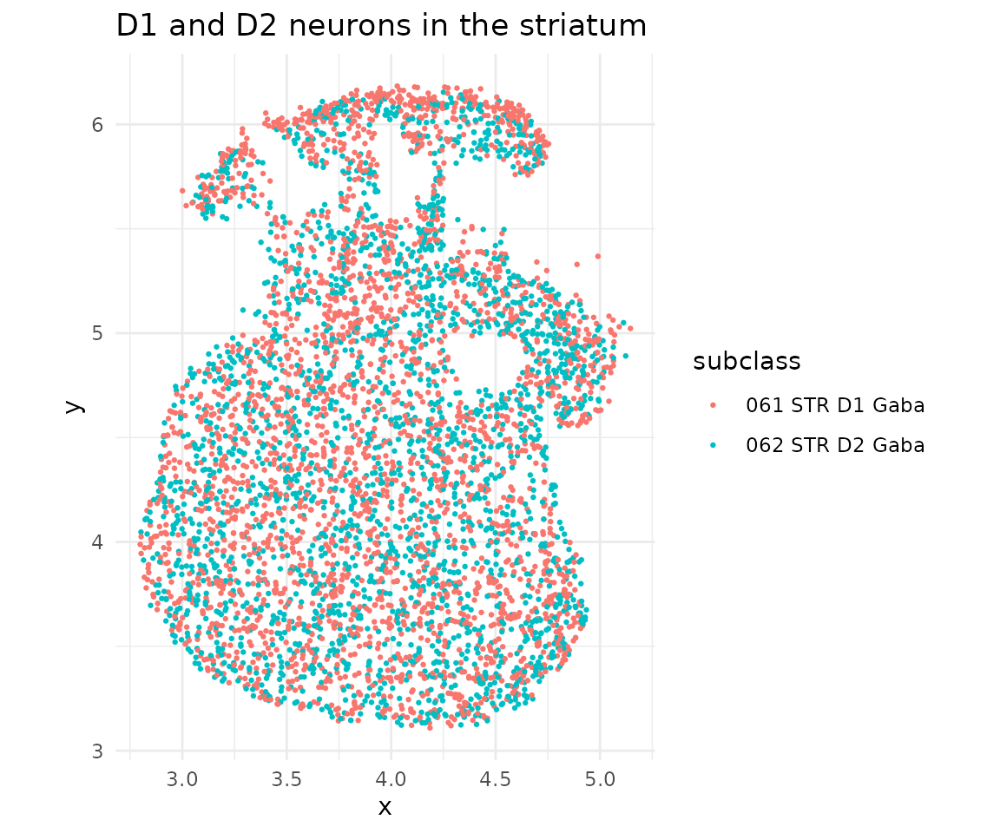
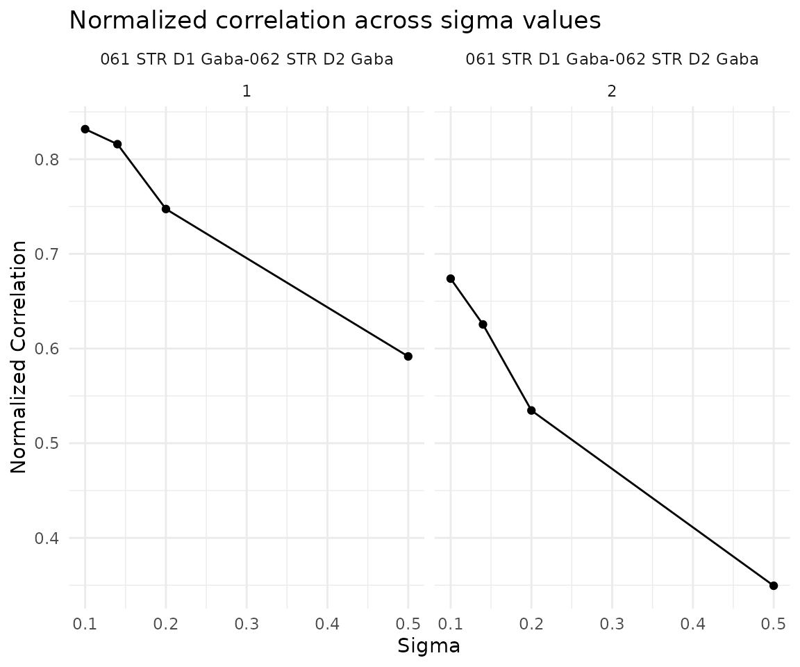
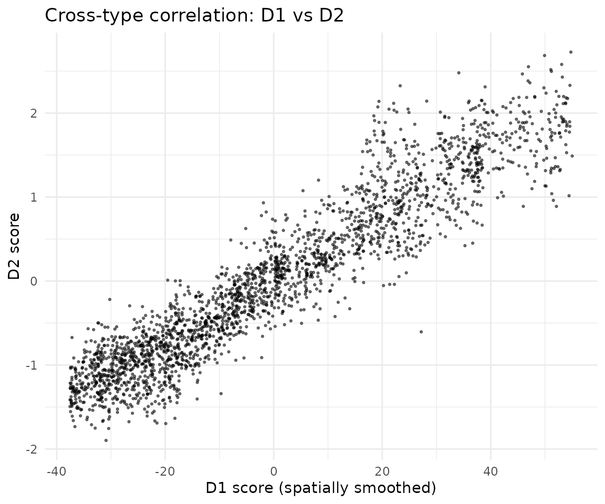
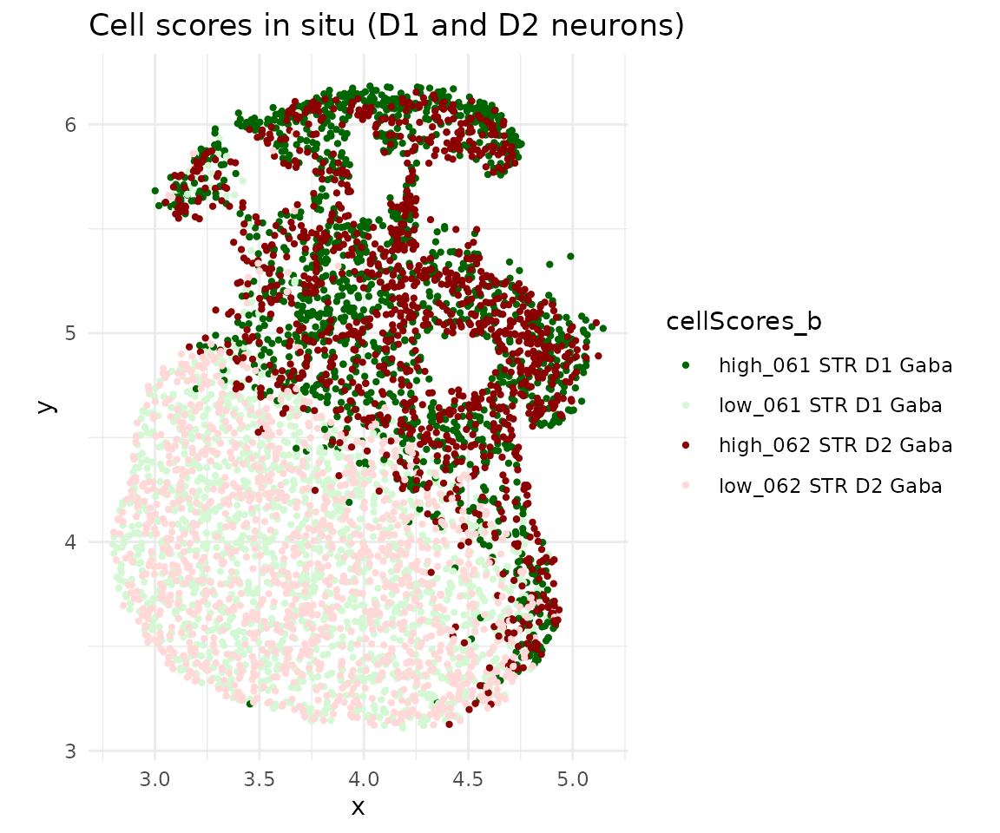
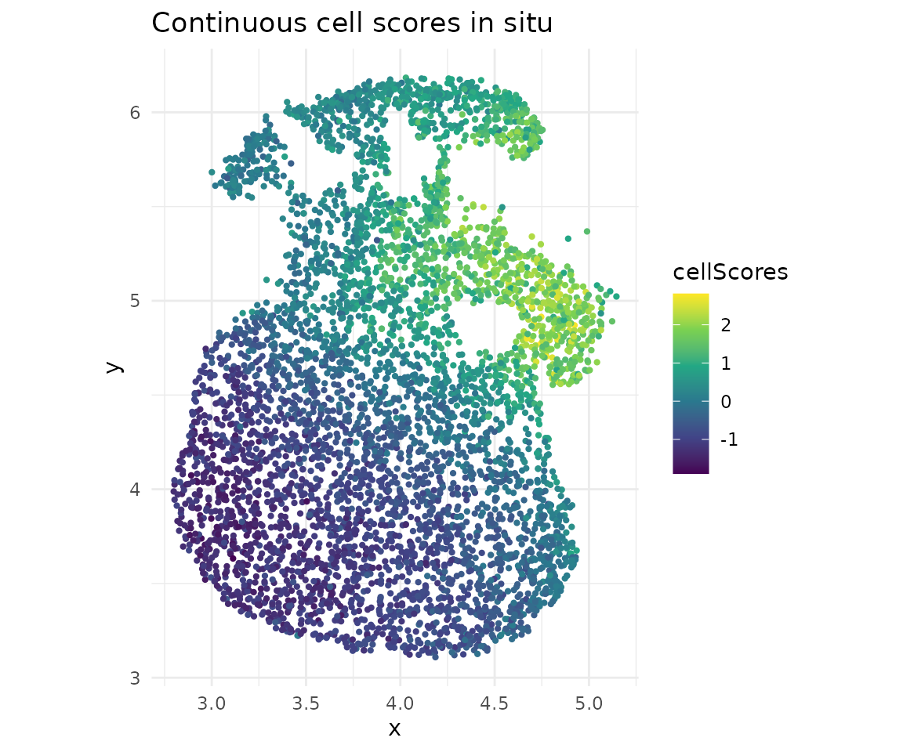

# Cross-cell-type co-progression (Brain MERFISH)

## Overview

This vignette demonstrates **cross-cell-type co-progression** using
brain MERFISH data from Zhang et al. *Nature* 2023. We analyze D1 and D2
GABAergic neurons in the striatum, detecting coordinated spatial gene
expression patterns between these two cell populations.

## Load packages

``` r
library(CoPro)
library(ggplot2)
```

## Download and load data

``` r
data_path <- copro_download_data("brain_merfish")
```

    ## Downloading copro_brain_merfish.rds from GitHub Release 'data-v1'...

    ## Downloaded to: /home/runner/.cache/R/CoPro/copro_brain_merfish.rds

``` r
dat <- readRDS(data_path)
```

## Visualize spatial layout

``` r
ggplot(dat$metaData) +
  geom_point(aes(x = x, y = y, color = subclass), size = 0.5) +
  coord_fixed() +
  theme_minimal() +
  ggtitle("D1 and D2 neurons in the striatum")
```



## Create CoPro object and run pipeline

``` r
cell_types <- c("061 STR D1 Gaba", "062 STR D2 Gaba")

obj <- newCoProSingle(
  normalizedData = dat$normalizedData,
  locationData = dat$locationData,
  metaData = dat$metaData,
  cellTypes = dat$cellTypes
)
obj <- subsetData(obj, cellTypesOfInterest = cell_types)

# Core pipeline
obj <- computePCA(obj, nPCA = 40, center = TRUE, scale. = TRUE)
```

    ## Input is dense (matrixarray), performing irlba pca...
    ## Input is dense (matrixarray), performing irlba pca...

``` r
obj <- computeDistance(obj, distType = "Euclidean2D",
                       normalizeDistance = FALSE)
```

    ##         0%        25%        50%        75%       100% 
    ## 0.03333036 0.77980408 1.21734420 1.70564639 3.10426158

``` r
obj <- computeKernelMatrix(obj, sigmaValues = c(0.1, 0.14, 0.2, 0.5))
```

    ## Computing pairwise kernel matrix for 2 cell types
    ## current sigma value is 0.1 
    ## current sigma value is 0.14 
    ## current sigma value is 0.2 
    ## current sigma value is 0.5

``` r
obj <- runSkrCCA(obj, scalePCs = TRUE, maxIter = 500)
```

    ## Running skrCCA for sigma = 0.1

    ## [1] "Convergence reached at 26 iterations (Max diff = 7.515e-06 )"
    ## [1] "Convergence reached at 1 iterations (Max diff = 1.233e-14 )"

    ## Running skrCCA for sigma = 0.14

    ## [1] "Convergence reached at 20 iterations (Max diff = 9.619e-06 )"
    ## [1] "Convergence reached at 1 iterations (Max diff = 1.665e-16 )"

    ## Running skrCCA for sigma = 0.2

    ## [1] "Convergence reached at 14 iterations (Max diff = 9.461e-06 )"
    ## [1] "Convergence reached at 1 iterations (Max diff = 3.886e-16 )"

    ## Running skrCCA for sigma = 0.5

    ## [1] "Convergence reached at 13 iterations (Max diff = 7.491e-06 )"
    ## [1] "Convergence reached at 0 iterations (Max diff = 2.949e-15 )"

    ## Optimization succeeded for 4 sigma value(s): sigma_0.1, sigma_0.14, sigma_0.2, sigma_0.5

``` r
obj <- computeNormalizedCorrelation(obj)
```

    ## Calculating spectral norms,  depending on the data size, this may take a while. 
    ## Finished calculating spectral norms

``` r
obj <- computeGeneAndCellScores(obj)
```

## Select optimal sigma

``` r
ncorr <- getNormCorr(obj)

ggplot(ncorr, aes(x = sigmaValues, y = normalizedCorrelation)) +
  geom_point() +
  geom_line() +
  facet_wrap(~ ct12 + CC_index) +
  xlab("Sigma") +
  ylab("Normalized Correlation") +
  ggtitle("Normalized correlation across sigma values") +
  theme_minimal()
```



## Cross-type correlation

Visualize how cell scores in D1 neurons (smoothed by the spatial kernel)
correlate with D2 neuron scores:

``` r
df_corr <- getCorrTwoTypes(obj,
  sigmaValueChoice = 0.14,
  cellTypeA = "061 STR D1 Gaba",
  cellTypeB = "062 STR D2 Gaba"
)

ggplot(df_corr) +
  geom_point(aes(x = AK, y = B), size = 0.5, alpha = 0.5) +
  xlab("D1 score (spatially smoothed)") +
  ylab("D2 score") +
  ggtitle("Cross-type correlation: D1 vs D2") +
  theme_minimal()
```



## In situ visualization

``` r
cs <- getCellScoresInSitu(obj, sigmaValueChoice = 0.14)

ggplot(cs) +
  geom_point(aes(x = x, y = y, color = cellScores_b), size = 0.8) +
  scale_color_manual(values = c("darkgreen", "#d4f8d4",
                                 "darkred", "#ffd8d8")) +
  coord_fixed() +
  ggtitle("Cell scores in situ (D1 and D2 neurons)") +
  theme_minimal()
```



``` r
# Continuous scores
ggplot(cs) +
  geom_point(aes(x = x, y = y, color = cellScores), size = 0.8) +
  scale_color_viridis_c() +
  coord_fixed() +
  ggtitle("Continuous cell scores in situ") +
  theme_minimal()
```



## Permutation test

Establish statistical significance with spatial permutations:

``` r
obj <- runSkrCCAPermu(obj, nPermu = 5L, permu_method = "bin",
                       num_bins_x = 10, num_bins_y = 10)
```

    ## Warning in runSkrCCAPermu(obj, nPermu = 5L, permu_method = "bin", num_bins_x =
    ## 10, : nPermu < 10 may give unreliable p-values. Consider nPermu >= 100.

    ## Permutation settings:
    ##   permu_method: bin 
    ##   permu_which: second_only 
    ##     -> Cell type 061 STR D1 Gaba is FIXED, others are permuted
    ##   num_bins_x: 10 
    ##   num_bins_y: 10 
    ##   Total bins: 100 
    ##   match_quantile: FALSE 
    ## 
    ## Generating cell permutation indices...
    ## Cell permutation indices generated.
    ## 
    ## Running CCA optimization for 5 permutations...
    ## [1] "Convergence reached at 23 iterations (Max diff = 7.942e-06 )"
    ## [1] "Convergence reached at 1 iterations (Max diff = 3.662e-13 )"
    ## [1] "Convergence reached at 15 iterations (Max diff = 7.143e-06 )"
    ## [1] "Convergence reached at 1 iterations (Max diff = 7.903e-15 )"
    ## [1] "Convergence reached at 19 iterations (Max diff = 5.864e-06 )"
    ## [1] "Convergence reached at 1 iterations (Max diff = 1.582e-11 )"
    ## [1] "Convergence reached at 14 iterations (Max diff = 4.520e-06 )"
    ## [1] "Convergence reached at 0 iterations (Max diff = 1.848e-10 )"
    ## [1] "Convergence reached at 8 iterations (Max diff = 4.634e-06 )"
    ## [1] "Convergence reached at 0 iterations (Max diff = 4.876e-11 )"
    ##   Completed 5 of 5 permutations
    ## 
    ## Permutation testing complete.
    ## Run computeNormalizedCorrelationPermu() to compute p-values.

``` r
obj <- computeNormalizedCorrelationPermu(obj, tol = 1e-3)
```

    ## Calculating spectral norms...
    ## Spectral norms calculated.
    ## 
    ## Computing normalized correlations for permutations...
    ##   Completed 5 of 5 permutations
    ## 
    ## Normalized correlation computation complete.

``` r
nc_permu <- do.call(rbind, obj@normalizedCorrelationPermu)
print(nc_permu)
```

    ##           sigmaValues       cellType1       cellType2 CC_index
    ## permu_1.1         0.1 061 STR D1 Gaba 062 STR D2 Gaba        1
    ## permu_1.2         0.1 061 STR D1 Gaba 062 STR D2 Gaba        2
    ## permu_2.1         0.1 061 STR D1 Gaba 062 STR D2 Gaba        1
    ## permu_2.2         0.1 061 STR D1 Gaba 062 STR D2 Gaba        2
    ## permu_3.1         0.1 061 STR D1 Gaba 062 STR D2 Gaba        1
    ## permu_3.2         0.1 061 STR D1 Gaba 062 STR D2 Gaba        2
    ## permu_4.1         0.1 061 STR D1 Gaba 062 STR D2 Gaba        1
    ## permu_4.2         0.1 061 STR D1 Gaba 062 STR D2 Gaba        2
    ## permu_5.1         0.1 061 STR D1 Gaba 062 STR D2 Gaba        1
    ## permu_5.2         0.1 061 STR D1 Gaba 062 STR D2 Gaba        2
    ##           normalizedCorrelation
    ## permu_1.1             0.2691072
    ## permu_1.2             0.2106740
    ## permu_2.1             0.2511427
    ## permu_2.2             0.2057824
    ## permu_3.1             0.2402538
    ## permu_3.2             0.1765175
    ## permu_4.1             0.2841232
    ## permu_4.2             0.1786754
    ## permu_5.1             0.3707562
    ## permu_5.2             0.1871863

## References

Zhang, M., Pan, X., Jung, W. *et al.* Molecularly defined and spatially
resolved cell atlas of the whole mouse brain. *Nature* 624, 343–354
(2023). <https://doi.org/10.1038/s41586-023-06808-9>

## Session info

``` r
sessionInfo()
```

    ## R version 4.5.3 (2026-03-11)
    ## Platform: x86_64-pc-linux-gnu
    ## Running under: Ubuntu 24.04.4 LTS
    ## 
    ## Matrix products: default
    ## BLAS:   /usr/lib/x86_64-linux-gnu/openblas-pthread/libblas.so.3 
    ## LAPACK: /usr/lib/x86_64-linux-gnu/openblas-pthread/libopenblasp-r0.3.26.so;  LAPACK version 3.12.0
    ## 
    ## locale:
    ##  [1] LC_CTYPE=C.UTF-8       LC_NUMERIC=C           LC_TIME=C.UTF-8       
    ##  [4] LC_COLLATE=C.UTF-8     LC_MONETARY=C.UTF-8    LC_MESSAGES=C.UTF-8   
    ##  [7] LC_PAPER=C.UTF-8       LC_NAME=C              LC_ADDRESS=C          
    ## [10] LC_TELEPHONE=C         LC_MEASUREMENT=C.UTF-8 LC_IDENTIFICATION=C   
    ## 
    ## time zone: UTC
    ## tzcode source: system (glibc)
    ## 
    ## attached base packages:
    ## [1] stats     graphics  grDevices utils     datasets  methods   base     
    ## 
    ## other attached packages:
    ## [1] ggplot2_4.0.2 CoPro_0.6.1  
    ## 
    ## loaded via a namespace (and not attached):
    ##  [1] rappdirs_0.3.4     sass_0.4.10        generics_0.1.4     lattice_0.22-9    
    ##  [5] digest_0.6.39      magrittr_2.0.5     timechange_0.4.0   evaluate_1.0.5    
    ##  [9] grid_4.5.3         RColorBrewer_1.1-3 fastmap_1.2.0      maps_3.4.3        
    ## [13] jsonlite_2.0.0     Matrix_1.7-4       httr_1.4.8         spam_2.11-3       
    ## [17] viridisLite_0.4.3  scales_1.4.0       httr2_1.2.2        textshaping_1.0.5 
    ## [21] jquerylib_0.1.4    cli_3.6.6          rlang_1.2.0        gitcreds_0.1.2    
    ## [25] withr_3.0.2        cachem_1.1.0       yaml_2.3.12        tools_4.5.3       
    ## [29] parallel_4.5.3     memoise_2.0.1      dplyr_1.2.1        curl_7.0.0        
    ## [33] vctrs_0.7.3        R6_2.6.1           lubridate_1.9.5    matrixStats_1.5.0 
    ## [37] lifecycle_1.0.5    fs_2.0.1           ragg_1.5.2         irlba_2.3.7       
    ## [41] pkgconfig_2.0.3    desc_1.4.3         pkgdown_2.2.0      pillar_1.11.1     
    ## [45] bslib_0.10.0       gtable_0.3.6       glue_1.8.0         gh_1.5.0          
    ## [49] Rcpp_1.1.1-1       fields_17.1        systemfonts_1.3.2  xfun_0.57         
    ## [53] tibble_3.3.1       tidyselect_1.2.1   knitr_1.51         farver_2.1.2      
    ## [57] htmltools_0.5.9    labeling_0.4.3     rmarkdown_2.31     piggyback_0.1.5   
    ## [61] dotCall64_1.2      compiler_4.5.3     S7_0.2.1-1
