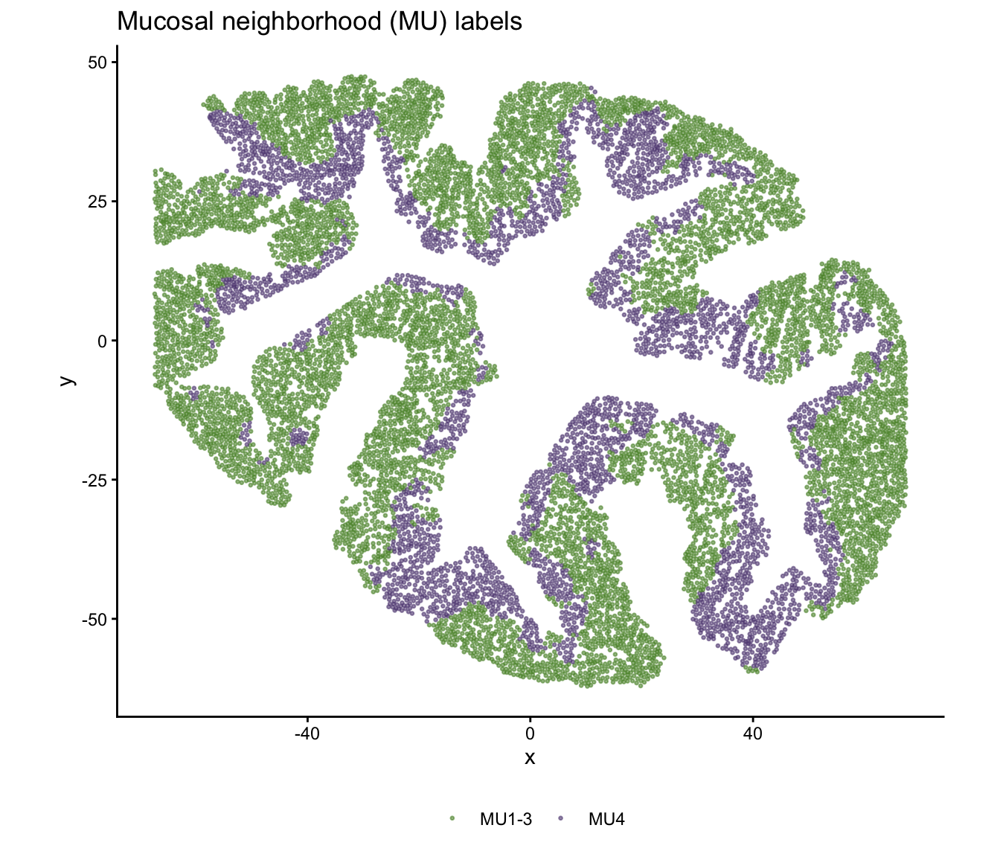
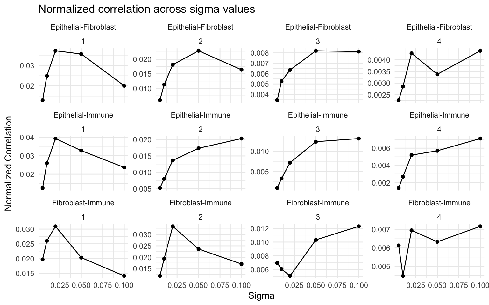
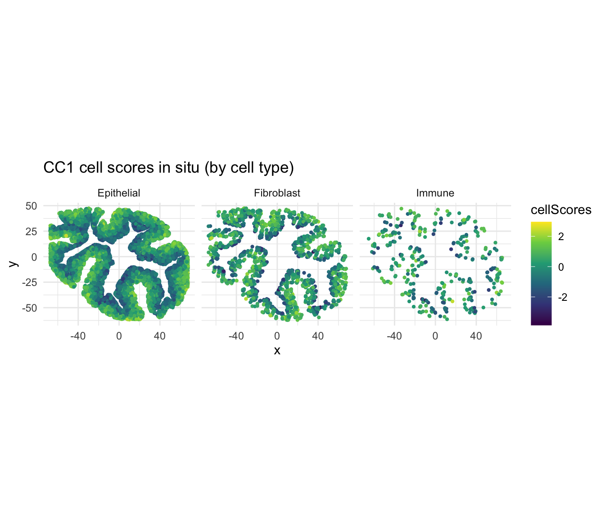
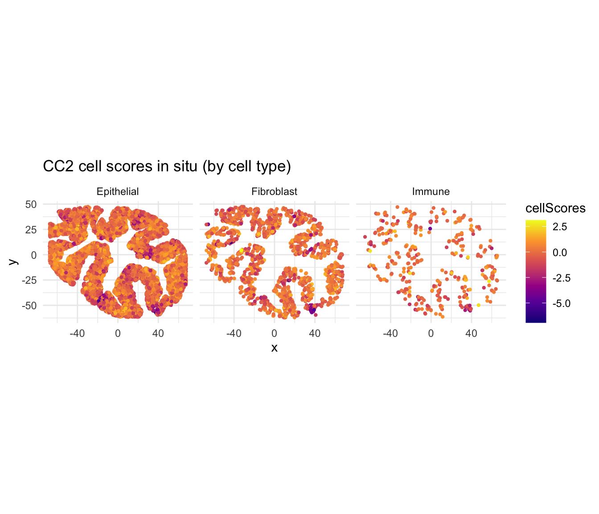
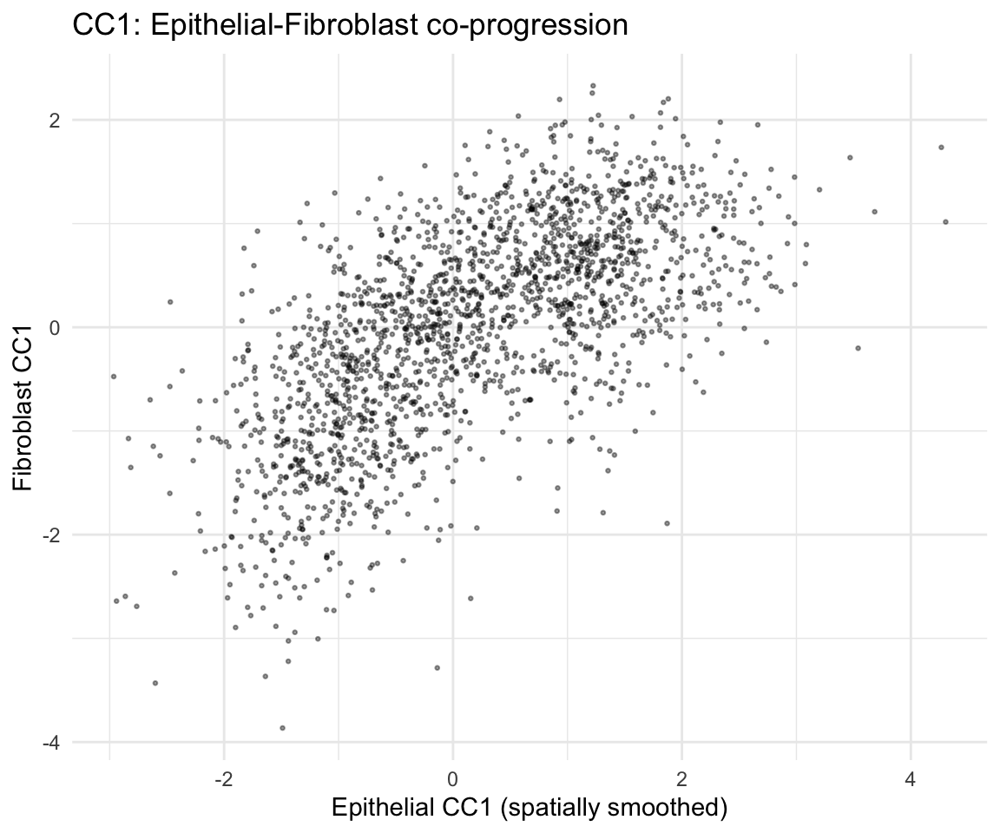
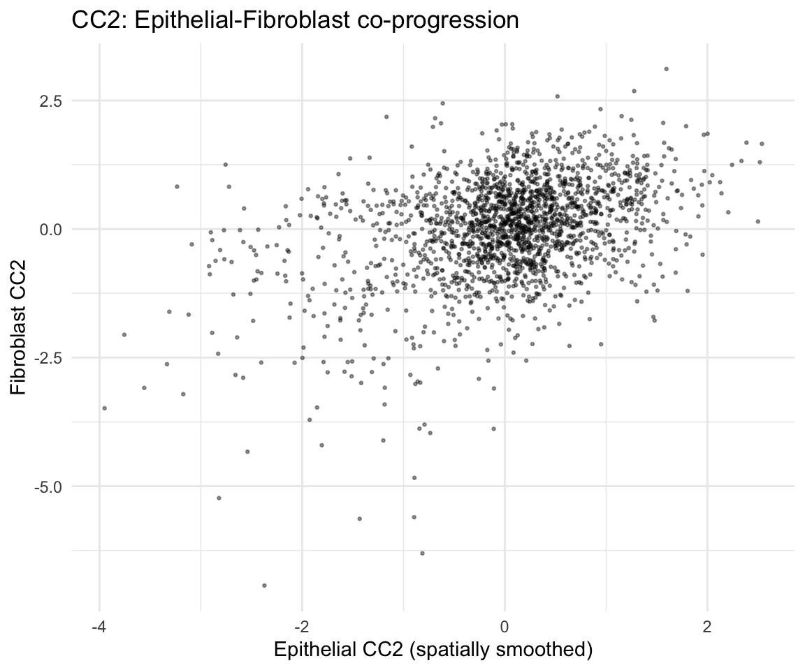

# Cross-cell-type co-progression with orthogonal axes (Colon Day 3)

## Overview

This vignette demonstrates how CoPro detects **cross-cell-type
co-progression** using colon organoid Day 3 data. CoPro identifies
multiple orthogonal canonical components (CCs), each capturing an
independent axis of coordinated spatial variation between cell types.

In this dataset, we analyze three cell types—Epithelial, Fibroblast, and
Immune—and show that CC1 and CC2 capture distinct, biologically
meaningful spatial programs. We also compare CoPro axes with
independently derived **mucosal neighborhood (MU) labels** to validate
that the unsupervised axes recover known tissue structure.

## Load packages

``` r

library(CoPro)
library(ggplot2)
```

## Download and load data

``` r

data_path <- copro_download_data("colon_d3")
dat <- readRDS(data_path)

str(dat[c("normalizedData", "locationData", "cellTypes")], max.level = 1)
```

    ## List of 3
    ##  $ normalizedData: num [1:11666, 1:891] 0 0 0 0 0 0 0 0 0 0 ...
    ##   ..- attr(*, "dimnames")=List of 2
    ##  $ locationData  :'data.frame':  11666 obs. of  2 variables:
    ##  $ cellTypes     : chr [1:11666] "Epithelial" "Fibroblast" "Epithelial" "Epithelial" ...

## Visualize the tissue

``` r

plot_df <- data.frame(
  x = dat$locationData$x,
  y = dat$locationData$y,
  celltype = dat$cellTypes
)

ggplot(plot_df, aes(x = x, y = y, color = celltype)) +
  geom_point(size = 0.5, alpha = 0.6) +
  scale_color_manual(values = c("Epithelial" = "#E41A1C",
                                 "Fibroblast" = "#377EB8",
                                 "Immune" = "#4DAF4A")) +
  coord_fixed() +
  ggtitle("Colon Day 3 organoid") +
  theme_classic() +
  theme(legend.position = "bottom")
```


plot of chunk plot-layout

### Mucosal neighborhood (MU) labels

The tissue has been independently annotated with mucosal neighborhood
labels (MU1–MU4) via Leiden clustering on spatial neighborhoods. MU4
represents an inflammation-associated microenvironment distinct from
MU1–3 (crypt-associated neighborhoods):

``` r

mu_df <- data.frame(
  x = dat$locationData$x,
  y = dat$locationData$y,
  MU = dat$metaData$Leiden_neigh
)

# Group MU1-3 together as in the manuscript
mu_df$MU_grouped <- ifelse(mu_df$MU %in% c("MU1", "MU2", "MU3"),
                            "MU1-3", as.character(mu_df$MU))
mu_df$MU_grouped <- factor(mu_df$MU_grouped, levels = c("MU1-3", "MU4"))

mu_colors <- c("MU1-3" = "#5c9137", "MU4" = "#614b83")

ggplot(mu_df, aes(x = x, y = y, color = MU_grouped)) +
  geom_point(size = 0.5, alpha = 0.6) +
  scale_color_manual(values = mu_colors) +
  coord_fixed() +
  ggtitle("Mucosal neighborhood (MU) labels") +
  theme_classic() +
  theme(legend.position = "bottom",
        legend.title = element_blank())
```



plot of chunk plot-mu

## Create CoPro object

``` r

obj <- newCoProSingle(
  normalizedData = dat$normalizedData,
  locationData = dat$locationData,
  metaData = dat$metaData,
  cellTypes = dat$cellTypes
)

cell_types <- c("Epithelial", "Fibroblast", "Immune")
obj <- subsetData(obj, cellTypesOfInterest = cell_types)
```

## Run the CoPro pipeline

``` r

# PCA
obj <- computePCA(obj, nPCA = 15, center = TRUE, scale. = TRUE)

# Distance and kernel
obj <- computeDistance(obj, distType = "Euclidean2D")

sigma_choice <- c(0.005, 0.01, 0.02, 0.05, 0.1)
obj <- computeKernelMatrix(obj, sigmaValues = sigma_choice)

# Sparse kernel CCA -- request 4 CCs to capture multiple axes
obj <- runSkrCCA(obj, scalePCs = TRUE, maxIter = 500, nCC = 4)

# Normalized correlation and scores
obj <- computeNormalizedCorrelation(obj)
obj <- computeGeneAndCellScores(obj)
```

## Select optimal sigma

``` r

ncorr <- getNormCorr(obj)

ggplot(ncorr, aes(x = sigmaValues, y = normalizedCorrelation)) +
  geom_point() +
  geom_line() +
  facet_wrap(~ ct12 + CC_index, scales = "free_y") +
  xlab("Sigma") +
  ylab("Normalized Correlation") +
  ggtitle("Normalized correlation across sigma values") +
  theme_minimal()
```



plot of chunk plot-ncorr

## Orthogonal axes: CC1 vs CC2

A key feature of CoPro is that it extracts **multiple orthogonal axes**.
Each CC captures a distinct pattern of spatial co-variation:

### CC1 cell scores in situ

``` r

sigma_opt <- 0.01  # adjust based on ncorr plot

cs_cc1 <- getCellScoresInSitu(obj, sigmaValueChoice = sigma_opt,
                               ccIndex = 1)

ggplot(cs_cc1) +
  geom_point(aes(x = x, y = y, color = cellScores), size = 0.8) +
  scale_color_viridis_c() +
  facet_wrap(~ cellTypesSub) +
  coord_fixed() +
  ggtitle("CC1 cell scores in situ (by cell type)") +
  theme_minimal()
```



plot of chunk insitu-cc1

### CC2 cell scores in situ

``` r

cs_cc2 <- getCellScoresInSitu(obj, sigmaValueChoice = sigma_opt,
                               ccIndex = 2)

ggplot(cs_cc2) +
  geom_point(aes(x = x, y = y, color = cellScores), size = 0.8) +
  scale_color_viridis_c(option = "C") +
  facet_wrap(~ cellTypesSub) +
  coord_fixed() +
  ggtitle("CC2 cell scores in situ (by cell type)") +
  theme_minimal()
```



plot of chunk insitu-cc2

CC1 and CC2 capture distinct spatial gradients. Because CCA axes are
orthogonal, these represent independent programs of coordinated gene
expression across cell types.

## CoPro axes recover mucosal neighborhood structure

A key validation is that CoPro’s unsupervised axes align with the
independently derived MU labels. We plot CC1 vs CC2 cell scores colored
by MU label, showing that MU4 (inflammation) occupies a distinct region
of the CoPro score space:

``` r

lmeta <- obj@metaDataSub
lmeta$cc1 <- lmeta[, paste0("cellScore_sigma_", sigma_opt, "_cc_index_1")]
lmeta$cc2 <- lmeta[, paste0("cellScore_sigma_", sigma_opt, "_cc_index_2")]
lmeta$MU_grouped <- ifelse(lmeta$Leiden_neigh == "MU4", "MU4", "MU1-3")

ggplot() +
  geom_point(data = lmeta, aes(x = cc1, y = cc2, color = MU_grouped),
             size = 0.1, alpha = 0.1) +
  geom_density_2d(data = lmeta[lmeta$MU_grouped == "MU1-3", ],
                  aes(x = cc1, y = cc2), color = "#5c9137",
                  linewidth = 0.5, alpha = 0.9) +
  geom_density_2d(data = lmeta[lmeta$MU_grouped == "MU4", ],
                  aes(x = cc1, y = cc2), color = "#614b83",
                  linewidth = 0.5, alpha = 0.9) +
  scale_color_manual(values = c("MU1-3" = "#5c9137", "MU4" = "#614b83")) +
  xlab("CoPro CC1") +
  ylab("CoPro CC2") +
  labs(color = "MU Label") +
  ggtitle("CoPro CC1 vs CC2 colored by MU label") +
  theme_classic()
```


plot of chunk cc1-vs-cc2-mu

## Example gene expression in situ

Top CoPro genes show spatially coherent expression patterns. Here we
visualize two marker genes: **Egr1** (immediate early gene, enriched in
the inflammation/CC2 axis) and **Mki67** (proliferation marker, enriched
in crypt base/CC1 axis):

``` r

expr_df <- data.frame(
  x = dat$locationData$x,
  y = dat$locationData$y,
  Egr1 = dat$normalizedData[, "Egr1"],
  Mki67 = dat$normalizedData[, "Mki67"]
)

# Egr1 (inflammation marker)
expr_df <- expr_df[order(expr_df$Egr1), ]
ggplot(expr_df, aes(x = x, y = y, color = Egr1)) +
  geom_point(size = 0.2) +
  scale_color_gradientn(colors = c("gray90", "darkred")) +
  coord_fixed() +
  ggtitle("Egr1 (inflammation marker)") +
  theme_classic() +
  theme(axis.line = element_blank(), axis.text = element_blank(),
        axis.ticks = element_blank(), axis.title = element_blank())
```


plot of chunk gene-insitu-egr1

``` r

# Mki67 (proliferation marker)
expr_df <- expr_df[order(expr_df$Mki67), ]
ggplot(expr_df, aes(x = x, y = y, color = Mki67)) +
  geom_point(size = 0.2) +
  scale_color_gradientn(colors = c("gray90", "darkblue")) +
  coord_fixed() +
  ggtitle("Mki67 (proliferation marker)") +
  theme_classic() +
  theme(axis.line = element_blank(), axis.text = element_blank(),
        axis.ticks = element_blank(), axis.title = element_blank())
```


plot of chunk gene-insitu-mki67

## Cross-type correlation plots

The correlation between cell types shows how strongly their spatial
programs are coupled:

``` r

# CC1: Epithelial vs Fibroblast
df_cc1 <- getCorrTwoTypes(obj,
  sigmaValueChoice = sigma_opt,
  cellTypeA = "Epithelial",
  cellTypeB = "Fibroblast",
  ccIndex = 1
)

ggplot(df_cc1) +
  geom_point(aes(x = AK, y = B), size = 0.5, alpha = 0.4) +
  xlab("Epithelial CC1 (spatially smoothed)") +
  ylab("Fibroblast CC1") +
  ggtitle("CC1: Epithelial-Fibroblast co-progression") +
  theme_minimal()
```



plot of chunk cross-corr

``` r

# CC2: Epithelial vs Fibroblast
df_cc2 <- getCorrTwoTypes(obj,
  sigmaValueChoice = sigma_opt,
  cellTypeA = "Epithelial",
  cellTypeB = "Fibroblast",
  ccIndex = 2
)

ggplot(df_cc2) +
  geom_point(aes(x = AK, y = B), size = 0.5, alpha = 0.4) +
  xlab("Epithelial CC2 (spatially smoothed)") +
  ylab("Fibroblast CC2") +
  ggtitle("CC2: Epithelial-Fibroblast co-progression") +
  theme_minimal()
```



plot of chunk cross-corr

## Gene scores

Identify which genes drive each co-progression axis:

``` r

# Compute regression-based gene scores (recommended)
obj <- computeRegressionGeneScores(obj, sigma = sigma_opt)
```

    ## Computed regression gene scores for sigma=0.01, cellType='Epithelial'

    ## Computed regression gene scores for sigma=0.01, cellType='Fibroblast'

    ## Computed regression gene scores for sigma=0.01, cellType='Immune'

### Visualize top genes for CC1

``` r

# Extract regression gene scores for Epithelial CC1
key <- paste0("geneScores|sigma", sigma_opt, "|Epithelial")
gs_epi <- obj@geneScoresRegression[[key]]

# Top 20 genes by absolute weight for CC1
gs_cc1 <- gs_epi[, 1]
top_genes <- head(sort(abs(gs_cc1), decreasing = TRUE), 20)
top_df <- data.frame(
  gene = factor(names(top_genes), levels = rev(names(top_genes))),
  weight = gs_cc1[names(top_genes)]
)
top_df$direction <- ifelse(top_df$weight > 0, "positive", "negative")

ggplot(top_df, aes(x = gene, y = weight, fill = direction)) +
  geom_col() +
  coord_flip() +
  scale_fill_manual(values = c("positive" = "darkred",
                                "negative" = "lightpink")) +
  ggtitle("Top 20 Epithelial genes (CC1, regression)") +
  theme_classic() +
  theme(legend.position = "none")
```


plot of chunk top-genes-cc1

### Visualize top genes for CC2

``` r

# Top 20 genes by absolute weight for CC2
gs_cc2 <- gs_epi[, 2]
top_genes_cc2 <- head(sort(abs(gs_cc2), decreasing = TRUE), 20)
top_df_cc2 <- data.frame(
  gene = factor(names(top_genes_cc2), levels = rev(names(top_genes_cc2))),
  weight = gs_cc2[names(top_genes_cc2)]
)
top_df_cc2$direction <- ifelse(top_df_cc2$weight > 0, "positive", "negative")

ggplot(top_df_cc2, aes(x = gene, y = weight, fill = direction)) +
  geom_col() +
  coord_flip() +
  scale_fill_manual(values = c("positive" = "darkred",
                                "negative" = "lightpink")) +
  ggtitle("Top 20 Epithelial genes (CC2, regression)") +
  theme_classic() +
  theme(legend.position = "none")
```


plot of chunk top-genes-cc2

## Session info

``` r

sessionInfo()
```

    ## R version 4.5.2 (2025-10-31)
    ## Platform: aarch64-apple-darwin20
    ## Running under: macOS Tahoe 26.1
    ## 
    ## Matrix products: default
    ## BLAS:   /System/Library/Frameworks/Accelerate.framework/Versions/A/Frameworks/vecLib.framework/Versions/A/libBLAS.dylib 
    ## LAPACK: /Library/Frameworks/R.framework/Versions/4.5-arm64/Resources/lib/libRlapack.dylib;  LAPACK version 3.12.1
    ## 
    ## locale:
    ## [1] en_US.UTF-8/en_US.UTF-8/en_US.UTF-8/C/en_US.UTF-8/en_US.UTF-8
    ## 
    ## time zone: America/Los_Angeles
    ## tzcode source: internal
    ## 
    ## attached base packages:
    ## [1] stats     graphics  grDevices utils     datasets  methods   base     
    ## 
    ## other attached packages:
    ## [1] ggplot2_4.0.2 CoPro_1.1.1   knitr_1.51   
    ## 
    ## loaded via a namespace (and not attached):
    ##  [1] Matrix_1.7-5       gtable_0.3.6       dplyr_1.2.1        compiler_4.5.2    
    ##  [5] maps_3.4.3         tidyselect_1.2.1   Rcpp_1.1.1         parallel_4.5.2    
    ##  [9] scales_1.4.0       lattice_0.22-9     R6_2.6.1           labeling_0.4.3    
    ## [13] generics_0.1.4     isoband_0.3.0      MASS_7.3-65        dotCall64_1.2     
    ## [17] tibble_3.3.1       pillar_1.11.1      RColorBrewer_1.1-3 rlang_1.2.0       
    ## [21] xfun_0.57          S7_0.2.1           otel_0.2.0         viridisLite_0.4.3 
    ## [25] cli_3.6.5          withr_3.0.2        magrittr_2.0.5     grid_4.5.2        
    ## [29] irlba_2.3.7        spam_2.11-3        lifecycle_1.0.5    fields_17.1       
    ## [33] vctrs_0.7.2        evaluate_1.0.5     glue_1.8.0         farver_2.1.2      
    ## [37] matrixStats_1.5.0  tools_4.5.2        pkgconfig_2.0.3
