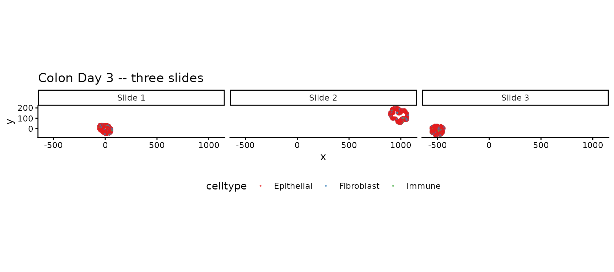
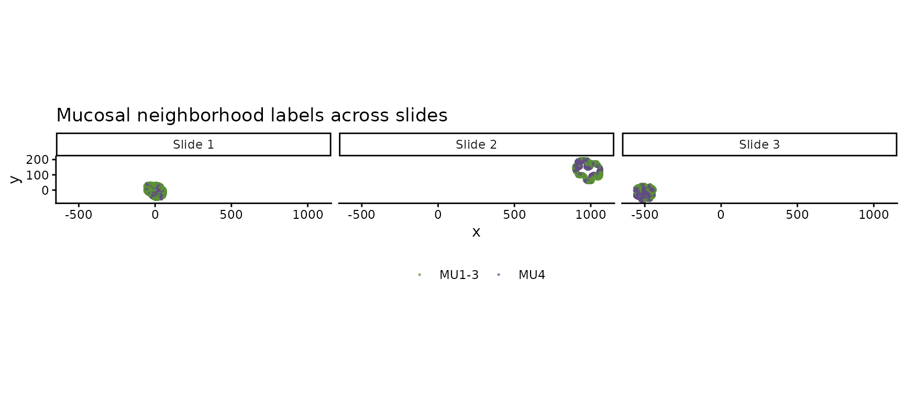
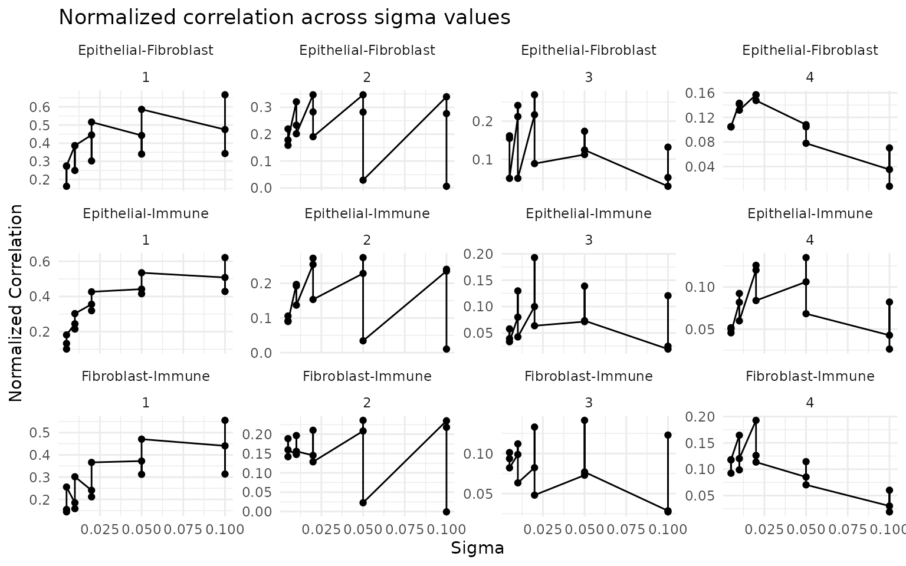
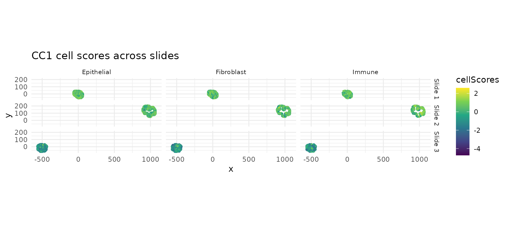
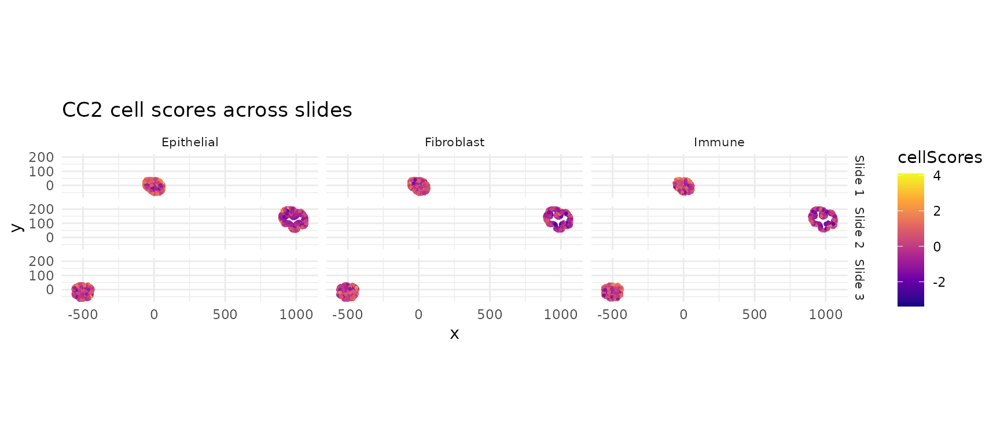
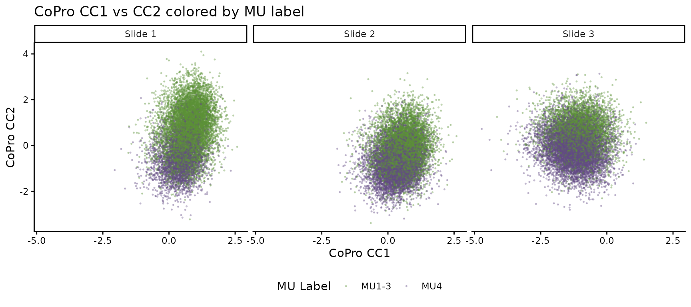
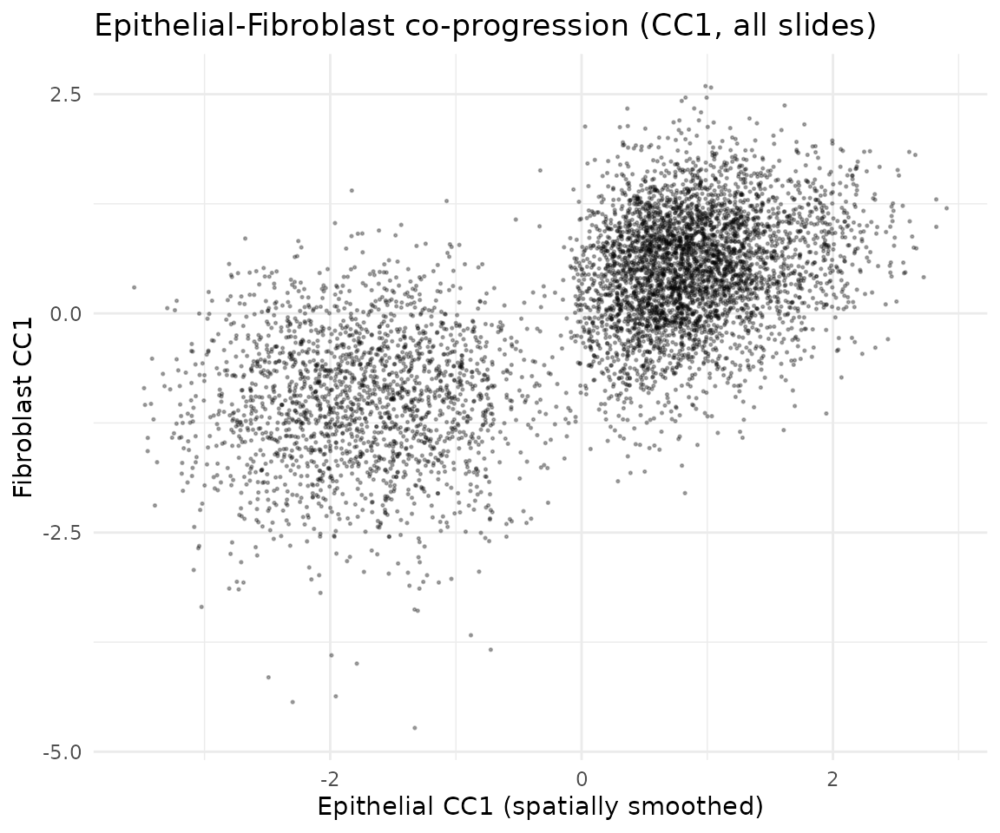
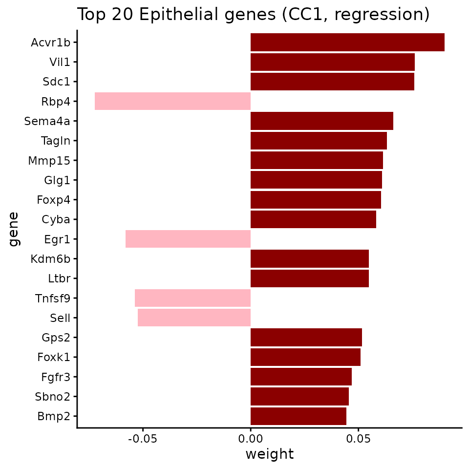

# Multi-slide joint analysis (Colon Day 3)

## Overview

When multiple tissue slides are available from the same condition, CoPro
can analyze them **jointly** using `newCoProMulti`. Joint analysis pools
spatial relationships across slides, yielding more robust co-progression
axes than single-slide analysis. This is especially valuable when
individual slides may capture only part of the tissue heterogeneity.

This vignette walks through the full multi-slide workflow using three
colon organoid Day 3 slides:

1.  Create a `CoProMulti` object with `newCoProMulti`
2.  Run the standard CoPro pipeline (PCA, kernel, CCA, scores)
3.  Visualize per-slide results
4.  Assess cross-slide consistency via score transfer
5.  Validate against independently derived mucosal neighborhood labels

For a complementary example showing the **reference-plus-transfer**
workflow (train on one slide, transfer to others), see the
`colon_d9_multi_slide` vignette.

## Load packages

``` r

library(CoPro)
library(ggplot2)
```

## Download and load data

``` r

data_path <- copro_download_data("colon_d3_multi")
```

    ## Downloading copro_colon_d3_multi.rds from GitHub Release 'data-v1'...

    ## Downloaded to: /home/runner/.cache/R/CoPro/copro_colon_d3_multi.rds

``` r

dat <- readRDS(data_path)

cat("Slides:", paste(dat$selectedSlides, collapse = ", "), "\n")
```

    ## Slides: 092421_D3_m1_1_slice_1, 092421_D3_m1_1_slice_3, 092421_D3_m2_1_slice_1

``` r

cat("Total cells:", nrow(dat$normalizedData), "\n")
```

    ## Total cells: 37930

``` r

cat("Genes:", ncol(dat$normalizedData), "\n")
```

    ## Genes: 891

``` r

table(dat$slideID)
```

    ## 
    ## 092421_D3_m1_1_slice_1 092421_D3_m1_1_slice_3 092421_D3_m2_1_slice_1 
    ##                  11666                  13870                  12394

## Visualize the tissue

### Cell types across slides

``` r

plot_df <- data.frame(
  x = dat$locationData$x,
  y = dat$locationData$y,
  celltype = dat$cellTypes,
  slide = dat$slideID
)

# Short slide labels for plotting
slide_labels <- setNames(
  paste0("Slide ", seq_along(dat$selectedSlides)),
  dat$selectedSlides
)
plot_df$slide_label <- slide_labels[plot_df$slide]

ggplot(plot_df, aes(x = x, y = y, color = celltype)) +
  geom_point(size = 0.3, alpha = 0.6) +
  scale_color_manual(values = c("Epithelial" = "#E41A1C",
                                 "Fibroblast" = "#377EB8",
                                 "Immune" = "#4DAF4A")) +
  facet_wrap(~ slide_label) +
  coord_fixed() +
  ggtitle("Colon Day 3 -- three slides") +
  theme_classic() +
  theme(legend.position = "bottom")
```



### Mucosal neighborhood (MU) labels

Each slide has been independently annotated with mucosal neighborhood
labels. MU4 marks an inflammation-associated microenvironment:

``` r

mu_df <- data.frame(
  x = dat$locationData$x,
  y = dat$locationData$y,
  MU = dat$metaData$Leiden_neigh,
  slide = dat$slideID
)
mu_df$slide_label <- slide_labels[mu_df$slide]

mu_df$MU_grouped <- ifelse(mu_df$MU %in% c("MU1", "MU2", "MU3"),
                            "MU1-3", as.character(mu_df$MU))
mu_df <- mu_df[mu_df$MU_grouped %in% c("MU1-3", "MU4"), ]
mu_df$MU_grouped <- factor(mu_df$MU_grouped, levels = c("MU1-3", "MU4"))

mu_colors <- c("MU1-3" = "#5c9137", "MU4" = "#614b83")

ggplot(mu_df, aes(x = x, y = y, color = MU_grouped)) +
  geom_point(size = 0.3, alpha = 0.6) +
  scale_color_manual(values = mu_colors) +
  facet_wrap(~ slide_label) +
  coord_fixed() +
  ggtitle("Mucosal neighborhood labels across slides") +
  theme_classic() +
  theme(legend.position = "bottom", legend.title = element_blank())
```



## Create a multi-slide CoPro object

`newCoProMulti` takes a `slideID` vector that tells CoPro which cells
belong to which slide. The pipeline then computes distance and kernel
matrices **within** each slide (cells on different slides are never
treated as spatial neighbors), while CCA optimizes a shared set of
weights across all slides jointly.

``` r

cell_types <- c("Epithelial", "Fibroblast", "Immune")

multi_obj <- newCoProMulti(
  normalizedData = dat$normalizedData,
  locationData = dat$locationData,
  metaData = dat$metaData,
  cellTypes = dat$cellTypes,
  slideID = dat$slideID
)
multi_obj <- subsetData(multi_obj, cellTypesOfInterest = cell_types)
```

## Run the CoPro pipeline

The pipeline steps are identical to single-slide analysis. Internally,
CoPro handles the multi-slide structure automatically—kernel matrices
are block-diagonal (no cross-slide spatial interactions), and CCA finds
weights that maximize the pooled canonical correlation.

``` r

multi_obj <- computePCA(multi_obj, nPCA = 40, center = TRUE, scale. = TRUE)
```

    ## Performing PCA for cell type: Epithelial

    ## Data centered and/or scaled

    ## PCA computed for cell type: Epithelial

    ## Performing PCA for cell type: Fibroblast

    ## Data centered and/or scaled

    ## PCA computed for cell type: Fibroblast

    ## Performing PCA for cell type: Immune

    ## Data centered and/or scaled

    ## PCA computed for cell type: Immune

``` r

multi_obj <- computeDistance(multi_obj, distType = "Euclidean2D")
```

    ## normalizeDistance = TRUE: low-percentile distance will be normalized across all slides and scaled to 0.01.

    ## Computing pairwise distances for slide: 092421_D3_m1_1_slice_1

    ## Slide: 092421_D3_m1_1_slice_1, Pair: Epithelial - Fibroblast

    ##          0%         25%         50%         75%        100% 
    ##   0.9705014  37.5605433  59.8000973  82.3149151 148.3187211

    ## Slide: 092421_D3_m1_1_slice_1, Pair: Epithelial - Immune

    ##         0%        25%        50%        75%       100% 
    ##   1.044265  37.159523  59.872983  82.261799 147.622508

    ## Slide: 092421_D3_m1_1_slice_1, Pair: Fibroblast - Immune

    ##         0%        25%        50%        75%       100% 
    ##   1.036319  37.135140  59.598056  82.079873 147.257437

    ## Computing pairwise distances for slide: 092421_D3_m1_1_slice_3

    ## Slide: 092421_D3_m1_1_slice_3, Pair: Epithelial - Fibroblast

    ##         0%        25%        50%        75%       100% 
    ##   1.057877  56.640926  89.810647 122.989128 194.939883

    ## Slide: 092421_D3_m1_1_slice_3, Pair: Epithelial - Immune

    ##         0%        25%        50%        75%       100% 
    ##   1.099256  56.453589  88.828288 121.616829 194.552898

    ## Slide: 092421_D3_m1_1_slice_3, Pair: Fibroblast - Immune

    ##         0%        25%        50%        75%       100% 
    ##   1.229139  56.785444  89.380375 123.533484 194.707180

    ## Computing pairwise distances for slide: 092421_D3_m2_1_slice_1

    ## Slide: 092421_D3_m2_1_slice_1, Pair: Epithelial - Fibroblast

    ##         0%        25%        50%        75%       100% 
    ##   1.009073  37.737153  59.369878  81.275043 142.566671

    ## Slide: 092421_D3_m2_1_slice_1, Pair: Epithelial - Immune

    ##        0%       25%       50%       75%      100% 
    ##   1.05659  37.90239  59.63997  81.95566 143.00729

    ## Slide: 092421_D3_m2_1_slice_1, Pair: Fibroblast - Immune

    ##         0%        25%        50%        75%       100% 
    ##   1.060916  38.454915  60.622840  83.243095 142.296317

    ## Global distance scaling factor: 0.010304

``` r

sigma_choice <- c(0.005, 0.01, 0.02, 0.05, 0.1)
multi_obj <- computeKernelMatrix(multi_obj, sigmaValues = sigma_choice)
```

    ## Computing pairwise kernel matrix for 3 cell types across 3 slides
    ## current sigma value is 0.005 
    ## current sigma value is 0.01 
    ## current sigma value is 0.02 
    ## current sigma value is 0.05 
    ## current sigma value is 0.1

``` r

multi_obj <- runSkrCCA(multi_obj, scalePCs = TRUE, maxIter = 500, nCC = 4)
```

    ## Running skrCCA [1/5] for sigma = 0.005 ...

    ## Convergence reached at 15 iterations (Max diff = 6.300e-06 )

    ## [1] "Convergence reached at 11 iterations (Max diff = 6.444e-06 )"
    ## [1] "Convergence reached at 66 iterations (Max diff = 8.890e-06 )"
    ## [1] "Convergence reached at 7 iterations (Max diff = 5.039e-06 )"

    ## Running skrCCA [2/5] for sigma = 0.01 ...

    ## Convergence reached at 9 iterations (Max diff = 6.447e-06 )

    ## [1] "Convergence reached at 11 iterations (Max diff = 6.704e-06 )"
    ## [1] "Convergence reached at 50 iterations (Max diff = 8.788e-06 )"
    ## [1] "Convergence reached at 6 iterations (Max diff = 4.469e-06 )"

    ## Running skrCCA [3/5] for sigma = 0.02 ...

    ## Convergence reached at 8 iterations (Max diff = 4.950e-06 )

    ## [1] "Convergence reached at 9 iterations (Max diff = 5.275e-06 )"
    ## [1] "Convergence reached at 26 iterations (Max diff = 9.623e-06 )"
    ## [1] "Convergence reached at 5 iterations (Max diff = 1.676e-06 )"

    ## Running skrCCA [4/5] for sigma = 0.05 ...

    ## Convergence reached at 10 iterations (Max diff = 9.913e-06 )

    ## [1] "Convergence reached at 5 iterations (Max diff = 8.622e-06 )"
    ## [1] "Convergence reached at 17 iterations (Max diff = 8.759e-06 )"
    ## [1] "Convergence reached at 5 iterations (Max diff = 6.842e-06 )"

    ## Running skrCCA [5/5] for sigma = 0.1 ...

    ## Convergence reached at 9 iterations (Max diff = 2.663e-06 )

    ## [1] "Convergence reached at 5 iterations (Max diff = 2.920e-06 )"
    ## [1] "Convergence reached at 9 iterations (Max diff = 9.487e-06 )"
    ## [1] "Convergence reached at 8 iterations (Max diff = 3.325e-06 )"

    ## skrCCA finished 5 sigma value(s) in 25.6 s.

    ## Optimization succeeded for 5 sigma value(s): sigma_0.005, sigma_0.01, sigma_0.02, sigma_0.05, sigma_0.1

``` r

multi_obj <- computeNormalizedCorrelation(multi_obj)
```

    ## Calculating spectral norms (can take time)...

    ## Finished calculating spectral norms.

``` r

multi_obj <- computeGeneAndCellScores(multi_obj)
```

## Select optimal sigma

``` r

ncorr <- getNormCorr(multi_obj)

ggplot(ncorr, aes(x = sigmaValues, y = normalizedCorrelation)) +
  geom_point() +
  geom_line() +
  facet_wrap(~ ct12 + CC_index, scales = "free_y") +
  xlab("Sigma") +
  ylab("Normalized Correlation") +
  ggtitle("Normalized correlation across sigma values") +
  theme_minimal()
```



``` r

sigma_opt <- 0.01  # adjust based on the ncorr plot above
```

## Visualize cell scores per slide

A key advantage of multi-slide analysis: the same CCA weights produce
cell scores on every slide. Consistent spatial patterns across slides
indicate a robust biological signal.

### CC1 scores across all slides

``` r

cs <- getCellScoresInSitu(multi_obj, sigmaValueChoice = sigma_opt,
                           ccIndex = 1)

# Add slide labels
cs$slide <- multi_obj@metaDataSub$Slice_ID[
  match(rownames(cs), rownames(multi_obj@metaDataSub))
]
if (is.null(cs$slide)) {
  cs$slide <- multi_obj@metaDataSub[
    match(paste(cs$x, cs$y), paste(multi_obj@locationDataSub$x,
                                    multi_obj@locationDataSub$y)),
    "Slice_ID"
  ]
}
cs$slide_label <- slide_labels[cs$slide]

ggplot(cs, aes(x = x, y = y, color = cellScores)) +
  geom_point(size = 0.5) +
  scale_color_viridis_c() +
  facet_grid(slide_label ~ cellTypesSub) +
  coord_fixed() +
  ggtitle("CC1 cell scores across slides") +
  theme_minimal() +
  theme(strip.text = element_text(size = 8))
```



### CC2 scores across all slides

``` r

cs2 <- getCellScoresInSitu(multi_obj, sigmaValueChoice = sigma_opt,
                            ccIndex = 2)
cs2$slide <- cs$slide
cs2$slide_label <- cs$slide_label

ggplot(cs2, aes(x = x, y = y, color = cellScores)) +
  geom_point(size = 0.5) +
  scale_color_viridis_c(option = "C") +
  facet_grid(slide_label ~ cellTypesSub) +
  coord_fixed() +
  ggtitle("CC2 cell scores across slides") +
  theme_minimal() +
  theme(strip.text = element_text(size = 8))
```



## CoPro axes vs MU labels

The CoPro axes are learned in a fully unsupervised manner. As a
validation, we check whether the unsupervised CC1/CC2 axes separate the
independently derived MU labels. We plot CC1 vs CC2 for each slide,
colored by MU label:

``` r

lmeta <- multi_obj@metaDataSub
lmeta$cc1 <- lmeta[, paste0("cellScore_sigma_", sigma_opt, "_cc_index_1")]
lmeta$cc2 <- lmeta[, paste0("cellScore_sigma_", sigma_opt, "_cc_index_2")]
lmeta$MU_grouped <- ifelse(lmeta$Leiden_neigh %in% c("MU1", "MU2", "MU3"),
                            "MU1-3",
                            ifelse(lmeta$Leiden_neigh == "MU4", "MU4", NA))
lmeta <- lmeta[!is.na(lmeta$MU_grouped), ]
lmeta$slide_label <- slide_labels[lmeta$Slice_ID]

ggplot(lmeta, aes(x = cc1, y = cc2, color = MU_grouped)) +
  geom_point(size = 0.3, alpha = 0.3) +
  scale_color_manual(values = mu_colors) +
  facet_wrap(~ slide_label) +
  labs(x = "CoPro CC1", y = "CoPro CC2", color = "MU Label") +
  ggtitle("CoPro CC1 vs CC2 colored by MU label") +
  theme_classic() +
  theme(legend.position = "bottom")
```



MU4 (inflammation) occupies a distinct region of the CoPro score space
on each slide, confirming that the jointly learned axes capture
biologically meaningful structure that generalizes across slides.

## Cross-type correlation

``` r

df_cc1 <- getCorrTwoTypes(multi_obj,
  sigmaValueChoice = sigma_opt,
  cellTypeA = "Epithelial",
  cellTypeB = "Fibroblast",
  ccIndex = 1
)

ggplot(df_cc1) +
  geom_point(aes(x = AK, y = B), size = 0.3, alpha = 0.3) +
  xlab("Epithelial CC1 (spatially smoothed)") +
  ylab("Fibroblast CC1") +
  ggtitle("Epithelial-Fibroblast co-progression (CC1, all slides)") +
  theme_minimal()
```



## Gene scores

``` r

multi_obj <- computeRegressionGeneScores(multi_obj, sigma = sigma_opt)
```

    ## Computed regression gene scores for sigma=0.01, cellType='Epithelial'

    ## Computed regression gene scores for sigma=0.01, cellType='Fibroblast'

    ## Computed regression gene scores for sigma=0.01, cellType='Immune'

### Top genes for CC1

``` r

key <- paste0("geneScores|sigma", sigma_opt, "|Epithelial")
gs_epi <- multi_obj@geneScoresRegression[[key]]

gs_cc1 <- gs_epi[, 1]
top_genes <- head(sort(abs(gs_cc1), decreasing = TRUE), 20)
top_df <- data.frame(
  gene = factor(names(top_genes), levels = rev(names(top_genes))),
  weight = gs_cc1[names(top_genes)]
)
top_df$direction <- ifelse(top_df$weight > 0, "positive", "negative")

ggplot(top_df, aes(x = gene, y = weight, fill = direction)) +
  geom_col() +
  coord_flip() +
  scale_fill_manual(values = c("positive" = "darkred",
                                "negative" = "lightpink")) +
  ggtitle("Top 20 Epithelial genes (CC1, regression)") +
  theme_classic() +
  theme(legend.position = "none")
```



## Assessing cross-slide consistency via transfer

Even when using joint analysis, it is useful to verify that the learned
gene program transfers well to individual slides. Here we run CoPro on
one slide as the reference and transfer its gene weights to each of the
other slides, comparing the transferred scores with the jointly learned
scores.

``` r

ref_slide <- dat$selectedSlides[1]
tar_slide <- dat$selectedSlides[2]

ref_idx <- dat$slideID == ref_slide
tar_idx <- dat$slideID == tar_slide
```

``` r

ref_obj <- newCoProSingle(
  normalizedData = dat$normalizedData[ref_idx, ],
  locationData = dat$locationData[ref_idx, ],
  metaData = dat$metaData[ref_idx, ],
  cellTypes = dat$cellTypes[ref_idx]
)
ref_obj <- subsetData(ref_obj, cellTypesOfInterest = cell_types)
ref_obj <- computePCA(ref_obj, nPCA = 40, center = TRUE, scale. = TRUE)
```

    ## Input is dense (matrixarray), performing irlba pca...
    ## Input is dense (matrixarray), performing irlba pca...
    ## Input is dense (matrixarray), performing irlba pca...

``` r

ref_obj <- computeDistance(ref_obj, distType = "Euclidean2D")
```

    ## normalizeDistance = TRUE: low-percentile distance will be scaled to 0.01.

    ##          0%         25%         50%         75%        100% 
    ##   0.9705014  37.5605433  59.8000973  82.3149151 148.3187211 
    ##         0%        25%        50%        75%       100% 
    ##   1.044265  37.159523  59.872983  82.261799 147.622508 
    ##         0%        25%        50%        75%       100% 
    ##   1.036319  37.135140  59.598056  82.079873 147.257437

    ## Distance normalization scaling factor: 0.010304

``` r

ref_obj <- computeKernelMatrix(ref_obj, sigmaValues = sigma_choice)
```

    ## Computing pairwise kernel matrix for 3 cell types
    ## current sigma value is 0.005 
    ## current sigma value is 0.01 
    ## current sigma value is 0.02 
    ## current sigma value is 0.05 
    ## current sigma value is 0.1

``` r

ref_obj <- runSkrCCA(ref_obj, scalePCs = TRUE, maxIter = 500, nCC = 4)
```

    ## Running skrCCA [1/5] for sigma = 0.005 ...

    ## [1] "Convergence reached at 8 iterations (Max diff = 6.705e-06 )"
    ## [1] "Convergence reached at 7 iterations (Max diff = 7.904e-06 )"
    ## [1] "Convergence reached at 35 iterations (Max diff = 8.959e-06 )"
    ## [1] "Convergence reached at 83 iterations (Max diff = 9.596e-06 )"

    ## Running skrCCA [2/5] for sigma = 0.01 ...

    ## [1] "Convergence reached at 9 iterations (Max diff = 8.457e-06 )"
    ## [1] "Convergence reached at 6 iterations (Max diff = 3.481e-06 )"
    ## [1] "Convergence reached at 22 iterations (Max diff = 8.421e-06 )"
    ## [1] "Convergence reached at 18 iterations (Max diff = 9.343e-06 )"

    ## Running skrCCA [3/5] for sigma = 0.02 ...

    ## [1] "Convergence reached at 10 iterations (Max diff = 4.865e-06 )"
    ## [1] "Convergence reached at 6 iterations (Max diff = 4.961e-06 )"
    ## [1] "Convergence reached at 16 iterations (Max diff = 7.374e-06 )"
    ## [1] "Convergence reached at 8 iterations (Max diff = 8.066e-06 )"

    ## Running skrCCA [4/5] for sigma = 0.05 ...

    ## [1] "Convergence reached at 13 iterations (Max diff = 6.279e-06 )"
    ## [1] "Convergence reached at 8 iterations (Max diff = 8.786e-06 )"
    ## [1] "Convergence reached at 4 iterations (Max diff = 8.633e-06 )"
    ## [1] "Convergence reached at 27 iterations (Max diff = 8.969e-06 )"

    ## Running skrCCA [5/5] for sigma = 0.1 ...

    ## [1] "Convergence reached at 23 iterations (Max diff = 9.616e-06 )"
    ## [1] "Convergence reached at 15 iterations (Max diff = 7.448e-06 )"
    ## [1] "Convergence reached at 7 iterations (Max diff = 4.530e-06 )"
    ## [1] "Convergence reached at 86 iterations (Max diff = 9.339e-06 )"

    ## skrCCA finished 5 sigma value(s) in 8.0 s.

    ## Optimization succeeded for 5 sigma value(s): sigma_0.005, sigma_0.01, sigma_0.02, sigma_0.05, sigma_0.1

``` r

ref_obj <- computeNormalizedCorrelation(ref_obj)
```

    ## Calculating spectral norms, this may take a while.

    ## Finished calculating spectral norms.

``` r

ref_obj <- computeGeneAndCellScores(ref_obj)
ref_obj <- computeRegressionGeneScores(ref_obj)
```

    ## Computed regression gene scores for sigma=0.005, cellType='Epithelial'

    ## Computed regression gene scores for sigma=0.005, cellType='Fibroblast'

    ## Computed regression gene scores for sigma=0.005, cellType='Immune'

    ## Computed regression gene scores for sigma=0.01, cellType='Epithelial'

    ## Computed regression gene scores for sigma=0.01, cellType='Fibroblast'

    ## Computed regression gene scores for sigma=0.01, cellType='Immune'

    ## Computed regression gene scores for sigma=0.02, cellType='Epithelial'

    ## Computed regression gene scores for sigma=0.02, cellType='Fibroblast'

    ## Computed regression gene scores for sigma=0.02, cellType='Immune'

    ## Computed regression gene scores for sigma=0.05, cellType='Epithelial'

    ## Computed regression gene scores for sigma=0.05, cellType='Fibroblast'

    ## Computed regression gene scores for sigma=0.05, cellType='Immune'

    ## Computed regression gene scores for sigma=0.1, cellType='Epithelial'

    ## Computed regression gene scores for sigma=0.1, cellType='Fibroblast'

    ## Computed regression gene scores for sigma=0.1, cellType='Immune'

``` r

tar_obj <- newCoProSingle(
  normalizedData = dat$normalizedData[tar_idx, ],
  locationData = dat$locationData[tar_idx, ],
  metaData = dat$metaData[tar_idx, ],
  cellTypes = dat$cellTypes[tar_idx]
)
tar_obj <- subsetData(tar_obj, cellTypesOfInterest = cell_types)
tar_obj <- computePCA(tar_obj, nPCA = 40, center = TRUE, scale. = TRUE)
```

    ## Input is dense (matrixarray), performing irlba pca...
    ## Input is dense (matrixarray), performing irlba pca...
    ## Input is dense (matrixarray), performing irlba pca...

``` r

tar_obj <- computeDistance(tar_obj, distType = "Euclidean2D")
```

    ## normalizeDistance = TRUE: low-percentile distance will be scaled to 0.01.

    ##         0%        25%        50%        75%       100% 
    ##   1.057877  56.640926  89.810647 122.989128 194.939883 
    ##         0%        25%        50%        75%       100% 
    ##   1.099256  56.453589  88.828288 121.616829 194.552898 
    ##         0%        25%        50%        75%       100% 
    ##   1.229139  56.785444  89.380375 123.533484 194.707180

    ## Distance normalization scaling factor: 0.0094529

``` r

tar_obj <- computeKernelMatrix(tar_obj, sigmaValues = sigma_choice)
```

    ## Computing pairwise kernel matrix for 3 cell types
    ## current sigma value is 0.005 
    ## current sigma value is 0.01 
    ## current sigma value is 0.02 
    ## current sigma value is 0.05 
    ## current sigma value is 0.1

``` r

tar_scores <- getTransferCellScores(
  ref_obj = ref_obj,
  tar_obj = tar_obj,
  sigma_choice = sigma_opt,
  gene_score_type = "regression"
)
```

    ## Using regression-based gene weights for transfer
    ## transferring gene scores for cell type Epithelial

    ## Processing feature 89/891

    ## Processing feature 178/891

    ## Processing feature 267/891

    ## Processing feature 356/891

    ## Processing feature 445/891

    ## Processing feature 534/891

    ## Processing feature 623/891

    ## Processing feature 712/891

    ## Processing feature 801/891

    ## Processing feature 890/891

    ## retaining 891 genes for CC_1 with threshold 0 
    ## retaining 891 genes for CC_2 with threshold 0 
    ## retaining 891 genes for CC_3 with threshold 0 
    ## retaining 891 genes for CC_4 with threshold 0 
    ## transferring gene scores for cell type Fibroblast

    ## Processing feature 89/891

    ## Processing feature 178/891

    ## Processing feature 267/891

    ## Processing feature 356/891

    ## Processing feature 445/891

    ## Processing feature 534/891

    ## Processing feature 623/891

    ## Processing feature 712/891

    ## Processing feature 801/891

    ## Processing feature 890/891

    ## retaining 891 genes for CC_1 with threshold 0 
    ## retaining 891 genes for CC_2 with threshold 0 
    ## retaining 891 genes for CC_3 with threshold 0 
    ## retaining 891 genes for CC_4 with threshold 0 
    ## transferring gene scores for cell type Immune

    ## Processing feature 89/891

    ## Processing feature 178/891

    ## Processing feature 267/891

    ## Processing feature 356/891

    ## Processing feature 445/891

    ## Processing feature 534/891

    ## Processing feature 623/891

    ## Processing feature 712/891

    ## Processing feature 801/891

    ## Processing feature 890/891

    ## retaining 891 genes for CC_1 with threshold 0 
    ## retaining 891 genes for CC_2 with threshold 0 
    ## retaining 891 genes for CC_3 with threshold 0 
    ## retaining 891 genes for CC_4 with threshold 0

### Transferred normalized correlation

High transferred normalized correlation indicates that the
co-progression pattern learned from one slide generalizes to the other:

``` r

tar_ncorr <- getTransferNormCorr(
  tar_obj = tar_obj,
  transfer_cell_scores = tar_scores,
  sigma_choice = sigma_opt
)
```

    ## Calculating spectral norms, this may take a while.

    ## Finished calculating spectral norms.

``` r

cat("Reference slide normalized correlation:\n")
```

    ## Reference slide normalized correlation:

``` r

ref_ncorr <- getNormCorr(ref_obj)
print(ref_ncorr[ref_ncorr$sigmaValues == sigma_opt, ])
```

    ##               sigmaValues  cellType1  cellType2 CC_index normalizedCorrelation
    ## sigma_0.01.1         0.01 Epithelial Fibroblast        1            0.31244189
    ## sigma_0.01.2         0.01 Epithelial     Immune        1            0.19792239
    ## sigma_0.01.3         0.01 Fibroblast     Immune        1            0.17062822
    ## sigma_0.01.4         0.01 Epithelial Fibroblast        2            0.14571993
    ## sigma_0.01.5         0.01 Epithelial     Immune        2            0.09284078
    ## sigma_0.01.6         0.01 Fibroblast     Immune        2            0.17583665
    ## sigma_0.01.7         0.01 Epithelial Fibroblast        3            0.08233057
    ## sigma_0.01.8         0.01 Epithelial     Immune        3            0.03781662
    ## sigma_0.01.9         0.01 Fibroblast     Immune        3            0.05047892
    ## sigma_0.01.10        0.01 Epithelial Fibroblast        4            0.06096402
    ## sigma_0.01.11        0.01 Epithelial     Immune        4            0.03876380
    ## sigma_0.01.12        0.01 Fibroblast     Immune        4            0.06308967
    ##                                ct12
    ## sigma_0.01.1  Epithelial-Fibroblast
    ## sigma_0.01.2      Epithelial-Immune
    ## sigma_0.01.3      Fibroblast-Immune
    ## sigma_0.01.4  Epithelial-Fibroblast
    ## sigma_0.01.5      Epithelial-Immune
    ## sigma_0.01.6      Fibroblast-Immune
    ## sigma_0.01.7  Epithelial-Fibroblast
    ## sigma_0.01.8      Epithelial-Immune
    ## sigma_0.01.9      Fibroblast-Immune
    ## sigma_0.01.10 Epithelial-Fibroblast
    ## sigma_0.01.11     Epithelial-Immune
    ## sigma_0.01.12     Fibroblast-Immune

``` r

cat("\nTransferred normalized correlation:\n")
```

    ## 
    ## Transferred normalized correlation:

``` r

print(tar_ncorr)
```

    ## $sigma_0.01
    ##    sigmaValue  cellType1  cellType2 CC_index normalizedCorrelation
    ## 1        0.01 Epithelial Fibroblast        1            0.17972348
    ## 2        0.01 Epithelial Fibroblast        2            0.10266297
    ## 3        0.01 Epithelial Fibroblast        3            0.04826522
    ## 4        0.01 Epithelial Fibroblast        4            0.05025752
    ## 5        0.01 Epithelial     Immune        1            0.13299037
    ## 6        0.01 Epithelial     Immune        2            0.05558749
    ## 7        0.01 Epithelial     Immune        3            0.04387332
    ## 8        0.01 Epithelial     Immune        4            0.02407954
    ## 9        0.01 Fibroblast     Immune        1            0.14497818
    ## 10       0.01 Fibroblast     Immune        2            0.04605177
    ## 11       0.01 Fibroblast     Immune        3            0.03190192
    ## 12       0.01 Fibroblast     Immune        4            0.05047697

### Compare transferred vs jointly learned scores

``` r

# Jointly learned scores for the target slide (from multi_obj)
joint_meta <- multi_obj@metaDataSub
joint_meta_tar <- joint_meta[joint_meta$Slice_ID == tar_slide, ]
joint_scores <- joint_meta_tar[, paste0("cellScore_sigma_", sigma_opt,
                                         "_cc_index_1")]

# Transferred scores for the target slide (from ref -> tar transfer)
# Match by cell type to compare
for (ct in cell_types) {
  ct_key <- paste0("geneScores|sigma", sigma_opt, "|", ct)
  if (ct_key %in% names(tar_scores)) {
    ct_idx_tar <- tar_obj@cellTypesSub == ct
    ct_idx_joint <- joint_meta_tar$Tier1 == ct
    if (sum(ct_idx_tar) > 0 && sum(ct_idx_joint) > 0) {
      n_match <- min(sum(ct_idx_tar), sum(ct_idx_joint))
      r_val <- cor(
        tar_scores[[ct_key]][seq_len(n_match), 1],
        joint_scores[ct_idx_joint][seq_len(n_match)]
      )
      cat(sprintf("  %s: r = %.3f (n = %d cells)\n", ct, r_val, n_match))
    }
  }
}
```

High correlation between transferred and jointly learned scores confirms
that both approaches recover the same biological signal.

## Key points

1.  **`newCoProMulti`** pools spatial information across slides,
    producing a single set of CCA weights. This is the recommended
    approach when all slides come from the same biological condition.
2.  **Per-slide visualization** of jointly learned scores reveals
    whether the co-progression pattern is consistent across tissue
    replicates.
3.  **Score transfer** provides an independent consistency check:
    weights learned on one slide should produce similar cell scores on
    another.
4.  The pipeline steps (`computePCA`, `computeDistance`, etc.) are the
    same for single-slide and multi-slide objects—only the constructor
    (`newCoProMulti` vs `newCoProSingle`) differs.
5.  For a **transfer-focused** workflow (train on a reference, predict
    on targets), see the `colon_d9_multi_slide` vignette.

## Session info

``` r

sessionInfo()
```

    ## R version 4.6.0 (2026-04-24)
    ## Platform: x86_64-pc-linux-gnu
    ## Running under: Ubuntu 24.04.4 LTS
    ## 
    ## Matrix products: default
    ## BLAS:   /usr/lib/x86_64-linux-gnu/openblas-pthread/libblas.so.3 
    ## LAPACK: /usr/lib/x86_64-linux-gnu/openblas-pthread/libopenblasp-r0.3.26.so;  LAPACK version 3.12.0
    ## 
    ## locale:
    ##  [1] LC_CTYPE=C.UTF-8       LC_NUMERIC=C           LC_TIME=C.UTF-8       
    ##  [4] LC_COLLATE=C.UTF-8     LC_MONETARY=C.UTF-8    LC_MESSAGES=C.UTF-8   
    ##  [7] LC_PAPER=C.UTF-8       LC_NAME=C              LC_ADDRESS=C          
    ## [10] LC_TELEPHONE=C         LC_MEASUREMENT=C.UTF-8 LC_IDENTIFICATION=C   
    ## 
    ## time zone: UTC
    ## tzcode source: system (glibc)
    ## 
    ## attached base packages:
    ## [1] stats     graphics  grDevices utils     datasets  methods   base     
    ## 
    ## other attached packages:
    ## [1] ggplot2_4.0.3 CoPro_1.1.0  
    ## 
    ## loaded via a namespace (and not attached):
    ##  [1] rappdirs_0.3.4     sass_0.4.10        generics_0.1.4     lattice_0.22-9    
    ##  [5] digest_0.6.39      magrittr_2.0.5     timechange_0.4.0   evaluate_1.0.5    
    ##  [9] grid_4.6.0         RColorBrewer_1.1-3 fastmap_1.2.0      maps_3.4.3        
    ## [13] jsonlite_2.0.0     Matrix_1.7-5       httr_1.4.8         spam_2.11-3       
    ## [17] viridisLite_0.4.3  scales_1.4.0       httr2_1.2.2        textshaping_1.0.5 
    ## [21] jquerylib_0.1.4    cli_3.6.6          rlang_1.2.0        gitcreds_0.1.2    
    ## [25] withr_3.0.2        cachem_1.1.0       yaml_2.3.12        tools_4.6.0       
    ## [29] parallel_4.6.0     memoise_2.0.1      dplyr_1.2.1        curl_7.1.0        
    ## [33] vctrs_0.7.3        R6_2.6.1           lubridate_1.9.5    matrixStats_1.5.0 
    ## [37] lifecycle_1.0.5    fs_2.1.0           ragg_1.5.2         irlba_2.3.7       
    ## [41] pkgconfig_2.0.3    desc_1.4.3         pkgdown_2.2.0      pillar_1.11.1     
    ## [45] bslib_0.10.0       gtable_0.3.6       glue_1.8.1         gh_1.5.0          
    ## [49] Rcpp_1.1.1-1.1     fields_17.3        systemfonts_1.3.2  xfun_0.57         
    ## [53] tibble_3.3.1       tidyselect_1.2.1   knitr_1.51         farver_2.1.2      
    ## [57] htmltools_0.5.9    labeling_0.4.3     rmarkdown_2.31     piggyback_0.1.5   
    ## [61] dotCall64_1.2      compiler_4.6.0     S7_0.2.2
