# Supervised detection of spatial gradients (Kidney)

## Overview

This vignette demonstrates CoPro’s **supervised/guided mode** using
kidney seqFISH data and its **score transfer** to scRNA-seq for
full-transcriptome analysis. In standard (unsupervised) CoPro, the CCA
identifies co-progression axes purely from the data. In supervised mode,
we guide one cell type’s axis using known biological ordering—here, the
nephron segment order from proximal to distal tubule—and let CoPro find
the co-varying vascular program.

The full workflow covers:

1.  **Supervised axis definition** on spatial (seqFISH) data
2.  **In-situ visualization** of tubular and vascular cell scores
3.  **Validation** against known nephron segment ordering
4.  **Score transfer** to independent scRNA-seq data using
    [`transfer_scores()`](https://zhen-miao.github.io/CoPro/reference/transfer_scores.md)
5.  **Full-transcriptome regression** to identify genes beyond the
    spatial panel

**Note:** This vignette uses a single control sample (Ctrl2). In the
manuscript, results are averaged across three biological replicates for
greater robustness. The single-sample results shown here may differ
slightly from published figures.

## Load packages

``` r
library(CoPro)
library(ggplot2)
library(ggrepel)
library(scales)
```

## Download and load data

``` r
data_path <- copro_download_data("kidney")
```

    ## Downloading copro_kidney.rds from GitHub Release 'data-v1'...

    ## Downloaded to: /home/runner/.cache/R/CoPro/copro_kidney.rds

``` r
dat <- readRDS(data_path)

cat("Cells:", nrow(dat$normalizedData), "\n")
```

    ## Cells: 28555

``` r
cat("Genes:", ncol(dat$normalizedData), "\n")
```

    ## Genes: 1298

``` r
cat("Cell types:", paste(unique(dat$cellTypes), collapse = ", "), "\n")
```

    ## Cell types: Vascular, Tubular

``` r
cat("Tubular subtypes:", paste(dat$tubularTypes, collapse = ", "), "\n")
```

    ## Tubular subtypes: PTS1, PTS2, PTS3, LOH-TL-C, LOH-TL-JM, TAL_1, TAL_2, TAL_3, DCT-CNT

``` r
cat("Vascular subtypes:", paste(dat$vascTypes, collapse = ", "), "\n")
```

    ## Vascular subtypes: Vasc_1, Vasc_2, Vasc_3

``` r
# scRNA-seq full-transcriptome expression (sparse, genes x cells)
cat("\nscRNA-seq data (full transcriptome, >= 1% expressed):\n")
```

    ## 
    ## scRNA-seq data (full transcriptome, >= 1% expressed):

``` r
cat("  Vascular:", nrow(dat$scRNA_vasc_expr), "genes x",
    ncol(dat$scRNA_vasc_expr), "cells\n")
```

    ##   Vascular: 10372 genes x 10198 cells

``` r
cat("  Nephron:", nrow(dat$scRNA_neph_expr), "genes x",
    ncol(dat$scRNA_neph_expr), "cells\n")
```

    ##   Nephron: 12060 genes x 9117 cells

## Visualize the tissue

### Tubular vs Vascular cells

``` r
plot_df <- data.frame(
  x = dat$locationData$x,
  y = dat$locationData$y,
  celltype = dat$cellTypes
)

ggplot(plot_df, aes(x = x, y = y, color = celltype)) +
  geom_point(size = 0.4, alpha = 0.6) +
  scale_color_manual(values = c("Tubular" = "#4e79a7",
                                 "Vascular" = "#f28e2b")) +
  coord_fixed() +
  ggtitle("Kidney seqFISH (Control 2)") +
  theme_classic() +
  theme(legend.position = "bottom")
```

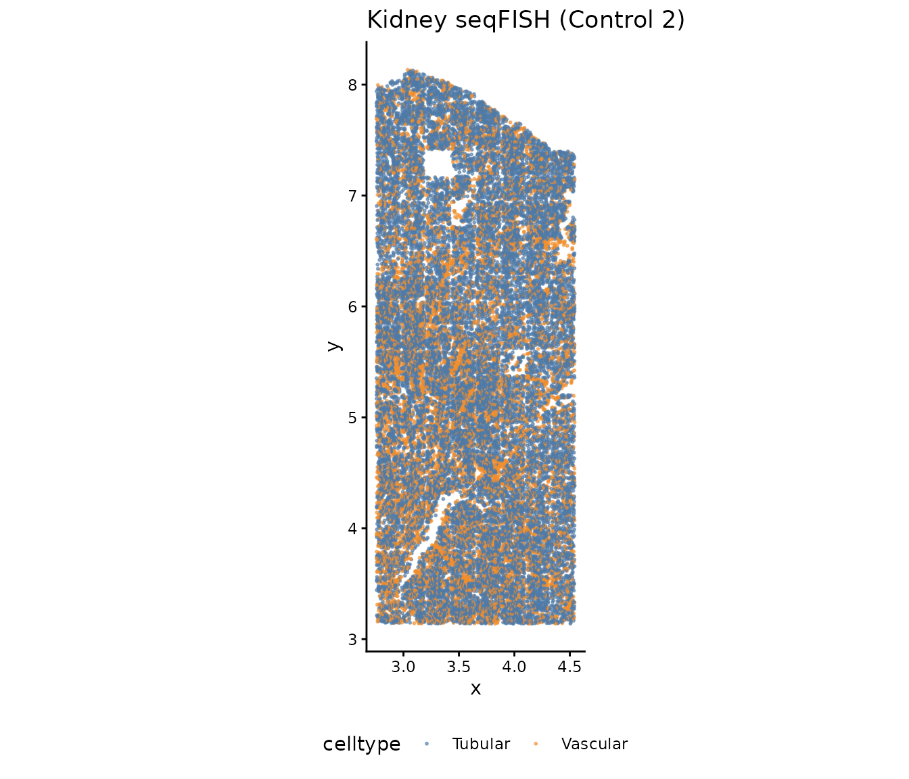

### Tubular subtypes along the nephron axis

The nephron has a known anatomical ordering from proximal to distal
tubule. CoPro uses this ordering as a biological prior:

``` r
subtype_df <- data.frame(
  x = dat$locationData$x,
  y = dat$locationData$y,
  subtype = dat$metaData$celltype,
  group = dat$cellTypes
)

# Tubular cells colored by segment
tub_df <- subtype_df[subtype_df$group == "Tubular", ]
segment_labels <- c("PTS1", "PTS2", "PTS3", "LOH-TL-C", "LOH-TL-JM",
                     "TAL_1", "TAL_2", "TAL_3", "DCT-CNT")
tub_df$subtype <- factor(tub_df$subtype, levels = segment_labels)

ggplot(tub_df, aes(x = x, y = y, color = subtype)) +
  geom_point(size = 0.8) +
  scale_color_brewer(palette = "Spectral") +
  coord_fixed() +
  ggtitle("Tubular subtypes (proximal -> distal)") +
  theme_classic()
```

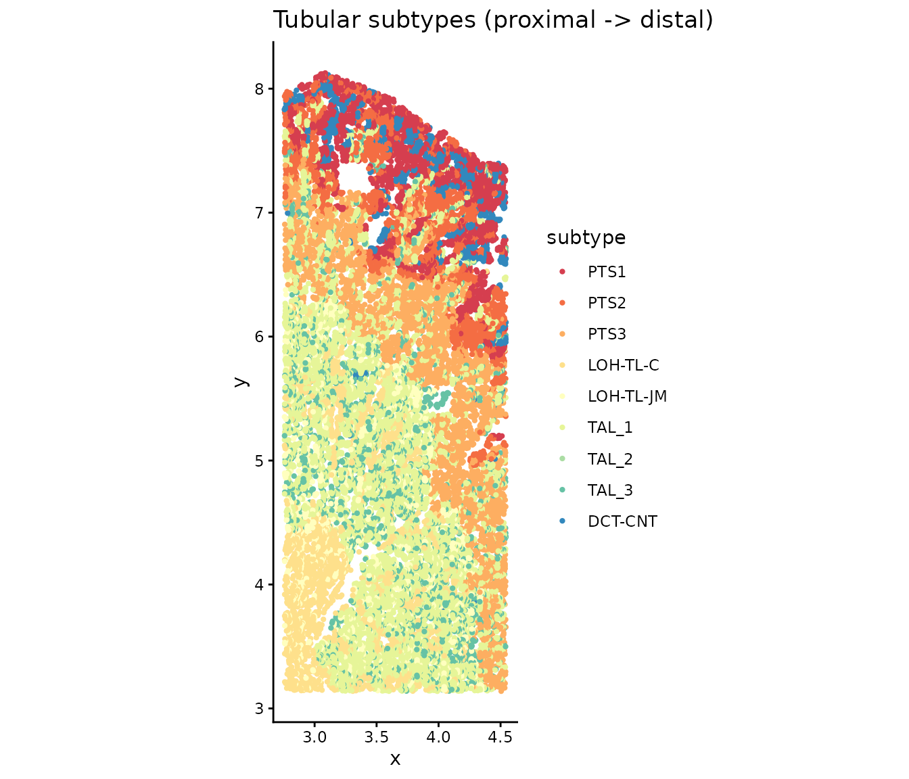

## Step 1: Create CoPro object and compute PCA

``` r
obj <- newCoProSingle(
  normalizedData = dat$normalizedData,
  locationData = dat$locationData,
  metaData = dat$metaData,
  cellTypes = dat$cellTypes
)

obj <- subsetData(obj, cellTypesOfInterest = c("Tubular", "Vascular"))

# For targeted spatial panels (seqFISH, ~1300 genes),
# use fewer PCs than for scRNA-seq
obj <- computePCA(obj, nPCA = 15, center = TRUE, scale. = TRUE)
```

    ## Input is dense (matrixarray), performing irlba pca...
    ## Input is dense (matrixarray), performing irlba pca...

## Step 2: Derive supervised tubular weight from nephron ordering

The key idea: we regress the known segment ordering onto the PCA scores
to find the PC-space direction that best recovers the corticomedullary
axis. This becomes our fixed tubular weight vector.

``` r
# Segment ordering: proximal (PTS1=1) to distal (DCT-CNT=6)
segment_order <- dat$segmentOrder
print(segment_order)
```

    ##      PTS1      PTS2      PTS3  LOH-TL-C LOH-TL-JM     TAL_1     TAL_2     TAL_3 
    ##         1         2         3         4         4         5         5         5 
    ##   DCT-CNT 
    ##         6

``` r
# Get tubular PCA scores
tubular_idx <- obj@cellTypesSub == "Tubular"
tubular_pca_x <- as.matrix(obj@pcaGlobal$Tubular$x)

# Assign ordered labels to tubular cells
tubular_meta <- obj@metaDataSub[tubular_idx, ]
ordered_labels <- segment_order[tubular_meta$celltype]

# OLS regression: find PC-space direction that recovers segment ordering
x_with_intercept <- cbind(1, tubular_pca_x)
w1_raw <- lm.fit(x = x_with_intercept, y = as.numeric(ordered_labels))$coefficients
w1_raw <- w1_raw[-1]  # drop intercept
w1_tubular <- w1_raw / sqrt(sum(w1_raw^2))  # unit-normalize

# Validate with Kendall tau
proj_scores <- as.vector(tubular_pca_x %*% matrix(w1_tubular, ncol = 1))
tau <- cor(proj_scores, ordered_labels, method = "kendall")
cat(sprintf("Kendall tau (tubular axis vs segment ordering): %.4f\n", tau))
```

    ## Kendall tau (tubular axis vs segment ordering): 0.8337

## Step 3: Derive supervised vascular weight via kernel regression

We compute the spatial kernel, smooth the tubular axis scores to each
vascular cell, and then regress vascular PCA scores against these
smoothed scores. This finds the vascular gene program that co-varies
with the nephron axis.

``` r
sigma_choice <- c(0.04, 0.08, 0.1, 0.15)
obj <- computeDistance(obj, distType = "Euclidean2D")
```

    ## normalizeDistance is set to TRUE, so distance will be normalized, so that 0.01 percentile distance will be scaled to 0.01
    ##         0%        25%        50%        75%       100% 
    ## 0.01661044 0.97355863 1.59208771 2.45716417 5.20528057 
    ## The scaling factor for normalizing distance is 0.6020311

``` r
obj <- computeKernelMatrix(obj, sigmaValues = sigma_choice)
```

    ## Computing pairwise kernel matrix for 2 cell types
    ## current sigma value is 0.04 
    ## current sigma value is 0.08 
    ## current sigma value is 0.1 
    ## current sigma value is 0.15

``` r
# Get vascular PCA scores
vasc_idx <- obj@cellTypesSub == "Vascular"
vasc_pca_x <- as.matrix(obj@pcaGlobal$Vascular$x)

# Cross-type kernel: vascular -> tubular
vasc_loc <- as.matrix(obj@locationDataSub[vasc_idx, c("x", "y")])
tub_loc <- as.matrix(obj@locationDataSub[tubular_idx, c("x", "y")])

dist_vt <- fields::rdist(vasc_loc, tub_loc)

# Gaussian kernel: K(d) = exp(-d^2 / sigma^2)
kij_vt <- exp(-dist_vt^2 / 0.1^2)
kij_vt[kij_vt < 5e-7] <- 0
up_qt <- quantile(kij_vt[kij_vt > 5e-7], 0.85)
kij_vt[kij_vt > up_qt] <- up_qt

# Kernel-smoothed tubular signal at each vascular cell
tubular_axis_scores <- tubular_pca_x %*% matrix(w1_tubular, ncol = 1)
y_vasc <- kij_vt %*% tubular_axis_scores
y_vasc <- scale(y_vasc, center = TRUE, scale = FALSE)

# Regress vascular PCA scores against smoothed tubular signal
w1_vasc_raw <- lm.fit(x = cbind(1, vasc_pca_x), y = as.vector(y_vasc))$coefficients
w1_vasc_raw <- w1_vasc_raw[-1]
w1_vasc <- w1_vasc_raw / sqrt(sum(w1_vasc_raw^2))  # unit-normalize
```

## Step 4: Run supervised CCA

``` r
obj <- runSkrCCA(obj, scalePCs = TRUE, maxIter = 500, nCC = 4,
                 transferred_weight_1 = list(
                   Tubular  = matrix(w1_tubular, ncol = 1),
                   Vascular = matrix(w1_vasc, ncol = 1)
                 ))
```

    ## Running skrCCA for sigma = 0.04

    ## [1] "Convergence reached at 0 iterations (Max diff = 1.985e-15 )"
    ## [1] "Convergence reached at 0 iterations (Max diff = 1.110e-15 )"
    ## [1] "Convergence reached at 0 iterations (Max diff = 5.128e-15 )"

    ## Running skrCCA for sigma = 0.08

    ## [1] "Convergence reached at 0 iterations (Max diff = 3.129e-15 )"
    ## [1] "Convergence reached at 0 iterations (Max diff = 1.665e-15 )"
    ## [1] "Convergence reached at 1 iterations (Max diff = 9.714e-16 )"

    ## Running skrCCA for sigma = 0.1

    ## [1] "Convergence reached at 1 iterations (Max diff = 1.110e-16 )"
    ## [1] "Convergence reached at 0 iterations (Max diff = 4.441e-16 )"
    ## [1] "Convergence reached at 0 iterations (Max diff = 2.165e-15 )"

    ## Running skrCCA for sigma = 0.15

    ## [1] "Convergence reached at 1 iterations (Max diff = 1.110e-16 )"
    ## [1] "Convergence reached at 0 iterations (Max diff = 3.331e-16 )"
    ## [1] "Convergence reached at 1 iterations (Max diff = 1.110e-16 )"

    ## Optimization succeeded for 4 sigma value(s): sigma_0.04, sigma_0.08, sigma_0.1, sigma_0.15

``` r
obj <- computeNormalizedCorrelation(obj)
```

    ## Calculating spectral norms,  depending on the data size, this may take a while. 
    ## Finished calculating spectral norms

``` r
obj <- computeGeneAndCellScores(obj)
obj <- computeRegressionGeneScores(obj)
```

    ## Computed regression gene scores for sigma=0.04, cellType='Tubular'

    ## Computed regression gene scores for sigma=0.04, cellType='Vascular'

    ## Computed regression gene scores for sigma=0.08, cellType='Tubular'

    ## Computed regression gene scores for sigma=0.08, cellType='Vascular'

    ## Computed regression gene scores for sigma=0.1, cellType='Tubular'

    ## Computed regression gene scores for sigma=0.1, cellType='Vascular'

    ## Computed regression gene scores for sigma=0.15, cellType='Tubular'

    ## Computed regression gene scores for sigma=0.15, cellType='Vascular'

## Results: Spatial analysis

### Normalized correlation across sigma values

``` r
ncorr <- getNormCorr(obj)

ggplot(ncorr, aes(x = sigmaValues, y = normalizedCorrelation, group = 1)) +
  geom_point() +
  geom_line() +
  facet_wrap(~ ct12 + CC_index) +
  xlab("Sigma") +
  ylab("Normalized Correlation") +
  ggtitle("Normalized correlation -- supervised nephron axis") +
  theme_minimal()
```

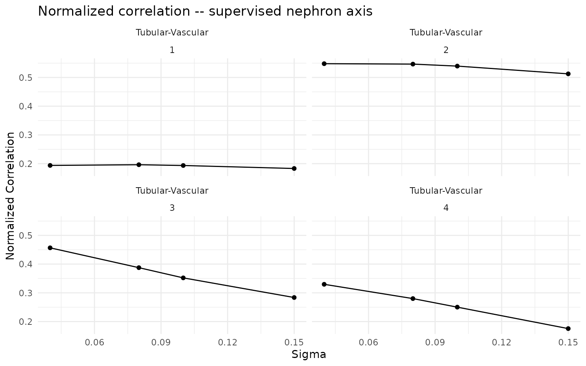

### Tubular cell scores in situ

The tubular cell scores should recapitulate the corticomedullary axis:

``` r
sigma_opt <- 0.1

cs <- getCellScoresInSitu(obj, sigmaValueChoice = sigma_opt)
cs_tub <- cs[cs$cellTypesSub == "Tubular", ]

# Quantile-clamp color scale for better contrast (3%/97%)
tub_lims <- quantile(cs_tub$cellScores, c(0.03, 0.97))

ggplot(cs_tub) +
  geom_point(aes(x = x, y = y, color = cellScores), size = 0.5, stroke = 0) +
  scale_color_viridis_c(option = "D", name = "Score",
                        limits = tub_lims, oob = scales::squish) +
  coord_fixed() +
  ggtitle("Tubular cell scores -- corticomedullary axis") +
  theme_classic() +
  theme(axis.line = element_blank(), axis.text = element_blank(),
        axis.ticks = element_blank(), axis.title = element_blank())
```

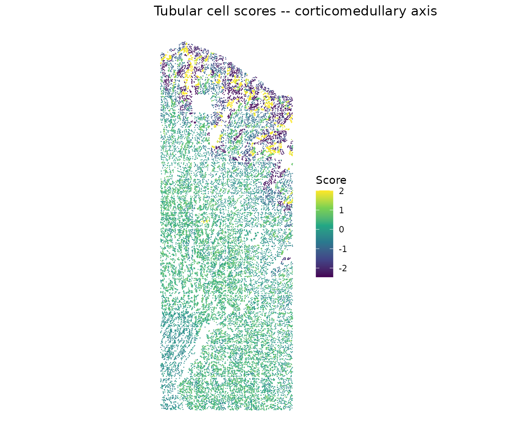

### Vascular cell scores in situ

The vascular program that co-varies with the nephron axis:

``` r
cs_vasc <- cs[cs$cellTypesSub == "Vascular", ]

vasc_lims <- quantile(cs_vasc$cellScores, c(0.03, 0.97))

ggplot(cs_vasc) +
  geom_point(aes(x = x, y = y, color = cellScores), size = 0.8, stroke = 0) +
  scale_color_viridis_c(option = "C", name = "Score",
                        limits = vasc_lims, oob = scales::squish) +
  coord_fixed() +
  ggtitle("Vascular cell scores -- cortical vs medullary separation") +
  theme_classic() +
  theme(axis.line = element_blank(), axis.text = element_blank(),
        axis.ticks = element_blank(), axis.title = element_blank())
```

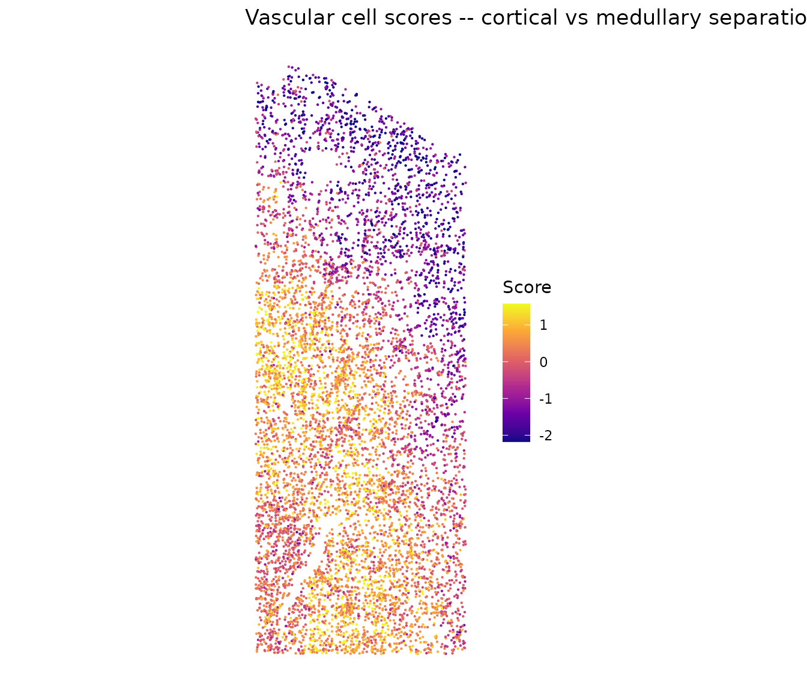

### CoPro score vs known nephron segment ordering

A key validation: CoPro cell scores should monotonically increase (or
decrease) along the known nephron segments, indicating successful
recovery of the corticomedullary axis.

``` r
# Add cell scores to metadata
tub_meta <- obj@metaDataSub[tubular_idx, ]
tub_meta$copro_score <- cs_tub$cellScores

seg_levels <- c("PTS1", "PTS2", "PTS3", "LOH-TL-C", "LOH-TL-JM",
                "TAL_1", "TAL_2", "TAL_3", "DCT-CNT")
tub_meta$segment <- factor(tub_meta$celltype, levels = seg_levels)

tau_all <- cor(tub_meta$copro_score,
               as.numeric(segment_order[as.character(tub_meta$celltype)]),
               method = "kendall")

ggplot(tub_meta[!is.na(tub_meta$segment), ]) +
  geom_boxplot(aes(x = segment, y = copro_score, fill = segment),
               outlier.size = 0.3) +
  scale_fill_brewer(palette = "Spectral", guide = "none") +
  labs(x = "Nephron segment", y = "CoPro score (CC1)",
       title = "CoPro score vs known nephron ordering",
       subtitle = sprintf("Kendall tau = %.3f", tau_all)) +
  theme_classic() +
  theme(axis.text.x = element_text(angle = 45, hjust = 1))
```

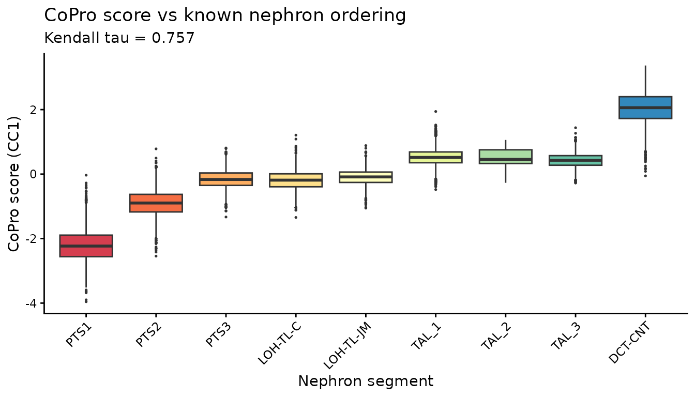

### Vascular subtype separation

The vascular subtypes (Vasc_1, Vasc_2, Vasc_3) should show differential
scores reflecting cortical vs medullary localization:

``` r
vasc_meta <- obj@metaDataSub[vasc_idx, ]
vasc_meta$copro_score <- cs_vasc$cellScores
vasc_meta$vasc_subtype <- vasc_meta$celltype

ggplot(vasc_meta) +
  geom_boxplot(aes(x = vasc_subtype, y = copro_score,
                   fill = vasc_subtype)) +
  scale_fill_brewer(palette = "Set2", guide = "none") +
  labs(x = "Vascular subtype", y = "CoPro score (CC1)",
       title = "Vascular subtypes along the corticomedullary axis") +
  theme_classic()
```

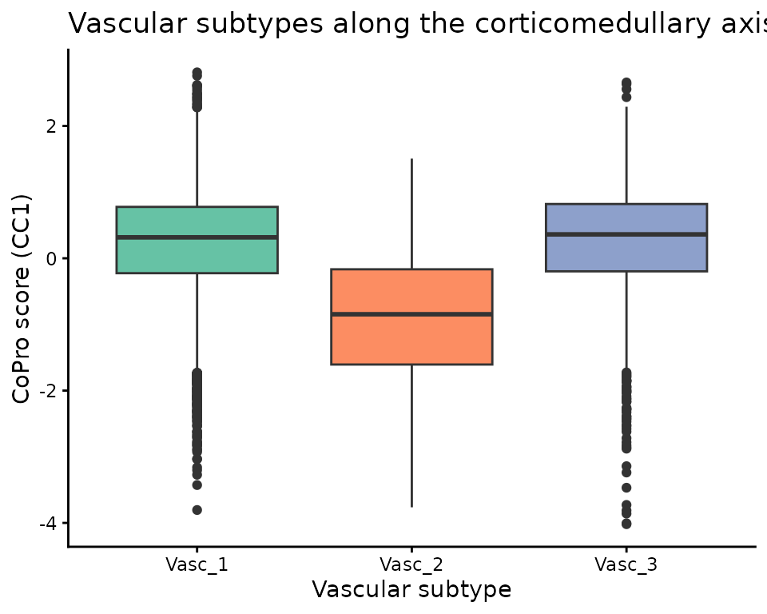

### Tubular-vascular cross-type correlation

``` r
df_corr <- getCorrTwoTypes(obj,
  sigmaValueChoice = sigma_opt,
  cellTypeA = "Tubular",
  cellTypeB = "Vascular",
  ccIndex = 1
)

ggplot(df_corr) +
  geom_point(aes(x = AK, y = B), size = 0.5, alpha = 0.5) +
  xlab("Tubular CC1 (spatially smoothed)") +
  ylab("Vascular CC1") +
  ggtitle("Tubular-Vascular co-progression along nephron axis") +
  theme_minimal()
```

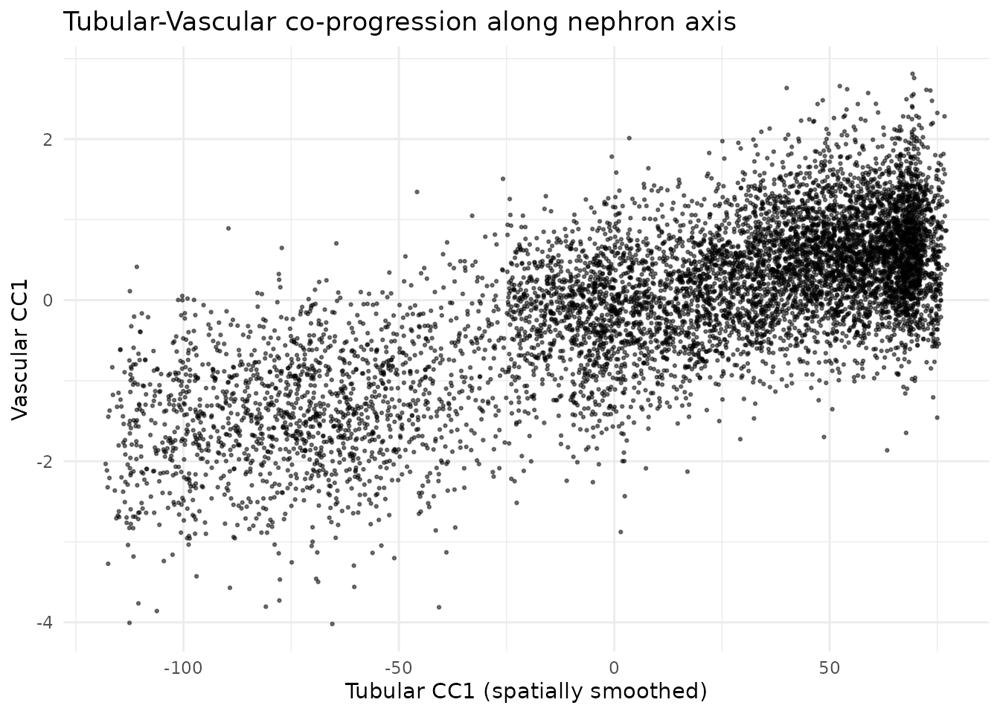

### Top gene weights (spatial panel)

``` r
key <- paste0("geneScores|sigma", sigma_opt, "|Vascular")
gs_vasc <- obj@geneScoresRegression[[key]]

gs_cc1 <- gs_vasc[, 1]
top_genes <- head(sort(abs(gs_cc1), decreasing = TRUE), 20)
top_df <- data.frame(
  gene = factor(names(top_genes), levels = rev(names(top_genes))),
  weight = gs_cc1[names(top_genes)]
)
top_df$direction <- ifelse(top_df$weight > 0, "cortical", "medullary")

ggplot(top_df, aes(x = gene, y = weight, fill = direction)) +
  geom_col() +
  coord_flip() +
  scale_fill_manual(values = c("cortical" = "#e41a1c",
                                "medullary" = "#377eb8")) +
  ggtitle("Top 20 Vascular genes (CC1, regression)") +
  theme_classic() +
  theme(legend.position = "bottom")
```

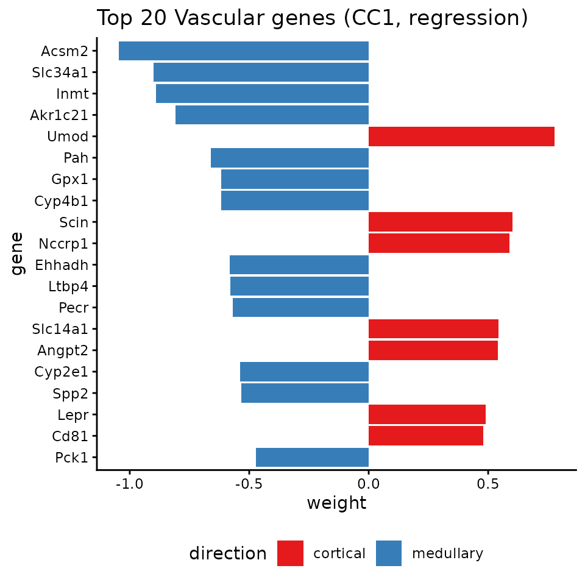

``` r
key_tub <- paste0("geneScores|sigma", sigma_opt, "|Tubular")
gs_tub <- obj@geneScoresRegression[[key_tub]]

gs_tub_cc1 <- gs_tub[, 1]
top_tub <- head(sort(abs(gs_tub_cc1), decreasing = TRUE), 20)
top_tub_df <- data.frame(
  gene = factor(names(top_tub), levels = rev(names(top_tub))),
  weight = gs_tub_cc1[names(top_tub)]
)
top_tub_df$direction <- ifelse(top_tub_df$weight > 0, "distal", "proximal")

ggplot(top_tub_df, aes(x = gene, y = weight, fill = direction)) +
  geom_col() +
  coord_flip() +
  scale_fill_manual(values = c("distal" = "#e41a1c",
                                "proximal" = "#377eb8")) +
  ggtitle("Top 20 Tubular genes (CC1, regression)") +
  theme_classic() +
  theme(legend.position = "bottom")
```

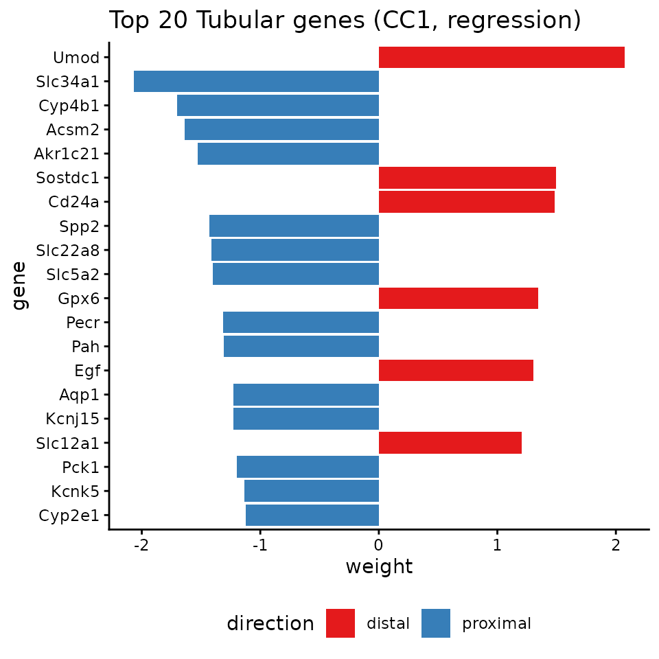

## Score transfer to scRNA-seq

CoPro gene weights learned from the spatial (seqFISH) panel can be
**transferred** to scRNA-seq data. The
[`transfer_scores()`](https://zhen-miao.github.io/CoPro/reference/transfer_scores.md)
function:

1.  **Quantile-normalizes** each gene in the scRNA-seq data to match the
    seqFISH distribution
2.  **Standardizes** using the seqFISH mean and SD
3.  **Multiplies** by the gene weight vector to produce a per-cell score

This lets us visualize the corticomedullary axis on independent cell
populations and identify axis-associated genes across the full
transcriptome.

### Step 1: Extract gene weights and spatial expression

``` r
# Get regression gene weights for vascular cells (CC1)
gs_vasc_cc1 <- gs_vasc[, 1, drop = FALSE]  # genes x 1 matrix

# Get the seqFISH expression matrix for vascular cells (reference)
seqfish_vasc_expr <- obj@normalizedDataSub[vasc_idx, ]

# scRNA-seq expression: sparse genes x cells -> dense cells x genes
sc_vasc_full <- t(as.matrix(dat$scRNA_vasc_expr))

# Align genes: use intersection of seqFISH, scRNA-seq, and gene weights
shared_genes <- intersect(colnames(seqfish_vasc_expr), colnames(sc_vasc_full))
shared_genes <- intersect(shared_genes, rownames(gs_vasc_cc1))
cat("Shared genes for transfer:", length(shared_genes), "\n")
```

    ## Shared genes for transfer: 632

``` r
seqfish_vasc_shared <- as.matrix(seqfish_vasc_expr[, shared_genes])
sc_vasc_shared <- sc_vasc_full[, shared_genes]
gs_shared <- gs_vasc_cc1[shared_genes, , drop = FALSE]
```

### Step 2: Transfer scores

``` r
# transfer_scores: quantile normalize scRNA-seq to seqFISH,
# standardize, then multiply by gene weights
vasc_transferred <- transfer_scores(
  mat_A = seqfish_vasc_shared,   # reference (seqFISH)
  mat_B = sc_vasc_shared,        # target (scRNA-seq)
  gs_ct = gs_shared,             # gene weights
  use_quantile_normalization = TRUE,
  gs_weight_threshold = 0,
  verbose = FALSE
)

cat("Transferred vascular scores:", length(vasc_transferred), "cells\n")
```

    ## Transferred vascular scores: 10198 cells

``` r
cat("Score range:", round(range(vasc_transferred), 2), "\n")
```

    ## Score range: -33.78 13.99

### Step 3: Transfer nephron scores

``` r
# Same procedure for nephron/tubular cells
gs_tub_cc1 <- gs_tub[, 1, drop = FALSE]

seqfish_tub_expr <- obj@normalizedDataSub[tubular_idx, ]

sc_neph_full <- t(as.matrix(dat$scRNA_neph_expr))

shared_genes_n <- intersect(colnames(seqfish_tub_expr), colnames(sc_neph_full))
shared_genes_n <- intersect(shared_genes_n, rownames(gs_tub_cc1))

neph_transferred <- transfer_scores(
  mat_A = as.matrix(seqfish_tub_expr[, shared_genes_n]),
  mat_B = sc_neph_full[, shared_genes_n],
  gs_ct = gs_tub_cc1[shared_genes_n, , drop = FALSE],
  use_quantile_normalization = TRUE,
  gs_weight_threshold = 0,
  verbose = FALSE
)

cat("Transferred nephron scores:", length(neph_transferred), "cells\n")
```

    ## Transferred nephron scores: 9117 cells

## Results: scRNA-seq transfer

### Nephron UMAP colored by transferred CoPro score

``` r
neph_umap <- dat$scRNA_neph_umap
neph_umap$axis_score <- neph_transferred[rownames(neph_umap), 1]
neph_umap_filt <- neph_umap[!is.na(neph_umap$agg_label), ]

ggplot(neph_umap_filt[!is.na(neph_umap_filt$axis_score), ],
       aes(x = UMAP1, y = UMAP2, color = axis_score)) +
  geom_point(size = 0.3, alpha = 0.5) +
  scale_color_viridis_c(option = "D") +
  theme_classic(base_size = 10) +
  theme(axis.line = element_blank(), axis.ticks = element_blank(),
        axis.title = element_blank(), axis.text = element_blank()) +
  labs(title = "Transferred CoPro score (nephron)", color = "Score")
```

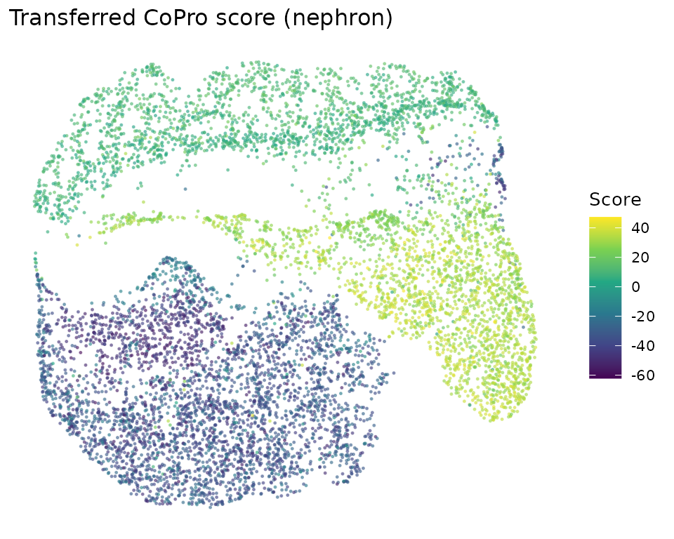

### Nephron UMAP colored by cell type

``` r
seg_levels_agg <- c("PTS1", "PTS2", "PTS3", "LOH-TL-C", "LOH-TL-JM",
                     "TAL", "DCT-CNT")

neph_umap_filt$agg_label <- factor(neph_umap_filt$agg_label,
                                    levels = seg_levels_agg)

seg_colors <- c(
  "PTS1" = "#08519c", "PTS2" = "#3182bd", "PTS3" = "#6baed6",
  "LOH-TL-C" = "#006d2c", "LOH-TL-JM" = "#31a354",
  "TAL" = "#e6550d", "DCT-CNT" = "#7a0177"
)

ggplot(neph_umap_filt[!is.na(neph_umap_filt$agg_label), ],
       aes(x = UMAP1, y = UMAP2, color = agg_label)) +
  geom_point(size = 0.3, alpha = 0.5) +
  scale_color_manual(values = seg_colors) +
  theme_classic(base_size = 10) +
  theme(axis.line = element_blank(), axis.ticks = element_blank(),
        axis.title = element_blank(), axis.text = element_blank()) +
  labs(title = "Nephron cell type annotation", color = "Segment") +
  guides(color = guide_legend(override.aes = list(size = 2)))
```

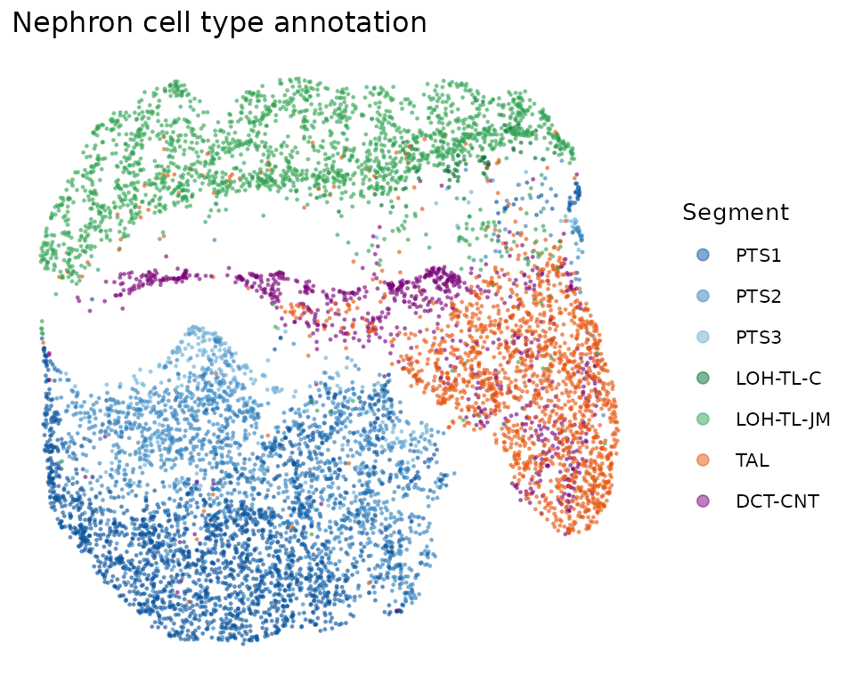

### Nephron boxplot by segment

Transferred CoPro scores recapitulate the nephron segment ordering in
the independent scRNA-seq dataset:

``` r
ont_to_spatial <- dat$scRNA_ont_to_spatial

neph_box <- data.frame(
  axis_score = neph_transferred[, 1],
  ont_id = neph_umap[rownames(neph_transferred), "ont_id"],
  stringsAsFactors = FALSE
)
neph_box$agg_label <- ont_to_spatial[as.character(neph_box$ont_id)]
neph_box <- neph_box[!is.na(neph_box$agg_label), ]
neph_box$agg_label <- factor(neph_box$agg_label, levels = seg_levels_agg)

ggplot(neph_box, aes(x = agg_label, y = axis_score, fill = agg_label)) +
  geom_boxplot(outlier.size = 0.3, lwd = 0.3) +
  scale_fill_manual(values = seg_colors, guide = "none") +
  labs(x = "Cell type", y = "CoPro axis score",
       title = "Transferred score by nephron segment (scRNA-seq)") +
  theme_classic() +
  theme(axis.text.x = element_text(angle = 45, hjust = 1, size = 9))
```

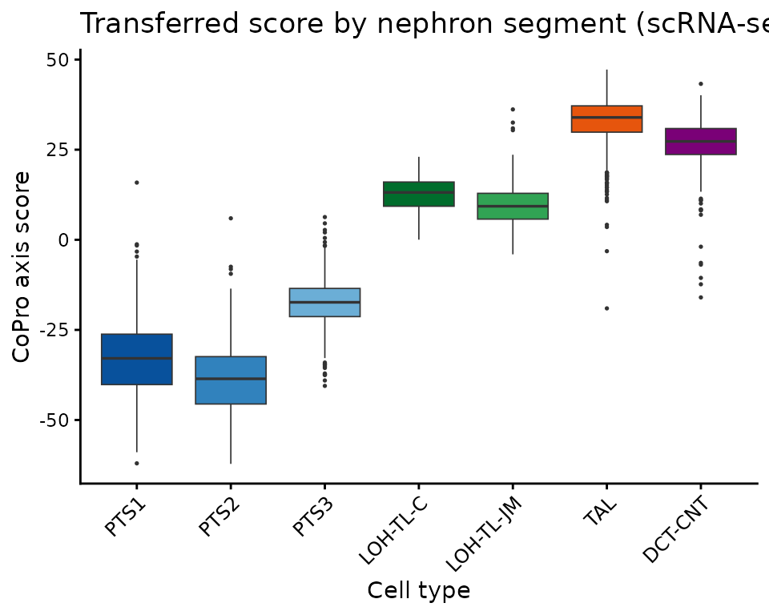

### Vascular UMAP colored by transferred CoPro score

``` r
vasc_umap <- dat$scRNA_vasc_umap
vasc_umap$axis_score <- vasc_transferred[rownames(vasc_umap), 1]

q05 <- quantile(vasc_umap$axis_score, 0.05, na.rm = TRUE)
q95 <- quantile(vasc_umap$axis_score, 0.95, na.rm = TRUE)

ggplot(vasc_umap[!is.na(vasc_umap$axis_score), ],
       aes(x = UMAP1, y = UMAP2, color = axis_score)) +
  geom_point(size = 0.3, alpha = 0.5) +
  scale_color_viridis_c(option = "C",
                        limits = c(q05, q95), oob = scales::squish) +
  theme_classic(base_size = 10) +
  theme(axis.line = element_blank(), axis.ticks = element_blank(),
        axis.title = element_blank(), axis.text = element_blank()) +
  labs(title = "Transferred CoPro score (vasculature)", color = "Score")
```

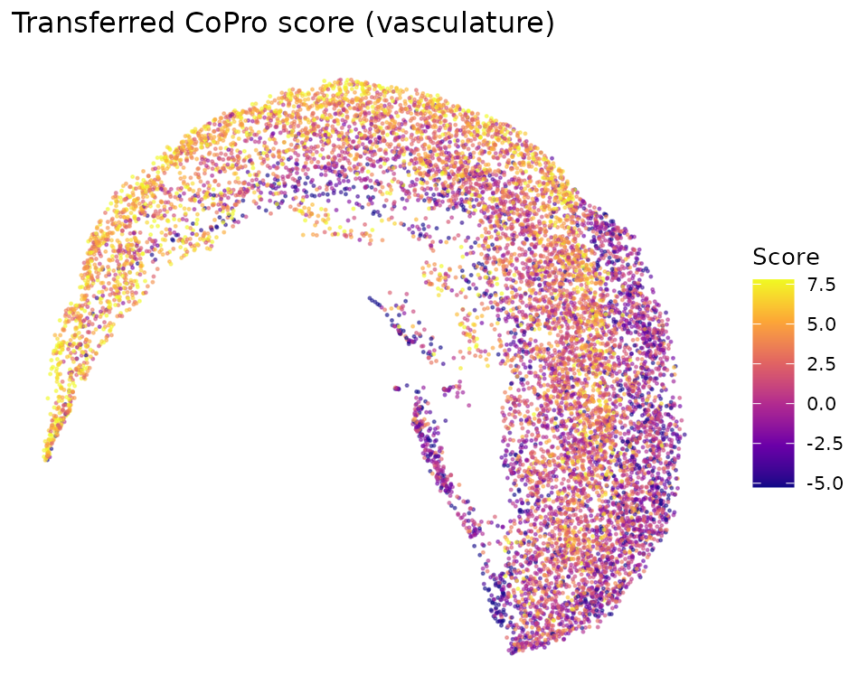

### Vascular UMAP colored by cluster

``` r
ggplot(vasc_umap, aes(x = UMAP1, y = UMAP2, color = cluster)) +
  geom_point(size = 0.3, alpha = 0.5) +
  theme_classic(base_size = 10) +
  theme(axis.line = element_blank(), axis.ticks = element_blank(),
        axis.title = element_blank(), axis.text = element_blank()) +
  labs(title = "Vascular cluster annotation", color = "Cluster") +
  guides(color = guide_legend(override.aes = list(size = 2)))
```

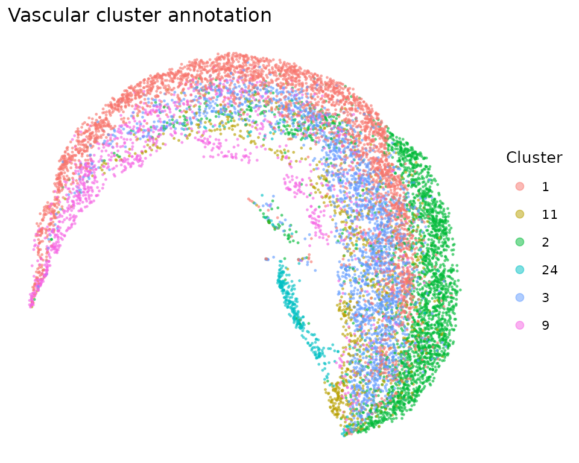

### Vascular boxplot by cluster

Transferred scores separate vascular clusters along the corticomedullary
axis:

``` r
vasc_box <- data.frame(
  axis_score = vasc_transferred[, 1],
  cluster = vasc_umap[rownames(vasc_transferred), "cluster"],
  stringsAsFactors = FALSE
)

# Order clusters by median score
cluster_medians <- tapply(vasc_box$axis_score, vasc_box$cluster, median)
vasc_box$cluster <- factor(vasc_box$cluster,
                            levels = names(sort(cluster_medians)))

ggplot(vasc_box, aes(x = cluster, y = axis_score, fill = cluster)) +
  geom_boxplot(outlier.size = 0.3, lwd = 0.4) +
  labs(x = "Cluster", y = "CoPro axis score",
       title = "Transferred score by vascular cluster (scRNA-seq)") +
  theme_classic() + theme(legend.position = "none")
```

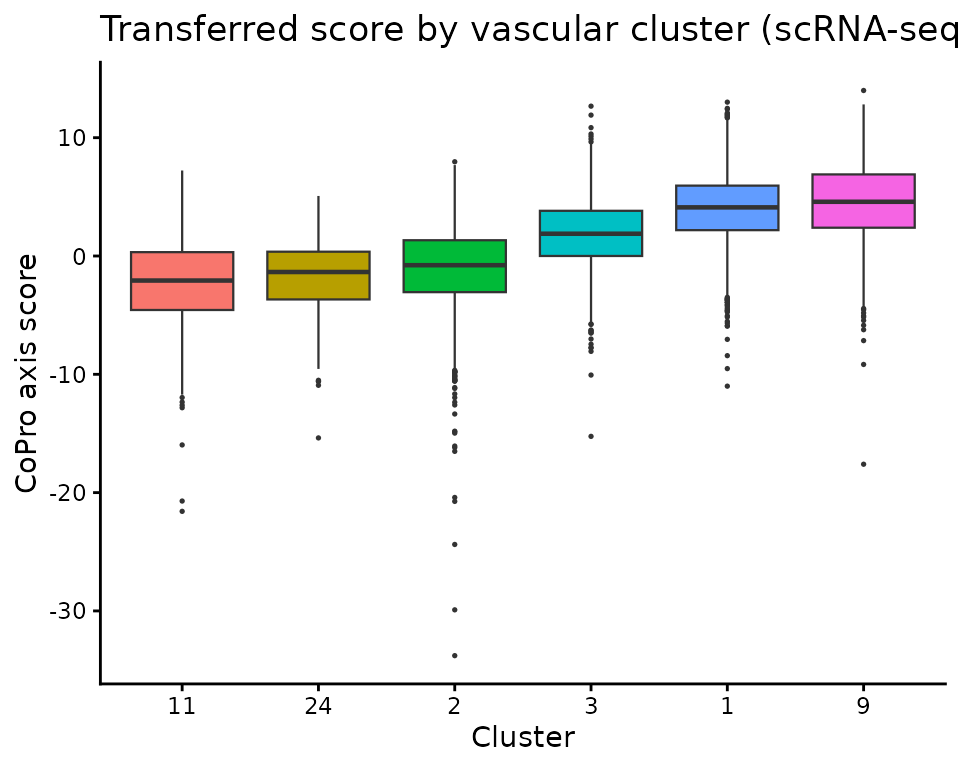

### Full-transcriptome regression

After transferring CoPro scores using the shared spatial panel genes,
each scRNA-seq cell has an axis score. We then regress **every gene in
the full scRNA-seq transcriptome** against this score. This is the key
advantage of score transfer: the spatial panel provides the axis, but
the full transcriptome reveals axis-associated genes beyond the panel.

``` r
# Use transferred vascular scores
vasc_scores_vec <- vasc_transferred[, 1]

# Remove outlier cells (1st/99th percentile)
q01 <- quantile(vasc_scores_vec, 0.01)
q99 <- quantile(vasc_scores_vec, 0.99)
keep <- vasc_scores_vec >= q01 & vasc_scores_vec <= q99
vasc_scores_filt <- vasc_scores_vec[keep]

# Full-transcriptome expression for regression (all genes, not just shared)
sc_vasc_filt <- sc_vasc_full[names(vasc_scores_filt), ]

# Filter genes: non-zero SD
gene_sd <- apply(sc_vasc_filt, 2, sd)
sc_vasc_filt <- sc_vasc_filt[, gene_sd >= 1e-5, drop = FALSE]

# Regress each gene against the axis score (centered)
ax_c <- vasc_scores_filt - mean(vasc_scores_filt)
reg_results <- data.frame(
  gene = colnames(sc_vasc_filt),
  beta = NA_real_, r = NA_real_, p_value = NA_real_,
  mean_expr = colMeans(sc_vasc_filt),
  stringsAsFactors = FALSE
)

for (i in seq_len(ncol(sc_vasc_filt))) {
  y <- sc_vasc_filt[, i] - mean(sc_vasc_filt[, i])
  ct <- cor.test(ax_c, y)
  reg_results$beta[i] <- coef(lm(y ~ ax_c))[2]
  reg_results$r[i] <- ct$estimate
  reg_results$p_value[i] <- ct$p.value
}

reg_results$fdr <- p.adjust(reg_results$p_value, method = "BH")

cat("Significant genes (FDR < 0.05):",
    sum(reg_results$fdr < 0.05, na.rm = TRUE), "\n")
```

    ## Significant genes (FDR < 0.05): 3243

``` r
# MA plot: beta on x-axis, log expression on y-axis
reg_results$log_mean_expr <- log(reg_results$mean_expr + 1)

# Known vascular zone markers from Barry et al. 2019
known_cortical  <- c("Gata5", "Tbx3", "Prdm1", "Pbx1", "Klf4",
                      "Ehd3", "Lpl", "Sema5a",
                      "Slc6a6", "Slc16a2",
                      "Efnb2", "Hey1", "Dll4", "Notch4", "Sox17", "Pdgfb")
known_medullary <- c("Nr2f2", "Plvap", "Cryab", "Ephb4",
                      "Slc14a1", "Aqp1", "Slco4a1", "Igfbp7")
known_markers <- c(known_cortical, known_medullary)

reg_results$is_known <- reg_results$gene %in% known_markers
reg_results$direction <- ifelse(
  reg_results$fdr < 0.05 & (reg_results$is_known |
    abs(reg_results$beta) >= 0.02),
  ifelse(reg_results$beta > 0, "Medullary", "Cortical"),
  "NS"
)

# Label known markers + large-beta genes
reg_results$label <- ifelse(
  reg_results$is_known | (reg_results$direction != "NS" &
                           abs(reg_results$beta) >= 0.05),
  reg_results$gene, ""
)

# Three-layer plot matching manuscript style
df_ns    <- reg_results[reg_results$direction == "NS", ]
df_conc  <- reg_results[reg_results$direction != "NS" & !reg_results$is_known, ]
df_known <- reg_results[reg_results$is_known, ]

ggplot(reg_results, aes(x = beta, y = log_mean_expr)) +
  geom_point(data = df_ns, color = "grey80", size = 0.3, alpha = 0.3) +
  geom_point(data = df_conc, aes(color = direction), size = 0.5, alpha = 0.4) +
  geom_point(data = df_known, aes(color = direction), size = 2.5,
             shape = 17, alpha = 0.9) +
  geom_text_repel(
    data = reg_results[reg_results$label != "", ],
    aes(label = label, color = direction),
    size = 2.5, max.overlaps = 30, segment.size = 0.2,
    fontface = "italic", show.legend = FALSE,
    min.segment.length = 0.2, box.padding = 0.35
  ) +
  scale_color_manual(
    values = c("NS" = "grey80", "Medullary" = "#2166ac", "Cortical" = "#b2182b"),
    breaks = c("Cortical", "Medullary"),
    labels = c("Cortical (GC)", "Medullary (vasa recta)"),
    name = NULL
  ) +
  labs(x = expression(beta ~ (regression ~ coefficient)),
       y = expression(ln(mean ~ expression + 1)),
       title = "Vascular full-transcriptome regression") +
  theme_classic(base_size = 11) +
  theme(legend.position = "bottom")
```

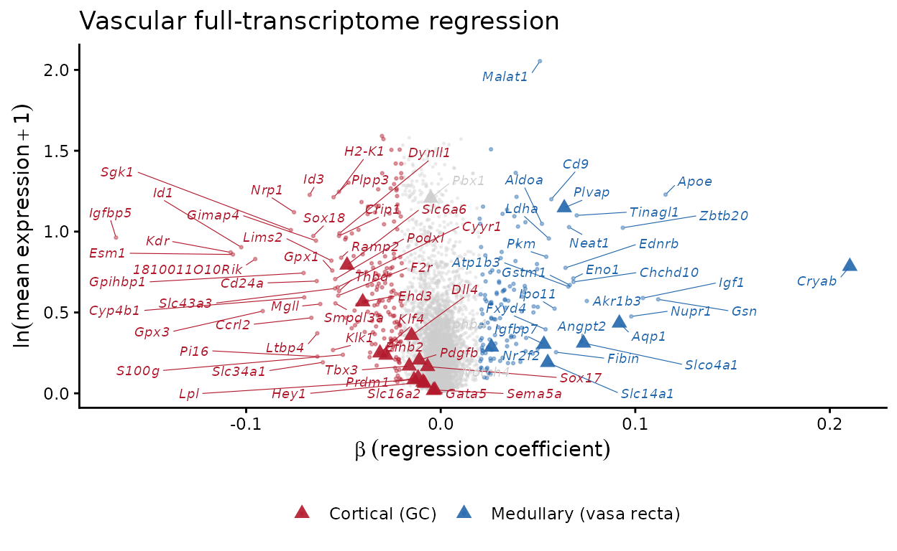

## Key takeaways

1.  **Supervised mode** lets you leverage known biology (nephron segment
    ordering) to guide one axis while CoPro discovers the co-varying
    program in the other cell type.
2.  **Regression gene scores** (`computeRegressionGeneScores`) provide
    more reproducible gene-level results than PCA back-projection,
    especially for targeted spatial panels.
3.  **Score transfer** via
    [`transfer_scores()`](https://zhen-miao.github.io/CoPro/reference/transfer_scores.md)
    enables cross-platform analysis: learn spatial patterns from
    seqFISH/MERFISH, then validate and extend to scRNA-seq. The key
    steps are quantile normalization, standardization, and matrix
    multiplication.
4.  **Full-transcriptome regression** after transfer identifies
    axis-associated genes beyond the spatial panel, leveraging the full
    scRNA-seq transcriptome.
5.  **nPCA = 10–15** is recommended for seqFISH/MERFISH panels (500–2000
    genes). Using too many PCs adds unstable noise dimensions.
6.  Since this vignette uses a single spatial sample (Ctrl2), results
    may differ slightly from the manuscript which averages across three
    biological replicates.

## Session info

``` r
sessionInfo()
```

    ## R version 4.5.3 (2026-03-11)
    ## Platform: x86_64-pc-linux-gnu
    ## Running under: Ubuntu 24.04.4 LTS
    ## 
    ## Matrix products: default
    ## BLAS:   /usr/lib/x86_64-linux-gnu/openblas-pthread/libblas.so.3 
    ## LAPACK: /usr/lib/x86_64-linux-gnu/openblas-pthread/libopenblasp-r0.3.26.so;  LAPACK version 3.12.0
    ## 
    ## locale:
    ##  [1] LC_CTYPE=C.UTF-8       LC_NUMERIC=C           LC_TIME=C.UTF-8       
    ##  [4] LC_COLLATE=C.UTF-8     LC_MONETARY=C.UTF-8    LC_MESSAGES=C.UTF-8   
    ##  [7] LC_PAPER=C.UTF-8       LC_NAME=C              LC_ADDRESS=C          
    ## [10] LC_TELEPHONE=C         LC_MEASUREMENT=C.UTF-8 LC_IDENTIFICATION=C   
    ## 
    ## time zone: UTC
    ## tzcode source: system (glibc)
    ## 
    ## attached base packages:
    ## [1] stats     graphics  grDevices utils     datasets  methods   base     
    ## 
    ## other attached packages:
    ## [1] scales_1.4.0  ggrepel_0.9.8 ggplot2_4.0.2 CoPro_0.6.1  
    ## 
    ## loaded via a namespace (and not attached):
    ##  [1] rappdirs_0.3.4     sass_0.4.10        generics_0.1.4     lattice_0.22-9    
    ##  [5] digest_0.6.39      magrittr_2.0.5     timechange_0.4.0   evaluate_1.0.5    
    ##  [9] grid_4.5.3         RColorBrewer_1.1-3 fastmap_1.2.0      maps_3.4.3        
    ## [13] jsonlite_2.0.0     Matrix_1.7-4       httr_1.4.8         spam_2.11-3       
    ## [17] viridisLite_0.4.3  httr2_1.2.2        textshaping_1.0.5  jquerylib_0.1.4   
    ## [21] cli_3.6.6          rlang_1.2.0        gitcreds_0.1.2     withr_3.0.2       
    ## [25] cachem_1.1.0       yaml_2.3.12        tools_4.5.3        parallel_4.5.3    
    ## [29] memoise_2.0.1      dplyr_1.2.1        curl_7.0.0         vctrs_0.7.3       
    ## [33] R6_2.6.1           lubridate_1.9.5    matrixStats_1.5.0  lifecycle_1.0.5   
    ## [37] fs_2.0.1           ragg_1.5.2         irlba_2.3.7        pkgconfig_2.0.3   
    ## [41] desc_1.4.3         pkgdown_2.2.0      pillar_1.11.1      bslib_0.10.0      
    ## [45] gtable_0.3.6       glue_1.8.0         gh_1.5.0           Rcpp_1.1.1-1      
    ## [49] fields_17.1        systemfonts_1.3.2  xfun_0.57          tibble_3.3.1      
    ## [53] tidyselect_1.2.1   knitr_1.51         farver_2.1.2       htmltools_0.5.9   
    ## [57] labeling_0.4.3     rmarkdown_2.31     piggyback_0.1.5    dotCall64_1.2     
    ## [61] compiler_4.5.3     S7_0.2.1-1
