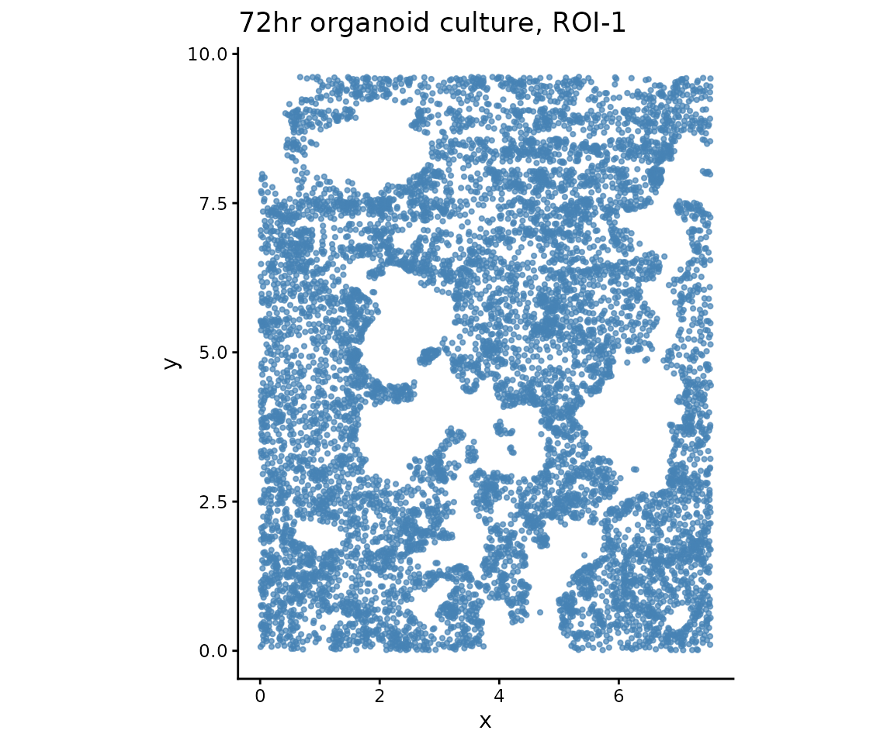
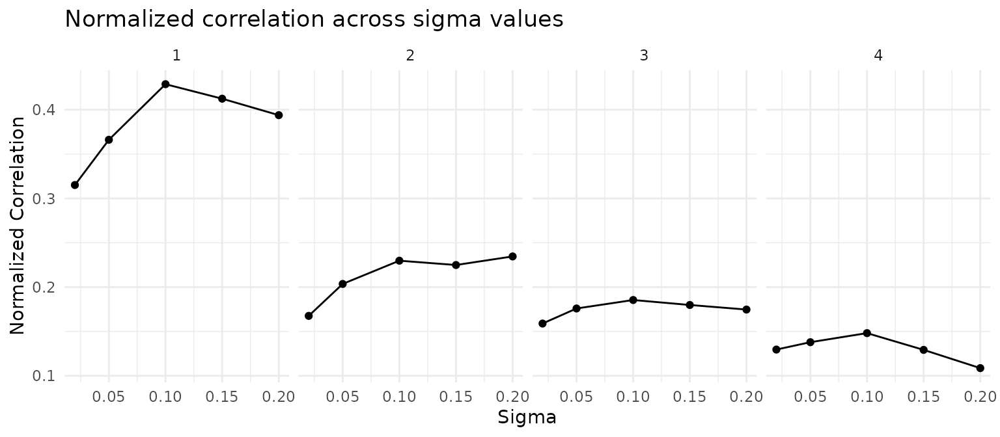
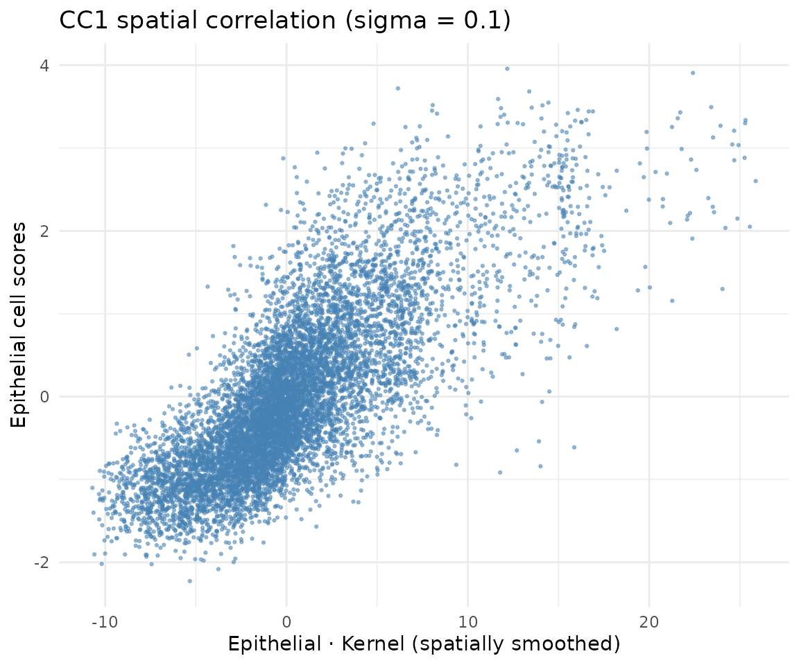
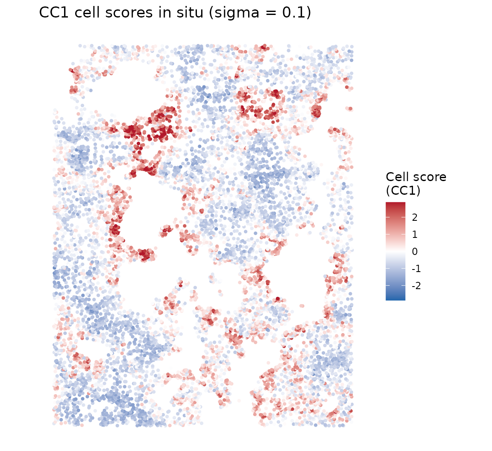
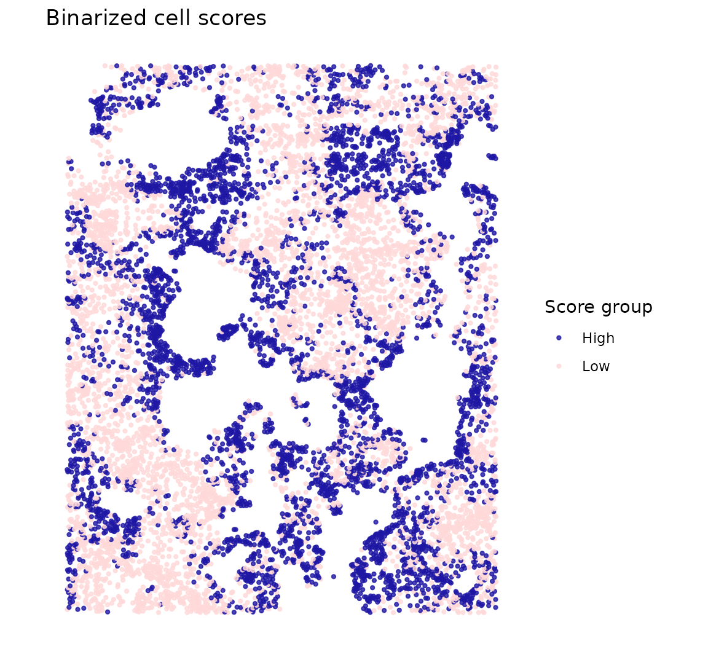
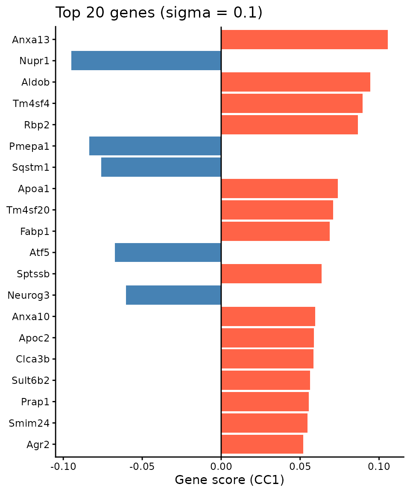

# Within-cell-type spatial patterns (Organoid)

## Overview

This vignette demonstrates how CoPro detects **within-cell-type spatial
patterns** using a single cell type. We analyze a 72-hour intestinal
organoid culture imaged by seqFISH, where all cells are epithelial.
CoPro identifies spatially organized gene programs—self-organization
patterns that emerge within a single population.

**What CoPro finds here:** The spatial co-progression of epithelial
cells captures the crypt–villus axis of the organoid—cells along the
same developmental trajectory cluster spatially.

## Load packages

``` r
library(CoPro)
library(ggplot2)
```

## Download and load data

``` r
data_path <- copro_download_data("organoid")
```

    ## Downloading copro_organoid.rds from GitHub Release 'data-v1'...

    ## Downloaded to: /home/runner/.cache/R/CoPro/copro_organoid.rds

``` r
dat <- readRDS(data_path)

cat("Cells:", nrow(dat$normalizedData), "\n")
```

    ## Cells: 9140

``` r
cat("Genes:", ncol(dat$normalizedData), "\n")
```

    ## Genes: 140

The dataset contains:

- `normalizedData`: expression matrix (cells x genes), capped at 95th
  percentile, DESeq2 size-factor normalized, log1p-transformed
- `locationData`: spatial coordinates (pixels / 5000)
- `metaData`: cell attributes
- `cellTypes`: all cells labeled as “Epithelial”

## Visualize tissue layout

``` r
plot_df <- data.frame(
  x = dat$locationData$x,
  y = dat$locationData$y
)

ggplot(plot_df, aes(x = x, y = y)) +
  geom_point(color = "steelblue", size = 0.8, alpha = 0.7) +
  coord_fixed() +
  ggtitle("72hr organoid culture, ROI-1") +
  xlab("x") + ylab("y") +
  theme_classic()
```



## Create CoPro object

``` r
obj <- newCoProSingle(
  normalizedData = dat$normalizedData,
  locationData = dat$locationData,
  metaData = dat$metaData,
  cellTypes = dat$cellTypes
)

obj <- subsetData(obj, cellTypesOfInterest = "Epithelial")
```

## Run the CoPro pipeline

``` r
# PCA
obj <- computePCA(obj, nPCA = 30, center = TRUE, scale. = TRUE)
```

    ## Input is dense (matrixarray), performing irlba pca...

``` r
# Spatial distance (no normalization for this dataset)
obj <- computeDistance(obj, distType = "Euclidean2D",
                       normalizeDistance = FALSE)
```

    ##         0%        25%        50%        75%       100% 
    ##  0.0412587  2.8279594  4.4908040  6.1964445 12.1367594

``` r
# Test multiple sigma values
sigma_choice <- c(0.01, 0.02, 0.05, 0.1, 0.15, 0.2)
obj <- computeKernelMatrix(obj, sigmaValues = sigma_choice,
                            upperQuantile = 0.85,
                            normalizeKernel = FALSE,
                            lowerLimit = 5e-7)
```

    ## Computing kernel matrix for one cell type
    ## current sigma value is 0.01

    ## Warning in .CheckSigmaValuesToRemove(kernel_current = kernel_current,
    ## lowerLimit = lowerLimit, : Kernel matrix for cell types Epithelial and
    ## Epithelial with sigma = 0.01 contains too many zeros. Specifically, less than
    ## 0.0218818380743982 % total counts are above the threshold

    ## Warning in .CheckSigmaValuesToRemove(kernel_current = kernel_current,
    ## lowerLimit = lowerLimit, : Dropping sigma value of 0.01 because all Gaussian
    ## kernel values are too small, which will not produce meaningful results.

    ## current sigma value is 0.02 
    ## current sigma value is 0.05 
    ## current sigma value is 0.1 
    ## current sigma value is 0.15 
    ## current sigma value is 0.2 
    ## removing 1 sigma values

``` r
# Sparse kernel CCA
obj <- runSkrCCA(obj, scalePCs = TRUE, maxIter = 500, nCC = 4)
```

    ## Running skrCCA for sigma = 0.02

    ## [1] "Convergence reached at 18 iterations (Max diff = 6.102e-06 )"
    ## [1] "Convergence reached at 0 iterations (Max diff = 4.163e-16 )"
    ## [1] "Convergence reached at 0 iterations (Max diff = 2.220e-16 )"
    ## [1] "Convergence reached at 0 iterations (Max diff = 4.441e-16 )"

    ## Running skrCCA for sigma = 0.05

    ## [1] "Convergence reached at 19 iterations (Max diff = 9.844e-06 )"
    ## [1] "Convergence reached at 0 iterations (Max diff = 2.498e-16 )"
    ## [1] "Convergence reached at 0 iterations (Max diff = 2.776e-16 )"
    ## [1] "Convergence reached at 0 iterations (Max diff = 4.441e-16 )"

    ## Running skrCCA for sigma = 0.1

    ## [1] "Convergence reached at 20 iterations (Max diff = 8.907e-06 )"
    ## [1] "Convergence reached at 0 iterations (Max diff = 3.747e-16 )"
    ## [1] "Convergence reached at 0 iterations (Max diff = 4.580e-16 )"
    ## [1] "Convergence reached at 0 iterations (Max diff = 5.412e-16 )"

    ## Running skrCCA for sigma = 0.15

    ## [1] "Convergence reached at 18 iterations (Max diff = 8.992e-06 )"
    ## [1] "Convergence reached at 0 iterations (Max diff = 2.220e-16 )"
    ## [1] "Convergence reached at 0 iterations (Max diff = 4.025e-16 )"
    ## [1] "Convergence reached at 0 iterations (Max diff = 1.665e-16 )"

    ## Running skrCCA for sigma = 0.2

    ## [1] "Convergence reached at 19 iterations (Max diff = 7.082e-06 )"
    ## [1] "Convergence reached at 0 iterations (Max diff = 1.943e-16 )"
    ## [1] "Convergence reached at 0 iterations (Max diff = 2.220e-16 )"
    ## [1] "Convergence reached at 0 iterations (Max diff = 1.388e-16 )"

    ## Optimization succeeded for 5 sigma value(s): sigma_0.02, sigma_0.05, sigma_0.1, sigma_0.15, sigma_0.2

``` r
# Normalized correlation and scores
obj <- computeNormalizedCorrelation(obj, tol = 1e-3)
```

    ## Calculating spectral norms,  depending on the data size, this may take a while. 
    ## Finished calculating spectral norms

``` r
obj <- computeGeneAndCellScores(obj)
```

## Select optimal sigma

CoPro automatically selects the sigma that maximizes the CC1 normalized
correlation. We visualize the normalized correlation across all sigma
values and canonical components:

``` r
ncorr <- getNormCorr(obj)

ggplot(ncorr, aes(x = sigmaValues, y = normalizedCorrelation)) +
  geom_point() +
  geom_line() +
  facet_wrap(~ CC_index, nrow = 1) +
  xlab("Sigma") +
  ylab("Normalized Correlation") +
  ggtitle("Normalized correlation across sigma values") +
  theme_minimal()
```



``` r
# Use the automatically selected sigma
sigma_opt <- obj@sigmaValueChoice
cat("Selected sigma:", sigma_opt, "\n")
```

    ## Selected sigma: 0.1

## Correlation plot

For a within-type model, the objective is to find cell scores that are
spatially correlated: cells close in space (as measured by the kernel)
should have similar scores. The kernel-smoothed scores (K \* scores) vs
raw cell scores should show a positive correlation:

``` r
df_corr <- getCorrOneType(obj,
  sigmaValueChoice = sigma_opt,
  cellTypeA = "Epithelial",
  ccIndex = 1
)

ggplot(df_corr) +
  geom_point(aes(x = AK, y = B), size = 0.5, alpha = 0.5,
             color = "steelblue") +
  xlab("Epithelial · Kernel (spatially smoothed)") +
  ylab("Epithelial cell scores") +
  ggtitle(paste0("CC1 spatial correlation (sigma = ", sigma_opt, ")")) +
  theme_minimal()
```



## Cell scores in situ

### Continuous scores

``` r
cs <- getCellScoresInSitu(obj, sigmaValueChoice = sigma_opt)

# Clamp color scale for contrast
q99 <- quantile(abs(cs$cellScores), 0.99)

ggplot(cs) +
  geom_point(aes(x = x, y = y, color = cellScores), size = 0.8) +
  scale_color_gradient2(low = "#2166ac", mid = "white", high = "#b2182b",
                        midpoint = 0,
                        limits = c(-q99, q99),
                        oob = scales::squish,
                        name = "Cell score\n(CC1)") +
  coord_fixed() +
  ggtitle(paste0("CC1 cell scores in situ (sigma = ", sigma_opt, ")")) +
  theme_classic() +
  theme(axis.line = element_blank(), axis.text = element_blank(),
        axis.ticks = element_blank(), axis.title = element_blank())
```



### Binarized scores

Binarizing at the median highlights the two spatial groups—high vs low
scoring cells, revealing the organoid’s spatial compartments:

``` r
cs$group <- ifelse(cs$cellScores > median(cs$cellScores), "High", "Low")

ggplot(cs) +
  geom_point(aes(x = x, y = y, color = group), size = 0.8, alpha = 0.8) +
  scale_color_manual(values = c("High" = "#1e17a4", "Low" = "#ffd8d8"),
                     name = "Score group") +
  coord_fixed() +
  ggtitle("Binarized cell scores") +
  theme_classic() +
  theme(axis.line = element_blank(), axis.text = element_blank(),
        axis.ticks = element_blank(), axis.title = element_blank())
```



The spatial pattern reveals the self-organization of the organoid
epithelium—cells are continuously ordered along a spatial gradient that
reflects their position within the organoid structure.

## Top genes associated with spatial progression

Gene scores reflect how strongly each gene contributes to the spatial
co-progression axis:

``` r
key <- paste0("geneScores|sigma", sigma_opt, "|Epithelial")
gs <- obj@geneScores[[key]][, 1]

top_idx <- head(order(abs(gs), decreasing = TRUE), 20)
top_df <- data.frame(
  gene = factor(names(gs)[top_idx],
                levels = rev(names(gs)[top_idx])),
  score = gs[top_idx]
)
top_df$direction <- ifelse(top_df$score > 0, "positive", "negative")

ggplot(top_df, aes(x = gene, y = score, fill = direction)) +
  geom_col() +
  coord_flip() +
  scale_fill_manual(values = c("positive" = "tomato",
                                "negative" = "steelblue"),
                    guide = "none") +
  geom_hline(yintercept = 0, linewidth = 0.5) +
  labs(x = NULL, y = "Gene score (CC1)") +
  ggtitle(paste0("Top 20 genes (sigma = ", sigma_opt, ")")) +
  theme_classic()
```



## Data citation

Organoid data from: Heyman Y, Erez M, Burnham P, Nitzan M, Raj A.
*Self-Organization Through Local Cell-Cell Communication Drives
Intestinal Epithelial Zonation.* bioRxiv 2025.11.14.688372; doi:
[10.1101/2025.11.14.688372](https://doi.org/10.1101/2025.11.14.688372)

## Session info

``` r
sessionInfo()
```

    ## R version 4.5.3 (2026-03-11)
    ## Platform: x86_64-pc-linux-gnu
    ## Running under: Ubuntu 24.04.4 LTS
    ## 
    ## Matrix products: default
    ## BLAS:   /usr/lib/x86_64-linux-gnu/openblas-pthread/libblas.so.3 
    ## LAPACK: /usr/lib/x86_64-linux-gnu/openblas-pthread/libopenblasp-r0.3.26.so;  LAPACK version 3.12.0
    ## 
    ## locale:
    ##  [1] LC_CTYPE=C.UTF-8       LC_NUMERIC=C           LC_TIME=C.UTF-8       
    ##  [4] LC_COLLATE=C.UTF-8     LC_MONETARY=C.UTF-8    LC_MESSAGES=C.UTF-8   
    ##  [7] LC_PAPER=C.UTF-8       LC_NAME=C              LC_ADDRESS=C          
    ## [10] LC_TELEPHONE=C         LC_MEASUREMENT=C.UTF-8 LC_IDENTIFICATION=C   
    ## 
    ## time zone: UTC
    ## tzcode source: system (glibc)
    ## 
    ## attached base packages:
    ## [1] stats     graphics  grDevices utils     datasets  methods   base     
    ## 
    ## other attached packages:
    ## [1] ggplot2_4.0.2 CoPro_0.6.1  
    ## 
    ## loaded via a namespace (and not attached):
    ##  [1] rappdirs_0.3.4     sass_0.4.10        generics_0.1.4     lattice_0.22-9    
    ##  [5] digest_0.6.39      magrittr_2.0.5     timechange_0.4.0   evaluate_1.0.5    
    ##  [9] grid_4.5.3         RColorBrewer_1.1-3 fastmap_1.2.0      maps_3.4.3        
    ## [13] jsonlite_2.0.0     Matrix_1.7-4       httr_1.4.8         spam_2.11-3       
    ## [17] viridisLite_0.4.3  scales_1.4.0       httr2_1.2.2        textshaping_1.0.5 
    ## [21] jquerylib_0.1.4    cli_3.6.6          rlang_1.2.0        gitcreds_0.1.2    
    ## [25] withr_3.0.2        cachem_1.1.0       yaml_2.3.12        tools_4.5.3       
    ## [29] parallel_4.5.3     memoise_2.0.1      dplyr_1.2.1        curl_7.0.0        
    ## [33] vctrs_0.7.3        R6_2.6.1           lubridate_1.9.5    matrixStats_1.5.0 
    ## [37] lifecycle_1.0.5    fs_2.0.1           ragg_1.5.2         irlba_2.3.7       
    ## [41] pkgconfig_2.0.3    desc_1.4.3         pkgdown_2.2.0      pillar_1.11.1     
    ## [45] bslib_0.10.0       gtable_0.3.6       glue_1.8.0         gh_1.5.0          
    ## [49] Rcpp_1.1.1-1       fields_17.1        systemfonts_1.3.2  xfun_0.57         
    ## [53] tibble_3.3.1       tidyselect_1.2.1   knitr_1.51         farver_2.1.2      
    ## [57] htmltools_0.5.9    labeling_0.4.3     rmarkdown_2.31     piggyback_0.1.5   
    ## [61] dotCall64_1.2      compiler_4.5.3     S7_0.2.1-1
