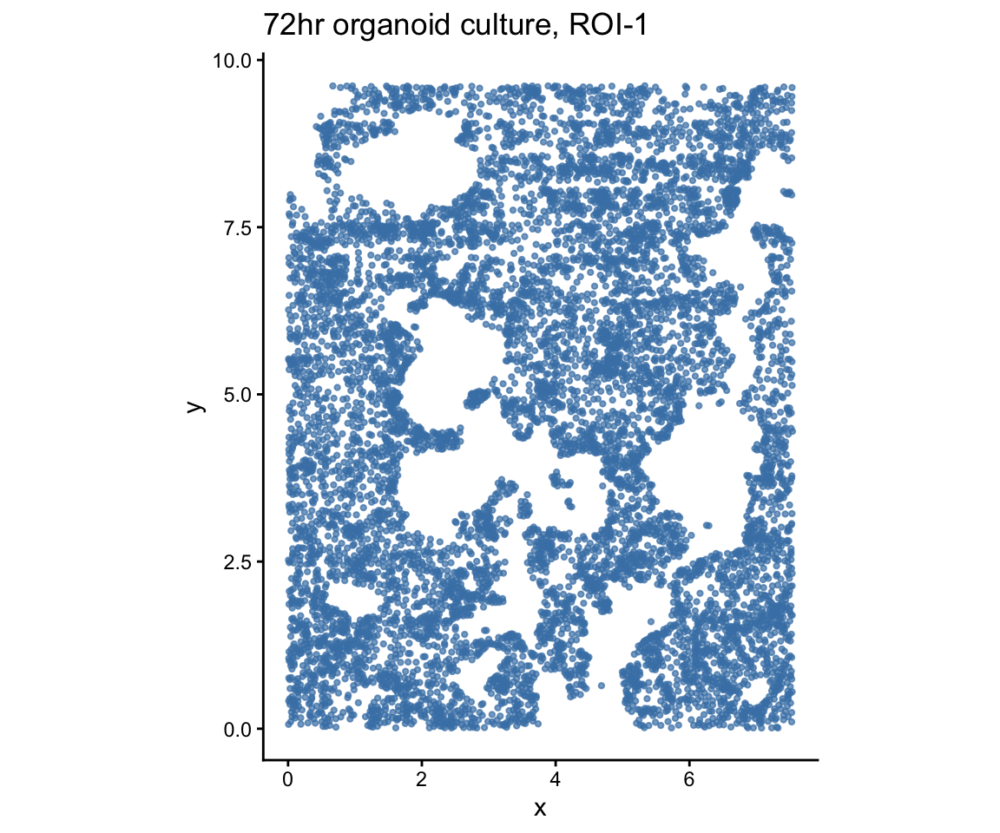
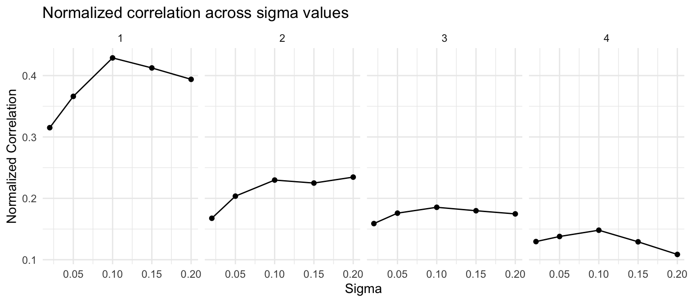
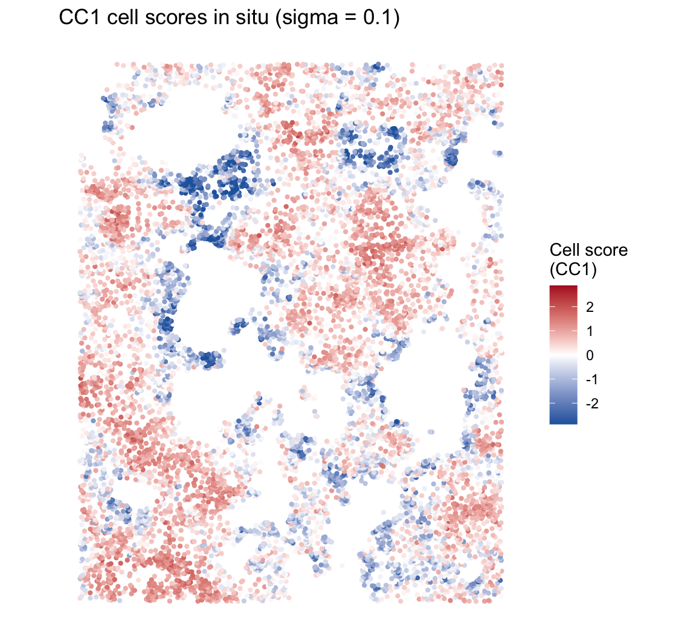
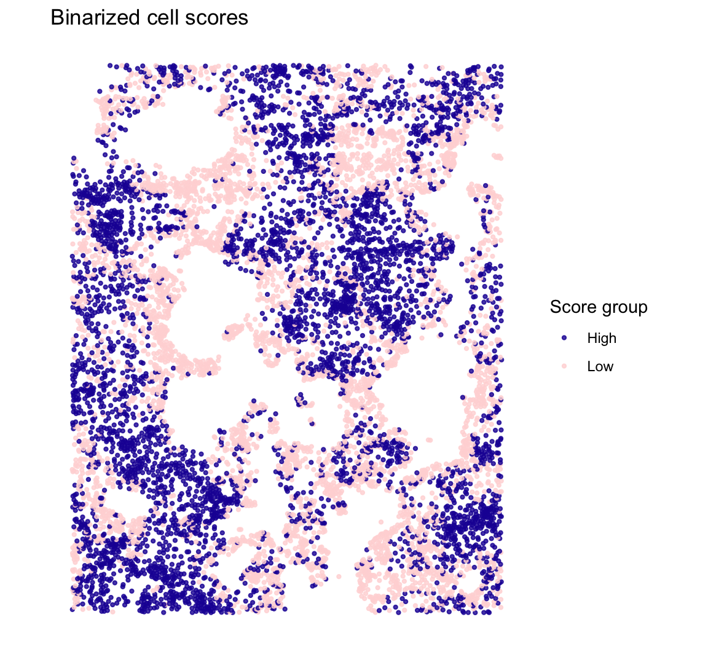
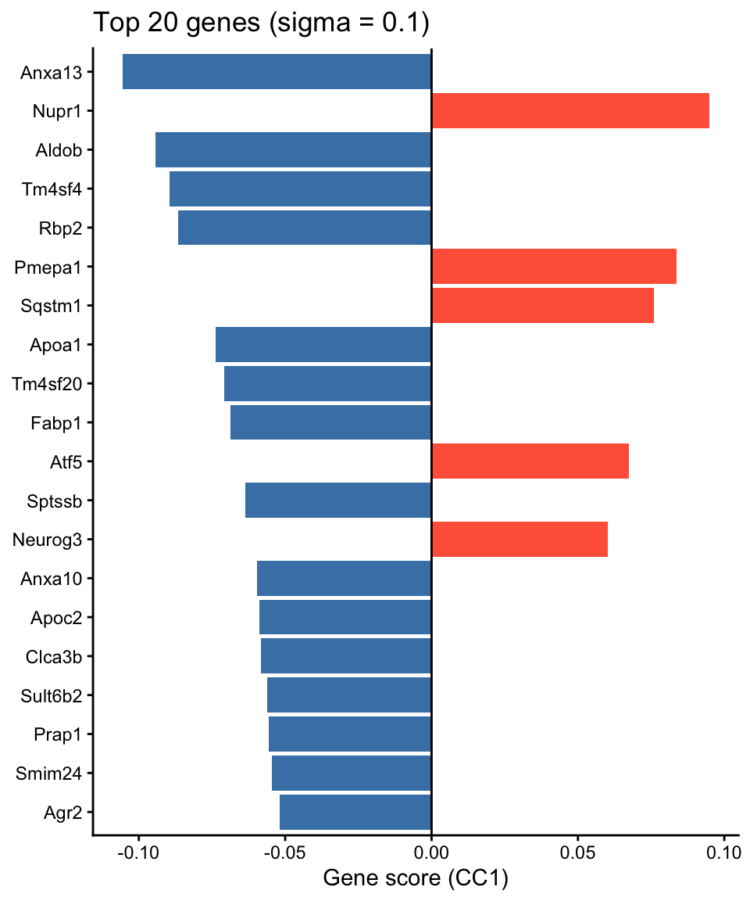

# Within-cell-type spatial patterns (Organoid)

## Overview

This vignette demonstrates how CoPro detects **within-cell-type spatial
patterns** using a single cell type. We analyze a 72-hour intestinal
organoid culture imaged by seqFISH, where all cells are epithelial.
CoPro identifies spatially organized gene programs—self-organization
patterns that emerge within a single population.

**What CoPro finds here:** The spatial co-progression of epithelial
cells captures the crypt–villus axis of the organoid—cells along the
same developmental trajectory cluster spatially.

## Load packages

``` r

library(CoPro)
library(ggplot2)
```

## Download and load data

``` r

data_path <- copro_download_data("organoid")
dat <- readRDS(data_path)

cat("Cells:", nrow(dat$normalizedData), "\n")
```

    ## Cells: 9140

``` r

cat("Genes:", ncol(dat$normalizedData), "\n")
```

    ## Genes: 140

The dataset contains:

- `normalizedData`: expression matrix (cells x genes), capped at 95th
  percentile, DESeq2 size-factor normalized, log1p-transformed
- `locationData`: spatial coordinates (pixels / 5000)
- `metaData`: cell attributes
- `cellTypes`: all cells labeled as “Epithelial”

## Visualize tissue layout

``` r

plot_df <- data.frame(
  x = dat$locationData$x,
  y = dat$locationData$y
)

ggplot(plot_df, aes(x = x, y = y)) +
  geom_point(color = "steelblue", size = 0.8, alpha = 0.7) +
  coord_fixed() +
  ggtitle("72hr organoid culture, ROI-1") +
  xlab("x") + ylab("y") +
  theme_classic()
```



plot of chunk plot-layout

## Create CoPro object

``` r

obj <- newCoProSingle(
  normalizedData = dat$normalizedData,
  locationData = dat$locationData,
  metaData = dat$metaData,
  cellTypes = dat$cellTypes
)

obj <- subsetData(obj, cellTypesOfInterest = "Epithelial")
```

## Run the CoPro pipeline

``` r

# PCA
obj <- computePCA(obj, nPCA = 30, center = TRUE, scale. = TRUE)

# Spatial distance (no normalization for this dataset)
obj <- computeDistance(obj, distType = "Euclidean2D",
                       normalizeDistance = FALSE)

# Test multiple sigma values
sigma_choice <- c(0.01, 0.02, 0.05, 0.1, 0.15, 0.2)
obj <- computeKernelMatrix(obj, sigmaValues = sigma_choice,
                            upperQuantile = 0.85,
                            normalizeKernel = FALSE,
                            lowerLimit = 5e-7)
```

    ## Warning in .CheckSigmaValuesToRemove(kernel_current = kernel_current,
    ## lowerLimit = lowerLimit, : Kernel matrix for cell types Epithelial and
    ## Epithelial with sigma = 0.01 contains too many zeros. Specifically, less than
    ## 0.0218818380743982 % total counts are above the threshold

    ## Warning in .CheckSigmaValuesToRemove(kernel_current = kernel_current,
    ## lowerLimit = lowerLimit, : Dropping sigma value of 0.01 because all Gaussian
    ## kernel values are too small, which will not produce meaningful results.

``` r

# Sparse kernel CCA
obj <- runSkrCCA(obj, scalePCs = TRUE, maxIter = 500, nCC = 4)

# Normalized correlation and scores
obj <- computeNormalizedCorrelation(obj, tol = 1e-3)
obj <- computeGeneAndCellScores(obj)
```

## Select optimal sigma

CoPro automatically selects the sigma that maximizes the CC1 normalized
correlation. We visualize the normalized correlation across all sigma
values and canonical components:

``` r

ncorr <- getNormCorr(obj)

ggplot(ncorr, aes(x = sigmaValues, y = normalizedCorrelation)) +
  geom_point() +
  geom_line() +
  facet_wrap(~ CC_index, nrow = 1) +
  xlab("Sigma") +
  ylab("Normalized Correlation") +
  ggtitle("Normalized correlation across sigma values") +
  theme_minimal()
```



plot of chunk plot-ncorr

``` r

# Use the automatically selected sigma
sigma_opt <- obj@sigmaValueChoice
cat("Selected sigma:", sigma_opt, "\n")
```

    ## Selected sigma: 0.1

## Correlation plot

For a within-type model, the objective is to find cell scores that are
spatially correlated: cells close in space (as measured by the kernel)
should have similar scores. The kernel-smoothed scores (K \* scores) vs
raw cell scores should show a positive correlation:

``` r

df_corr <- getCorrOneType(obj,
  sigmaValueChoice = sigma_opt,
  cellTypeA = "Epithelial",
  ccIndex = 1
)

ggplot(df_corr) +
  geom_point(aes(x = AK, y = B), size = 0.5, alpha = 0.5,
             color = "steelblue") +
  xlab("Epithelial · Kernel (spatially smoothed)") +
  ylab("Epithelial cell scores") +
  ggtitle(paste0("CC1 spatial correlation (sigma = ", sigma_opt, ")")) +
  theme_minimal()
```


plot of chunk plot-correlation

## Cell scores in situ

### Continuous scores

``` r

cs <- getCellScoresInSitu(obj, sigmaValueChoice = sigma_opt)

# Clamp color scale for contrast
q99 <- quantile(abs(cs$cellScores), 0.99)

ggplot(cs) +
  geom_point(aes(x = x, y = y, color = cellScores), size = 0.8) +
  scale_color_gradient2(low = "#2166ac", mid = "white", high = "#b2182b",
                        midpoint = 0,
                        limits = c(-q99, q99),
                        oob = scales::squish,
                        name = "Cell score\n(CC1)") +
  coord_fixed() +
  ggtitle(paste0("CC1 cell scores in situ (sigma = ", sigma_opt, ")")) +
  theme_classic() +
  theme(axis.line = element_blank(), axis.text = element_blank(),
        axis.ticks = element_blank(), axis.title = element_blank())
```



plot of chunk plot-insitu

### Binarized scores

Binarizing at the median highlights the two spatial groups—high vs low
scoring cells, revealing the organoid’s spatial compartments:

``` r

cs$group <- ifelse(cs$cellScores > median(cs$cellScores), "High", "Low")

ggplot(cs) +
  geom_point(aes(x = x, y = y, color = group), size = 0.8, alpha = 0.8) +
  scale_color_manual(values = c("High" = "#1e17a4", "Low" = "#ffd8d8"),
                     name = "Score group") +
  coord_fixed() +
  ggtitle("Binarized cell scores") +
  theme_classic() +
  theme(axis.line = element_blank(), axis.text = element_blank(),
        axis.ticks = element_blank(), axis.title = element_blank())
```



plot of chunk plot-binary

The spatial pattern reveals the self-organization of the organoid
epithelium—cells are continuously ordered along a spatial gradient that
reflects their position within the organoid structure.

## Top genes associated with spatial progression

Gene scores reflect how strongly each gene contributes to the spatial
co-progression axis:

``` r

key <- paste0("geneScores|sigma", sigma_opt, "|Epithelial")
gs <- obj@geneScores[[key]][, 1]

top_idx <- head(order(abs(gs), decreasing = TRUE), 20)
top_df <- data.frame(
  gene = factor(names(gs)[top_idx],
                levels = rev(names(gs)[top_idx])),
  score = gs[top_idx]
)
top_df$direction <- ifelse(top_df$score > 0, "positive", "negative")

ggplot(top_df, aes(x = gene, y = score, fill = direction)) +
  geom_col() +
  coord_flip() +
  scale_fill_manual(values = c("positive" = "tomato",
                                "negative" = "steelblue"),
                    guide = "none") +
  geom_hline(yintercept = 0, linewidth = 0.5) +
  labs(x = NULL, y = "Gene score (CC1)") +
  ggtitle(paste0("Top 20 genes (sigma = ", sigma_opt, ")")) +
  theme_classic()
```



plot of chunk top-genes

## Data citation

Organoid data from: Heyman Y, Erez M, Burnham P, Nitzan M, Raj A.
*Self-Organization Through Local Cell-Cell Communication Drives
Intestinal Epithelial Zonation.* bioRxiv 2025.11.14.688372; doi:
[10.1101/2025.11.14.688372](https://doi.org/10.1101/2025.11.14.688372)

## Session info

``` r

sessionInfo()
```

    ## R version 4.5.2 (2025-10-31)
    ## Platform: aarch64-apple-darwin20
    ## Running under: macOS Tahoe 26.1
    ## 
    ## Matrix products: default
    ## BLAS:   /System/Library/Frameworks/Accelerate.framework/Versions/A/Frameworks/vecLib.framework/Versions/A/libBLAS.dylib 
    ## LAPACK: /Library/Frameworks/R.framework/Versions/4.5-arm64/Resources/lib/libRlapack.dylib;  LAPACK version 3.12.1
    ## 
    ## locale:
    ## [1] en_US.UTF-8/en_US.UTF-8/en_US.UTF-8/C/en_US.UTF-8/en_US.UTF-8
    ## 
    ## time zone: America/Los_Angeles
    ## tzcode source: internal
    ## 
    ## attached base packages:
    ## [1] stats     graphics  grDevices utils     datasets  methods   base     
    ## 
    ## other attached packages:
    ## [1] patchwork_1.3.2 ggplot2_4.0.1   CoPro_1.1.0     testthat_3.3.2 
    ## 
    ## loaded via a namespace (and not attached):
    ##  [1] generics_0.1.4     renv_1.1.7         lattice_0.22-9     magrittr_2.0.4    
    ##  [5] evaluate_1.0.5     grid_4.5.2         RColorBrewer_1.1-3 pkgload_1.4.1     
    ##  [9] fastmap_1.2.0      maps_3.4.3         rprojroot_2.1.1    Matrix_1.7-5      
    ## [13] pkgbuild_1.4.8     sessioninfo_1.2.3  brio_1.1.5         purrr_1.2.1       
    ## [17] spam_2.11-3        viridisLite_0.4.2  scales_1.4.0       cli_3.6.5         
    ## [21] rlang_1.1.7        ellipsis_0.3.2     remotes_2.5.0      withr_3.0.2       
    ## [25] cachem_1.1.0       yaml_2.3.12        devtools_2.4.6     otel_0.2.0        
    ## [29] tools_4.5.2        parallel_4.5.2     memoise_2.0.1      dplyr_1.1.4       
    ## [33] vctrs_0.7.1        R6_2.6.1           matrixStats_1.5.0  lifecycle_1.0.5   
    ## [37] fs_1.6.6           usethis_3.2.1      irlba_2.3.7        pkgconfig_2.0.3   
    ## [41] desc_1.4.3         pillar_1.11.1      gtable_0.3.6       glue_1.8.0        
    ## [45] Rcpp_1.1.1         fields_17.1        xfun_0.56          tibble_3.3.1      
    ## [49] tidyselect_1.2.1   rstudioapi_0.18.0  knitr_1.51         farver_2.1.2      
    ## [53] labeling_0.4.3     dotCall64_1.2      compiler_4.5.2     S7_0.2.1
