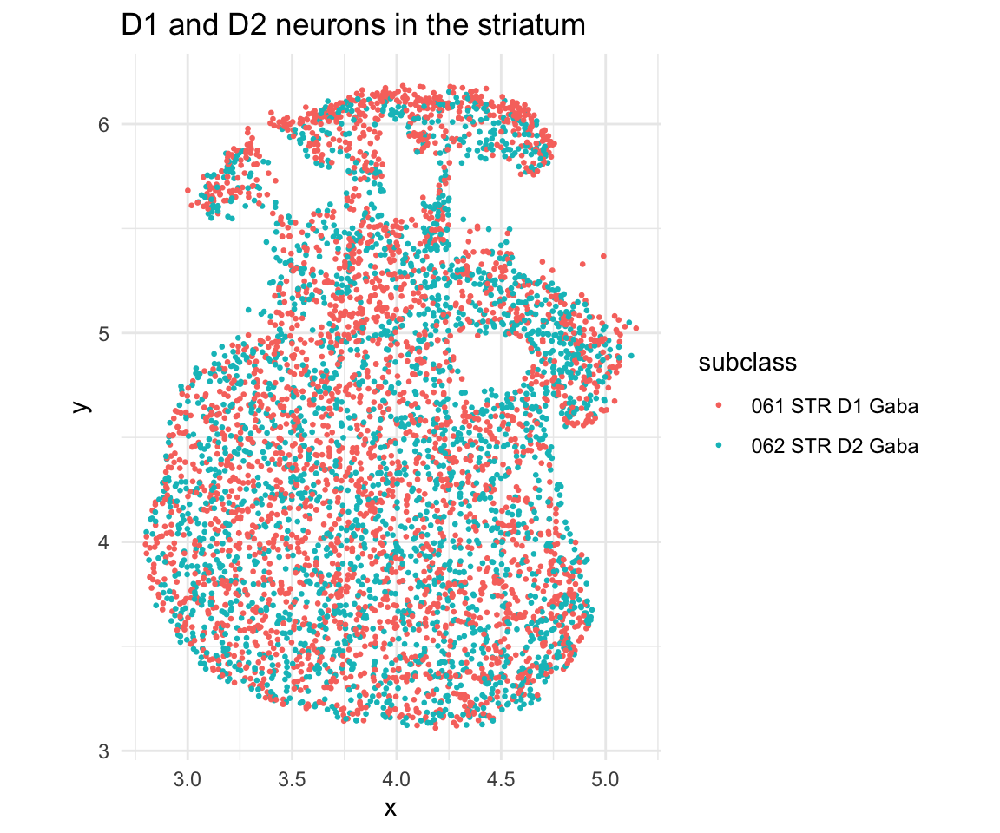
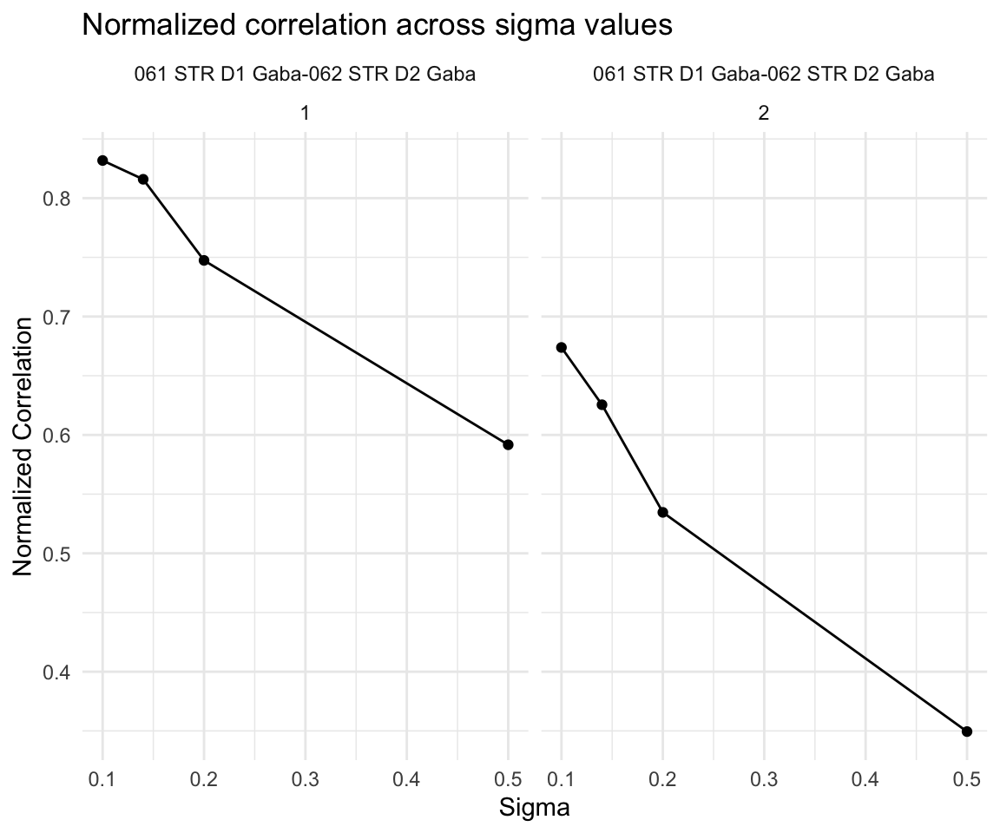
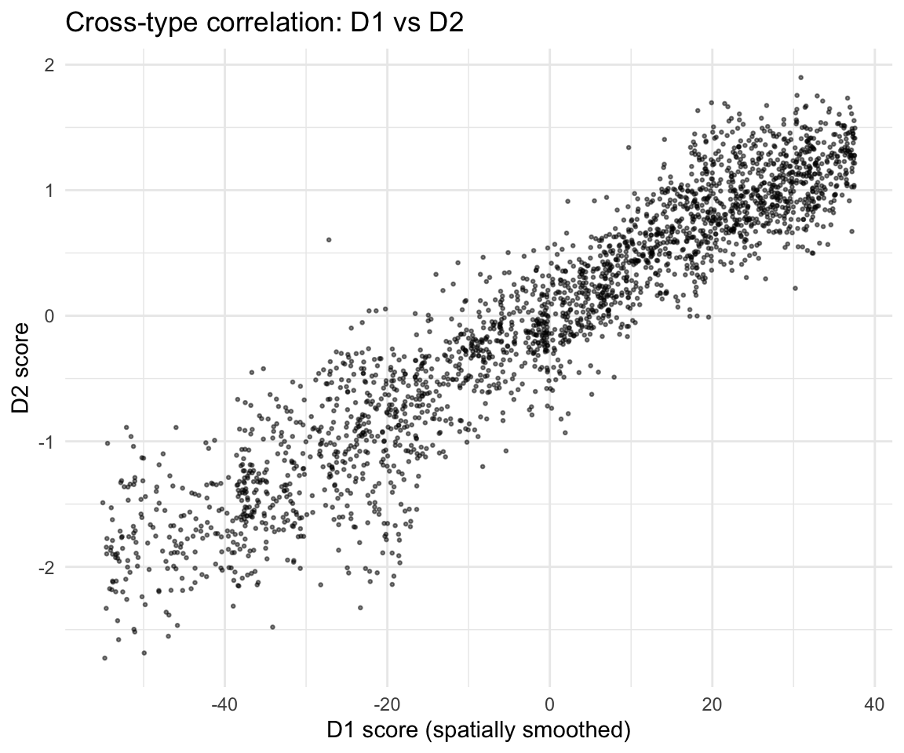
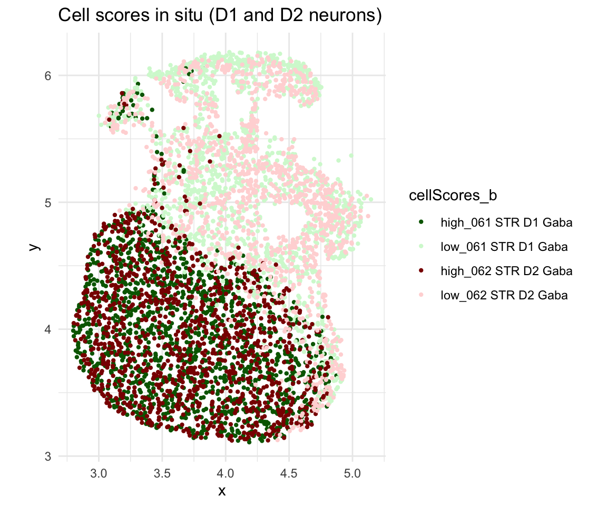
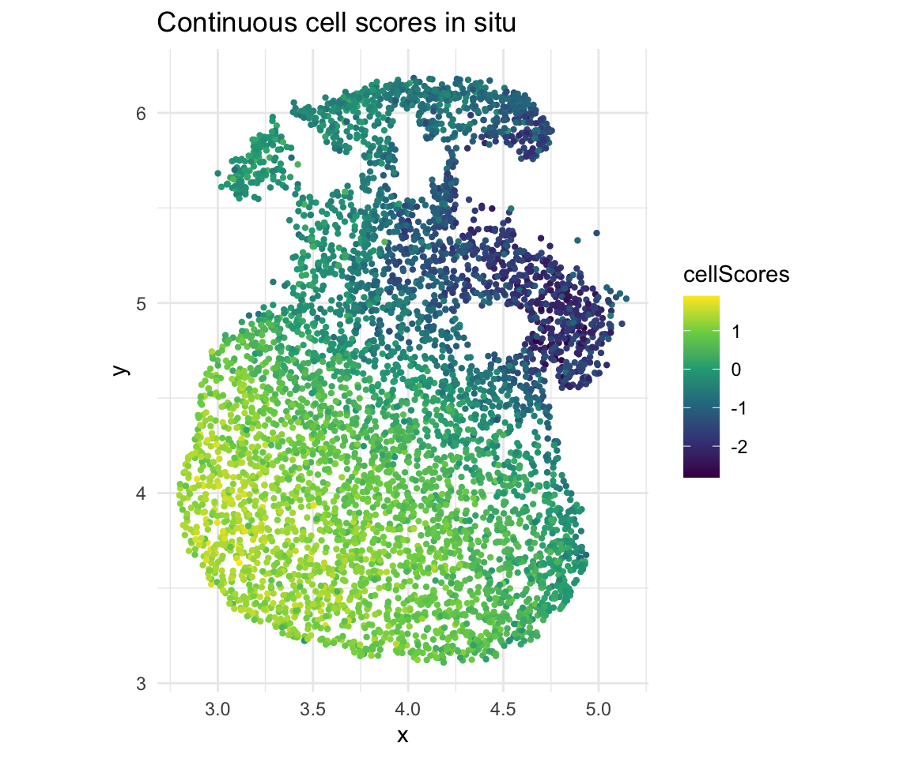

## Overview

This vignette demonstrates **cross-cell-type co-progression** using brain
MERFISH data from Zhang et al. *Nature* 2023. We analyze D1 and D2
GABAergic neurons in the striatum, detecting coordinated spatial gene
expression patterns between these two cell populations.

## Load packages


``` r
library(CoPro)
library(ggplot2)
```

## Download and load data


``` r
data_path <- copro_download_data("brain_merfish")
dat <- readRDS(data_path)
```

## Visualize spatial layout


``` r
ggplot(dat$metaData) +
  geom_point(aes(x = x, y = y, color = subclass), size = 0.5) +
  coord_fixed() +
  theme_minimal() +
  ggtitle("D1 and D2 neurons in the striatum")
```



## Create CoPro object and run pipeline


``` r
cell_types <- c("061 STR D1 Gaba", "062 STR D2 Gaba")

obj <- newCoProSingle(
  normalizedData = dat$normalizedData,
  locationData = dat$locationData,
  metaData = dat$metaData,
  cellTypes = dat$cellTypes
)
obj <- subsetData(obj, cellTypesOfInterest = cell_types)

# Core pipeline
obj <- computePCA(obj, nPCA = 40, center = TRUE, scale. = TRUE)
obj <- computeDistance(obj, distType = "Euclidean2D",
                       normalizeDistance = FALSE)
obj <- computeKernelMatrix(obj, sigmaValues = c(0.1, 0.14, 0.2, 0.5))
obj <- runSkrCCA(obj, scalePCs = TRUE, maxIter = 500)
obj <- computeNormalizedCorrelation(obj)
obj <- computeGeneAndCellScores(obj)
```

## Select optimal sigma


``` r
ncorr <- getNormCorr(obj)

ggplot(ncorr, aes(x = sigmaValues, y = normalizedCorrelation)) +
  geom_point() +
  geom_line() +
  facet_wrap(~ ct12 + CC_index) +
  xlab("Sigma") +
  ylab("Normalized Correlation") +
  ggtitle("Normalized correlation across sigma values") +
  theme_minimal()
```



## Cross-type correlation

Visualize how cell scores in D1 neurons (smoothed by the spatial kernel)
correlate with D2 neuron scores:


``` r
df_corr <- getCorrTwoTypes(obj,
  sigmaValueChoice = 0.14,
  cellTypeA = "061 STR D1 Gaba",
  cellTypeB = "062 STR D2 Gaba"
)

ggplot(df_corr) +
  geom_point(aes(x = AK, y = B), size = 0.5, alpha = 0.5) +
  xlab("D1 score (spatially smoothed)") +
  ylab("D2 score") +
  ggtitle("Cross-type correlation: D1 vs D2") +
  theme_minimal()
```



## In situ visualization


``` r
cs <- getCellScoresInSitu(obj, sigmaValueChoice = 0.14)

ggplot(cs) +
  geom_point(aes(x = x, y = y, color = cellScores_b), size = 0.8) +
  scale_color_manual(values = c("darkgreen", "#d4f8d4",
                                 "darkred", "#ffd8d8")) +
  coord_fixed() +
  ggtitle("Cell scores in situ (D1 and D2 neurons)") +
  theme_minimal()
```



``` r
# Continuous scores
ggplot(cs) +
  geom_point(aes(x = x, y = y, color = cellScores), size = 0.8) +
  scale_color_viridis_c() +
  coord_fixed() +
  ggtitle("Continuous cell scores in situ") +
  theme_minimal()
```



## Permutation test

Establish statistical significance with spatial permutations:


``` r
obj <- runSkrCCAPermu(obj, nPermu = 5L, permu_method = "bin",
                       num_bins_x = 10, num_bins_y = 10)
```

```
## Warning in runSkrCCAPermu(obj, nPermu = 5L, permu_method = "bin", num_bins_x =
## 10, : nPermu < 10 may give unreliable p-values. Consider nPermu >= 100.
```

```
## Permutation settings:
##   permu_method: bin 
##   permu_which: second_only 
##     -> Cell type 061 STR D1 Gaba is FIXED, others are permuted
##   num_bins_x: 10 
##   num_bins_y: 10 
##   Total bins: 100 
##   match_quantile: FALSE 
## 
## Generating cell permutation indices...
## Cell permutation indices generated.
## 
## Running CCA optimization for 5 permutations...
## [1] "Convergence reached at 15 iterations (Max diff = 6.601e-06 )"
## [1] "Convergence reached at 0 iterations (Max diff = 1.368e-10 )"
## [1] "Convergence reached at 28 iterations (Max diff = 8.467e-06 )"
## [1] "Convergence reached at 0 iterations (Max diff = 9.963e-13 )"
## [1] "Convergence reached at 56 iterations (Max diff = 8.786e-06 )"
## [1] "Convergence reached at 0 iterations (Max diff = 1.361e-10 )"
## [1] "Convergence reached at 11 iterations (Max diff = 9.432e-06 )"
## [1] "Convergence reached at 0 iterations (Max diff = 2.243e-09 )"
## [1] "Convergence reached at 11 iterations (Max diff = 4.301e-06 )"
## [1] "Convergence reached at 0 iterations (Max diff = 1.132e-10 )"
##   Completed 5 of 5 permutations
## 
## Permutation testing complete.
## Run computeNormalizedCorrelationPermu() to compute p-values.
```

``` r
obj <- computeNormalizedCorrelationPermu(obj, tol = 1e-3)
```

```
## Calculating spectral norms...
## Spectral norms calculated.
## 
## Computing normalized correlations for permutations...
##   Completed 5 of 5 permutations
## 
## Normalized correlation computation complete.
```

``` r
nc_permu <- do.call(rbind, obj@normalizedCorrelationPermu)
print(nc_permu)
```

```
##           sigmaValues       cellType1       cellType2 CC_index
## permu_1.1         0.1 061 STR D1 Gaba 062 STR D2 Gaba        1
## permu_1.2         0.1 061 STR D1 Gaba 062 STR D2 Gaba        2
## permu_2.1         0.1 061 STR D1 Gaba 062 STR D2 Gaba        1
## permu_2.2         0.1 061 STR D1 Gaba 062 STR D2 Gaba        2
## permu_3.1         0.1 061 STR D1 Gaba 062 STR D2 Gaba        1
## permu_3.2         0.1 061 STR D1 Gaba 062 STR D2 Gaba        2
## permu_4.1         0.1 061 STR D1 Gaba 062 STR D2 Gaba        1
## permu_4.2         0.1 061 STR D1 Gaba 062 STR D2 Gaba        2
## permu_5.1         0.1 061 STR D1 Gaba 062 STR D2 Gaba        1
## permu_5.2         0.1 061 STR D1 Gaba 062 STR D2 Gaba        2
##           normalizedCorrelation
## permu_1.1             0.3317592
## permu_1.2             0.2306265
## permu_2.1             0.2711081
## permu_2.2             0.2218264
## permu_3.1             0.2693285
## permu_3.2             0.2543175
## permu_4.1             0.2839825
## permu_4.2             0.1828652
## permu_5.1             0.3245313
## permu_5.2             0.2109768
```

## References

Zhang, M., Pan, X., Jung, W. *et al.* Molecularly defined and spatially
resolved cell atlas of the whole mouse brain. *Nature* 624, 343--354
(2023). <https://doi.org/10.1038/s41586-023-06808-9>

## Session info


``` r
sessionInfo()
```

```
## R version 4.5.2 (2025-10-31)
## Platform: aarch64-apple-darwin20
## Running under: macOS Tahoe 26.1
## 
## Matrix products: default
## BLAS:   /System/Library/Frameworks/Accelerate.framework/Versions/A/Frameworks/vecLib.framework/Versions/A/libBLAS.dylib 
## LAPACK: /Library/Frameworks/R.framework/Versions/4.5-arm64/Resources/lib/libRlapack.dylib;  LAPACK version 3.12.1
## 
## locale:
## [1] en_US.UTF-8/en_US.UTF-8/en_US.UTF-8/C/en_US.UTF-8/en_US.UTF-8
## 
## time zone: America/Los_Angeles
## tzcode source: internal
## 
## attached base packages:
## [1] stats     graphics  grDevices utils     datasets  methods   base     
## 
## other attached packages:
## [1] patchwork_1.3.2 ggplot2_4.0.1   CoPro_1.1.0     testthat_3.3.2 
## 
## loaded via a namespace (and not attached):
##  [1] generics_0.1.4     renv_1.1.7         lattice_0.22-9     magrittr_2.0.4    
##  [5] evaluate_1.0.5     grid_4.5.2         RColorBrewer_1.1-3 pkgload_1.4.1     
##  [9] fastmap_1.2.0      maps_3.4.3         rprojroot_2.1.1    Matrix_1.7-5      
## [13] pkgbuild_1.4.8     sessioninfo_1.2.3  brio_1.1.5         purrr_1.2.1       
## [17] spam_2.11-3        viridisLite_0.4.2  scales_1.4.0       cli_3.6.5         
## [21] rlang_1.1.7        ellipsis_0.3.2     remotes_2.5.0      withr_3.0.2       
## [25] cachem_1.1.0       yaml_2.3.12        devtools_2.4.6     otel_0.2.0        
## [29] tools_4.5.2        parallel_4.5.2     memoise_2.0.1      dplyr_1.1.4       
## [33] vctrs_0.7.1        R6_2.6.1           matrixStats_1.5.0  lifecycle_1.0.5   
## [37] fs_1.6.6           usethis_3.2.1      irlba_2.3.7        pkgconfig_2.0.3   
## [41] desc_1.4.3         pillar_1.11.1      gtable_0.3.6       glue_1.8.0        
## [45] Rcpp_1.1.1         fields_17.1        xfun_0.56          tibble_3.3.1      
## [49] tidyselect_1.2.1   rstudioapi_0.18.0  knitr_1.51         farver_2.1.2      
## [53] labeling_0.4.3     dotCall64_1.2      compiler_4.5.2     S7_0.2.1
```
