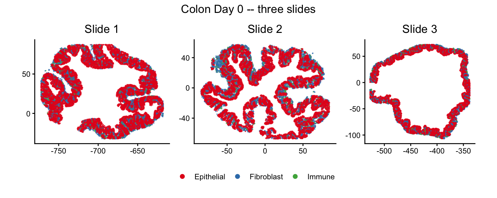
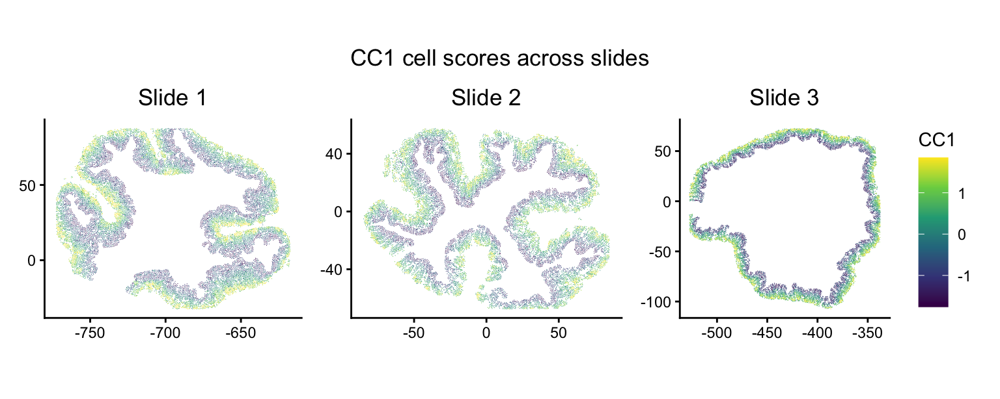
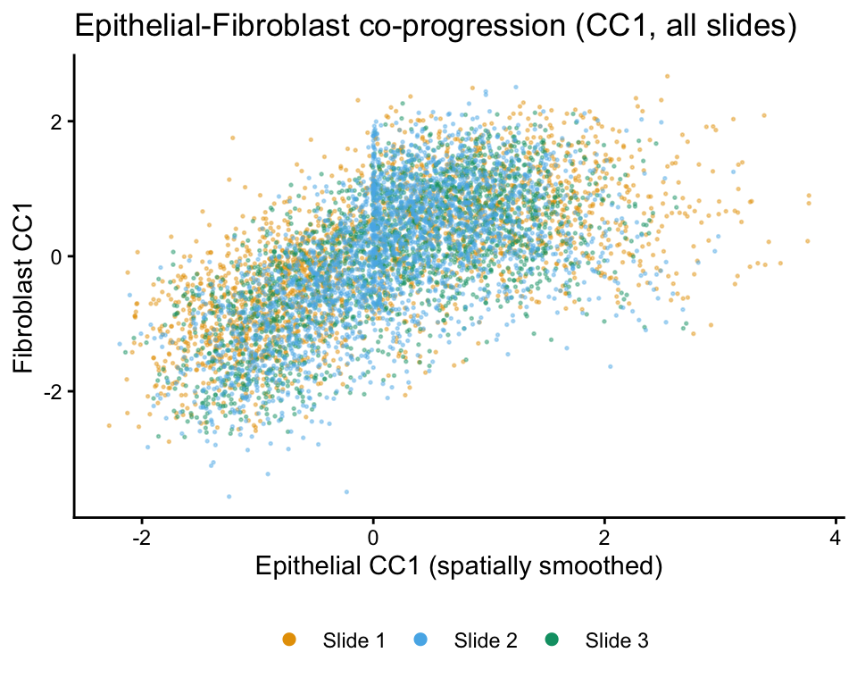
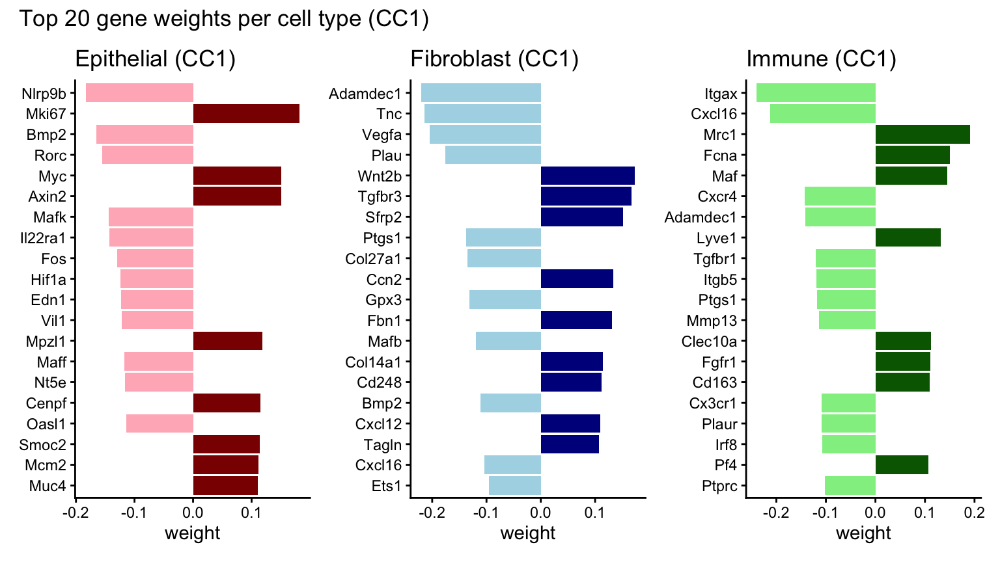
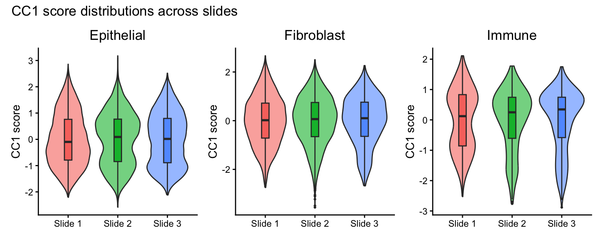
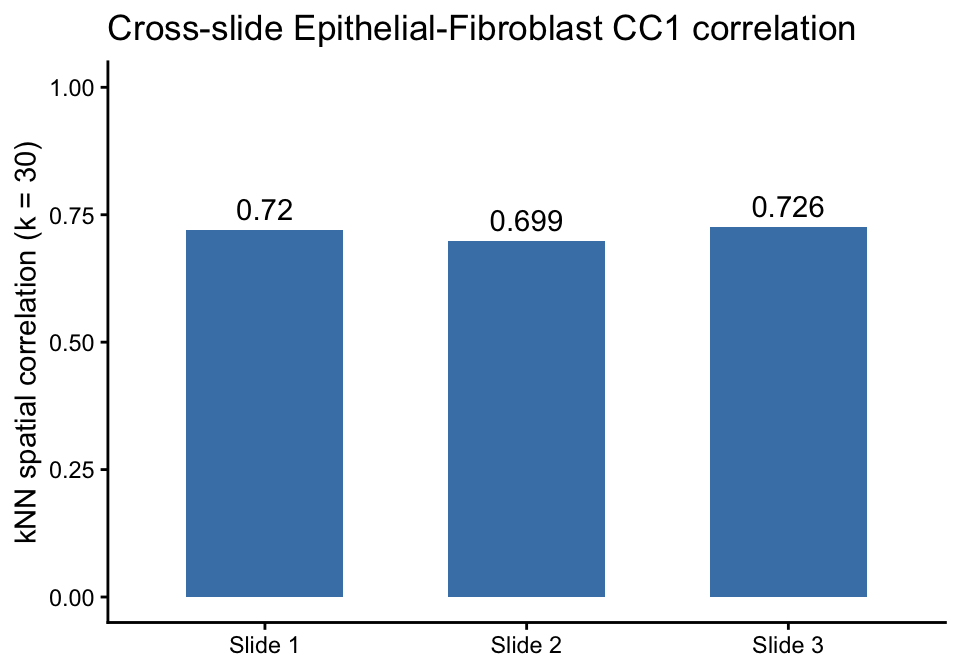

## Overview

When multiple tissue slides are available from the same condition, CoPro
can analyze them **jointly** using `newCoProMulti`. This vignette
demonstrates the **gene-space CCA** workflow (`runGeneSpaceCCA`), which
operates directly on gene expression rather than PCA space. Gene-space
CCA is designed for multi-slide analysis: it maximizes the average
per-slide canonical correlation, preventing batch-level mean shifts from
inflating the objective.

This vignette walks through the full multi-slide workflow using three
healthy colon Day 0 slides from different tissue regions:

1. Create a `CoProMulti` object with `newCoProMulti`
2. Compute distance and kernel matrices
3. Run gene-space CCA (`runGeneSpaceCCA`)
4. Visualize per-slide cell scores
5. Examine cross-cell-type spatial correlation
6. Inspect gene weights

For a complementary example showing multi-axis discovery on a single
slide, see the `colon_d3_cross_type` vignette. For the
**reference-plus-transfer** workflow (train on one slide, transfer to
others), see the `colon_d9_multi_slide` vignette.

## Load packages


``` r
library(CoPro)
library(ggplot2)
library(patchwork)
```

## Download and load data


``` r
data_path <- copro_download_data("colon_d0_multi")
```

```
## Using cached file: /Users/zhenmiao/Library/Caches/org.R-project.R/R/CoPro/copro_colon_d0_multi.rds
```

``` r
dat <- readRDS(data_path)

cat("Slides:", paste(dat$selectedSlides, collapse = "\n  "), "\n")
```

```
## Slides: 062921_D0_m3a_1_slice_1
##   082421_D0_m6_1_slice_1
##   082421_D0_m7_1_slice_1
```

``` r
cat("Total cells:", nrow(dat$normalizedData), "\n")
```

```
## Total cells: 39875
```

``` r
cat("Genes:", ncol(dat$normalizedData), "\n")
```

```
## Genes: 928
```

``` r
table(dat$slideID)
```

```
## 
## 062921_D0_m3a_1_slice_1  082421_D0_m6_1_slice_1  082421_D0_m7_1_slice_1 
##                   14504                   14739                   10632
```

## Visualize the tissue

Each slide comes from a different tissue region, so the spatial
coordinates are on different scales. We plot each slide individually
and combine them with `patchwork`, which preserves each panel's own
coordinate system.

### Cell types across slides


``` r
plot_df <- data.frame(
  x = dat$locationData$x,
  y = dat$locationData$y,
  celltype = dat$cellTypes,
  slide = dat$slideID
)

slide_labels <- setNames(
  paste0("Slide ", seq_along(dat$selectedSlides)),
  dat$selectedSlides
)
plot_df$slide_label <- slide_labels[plot_df$slide]

ct_colors <- c("Epithelial" = "#E41A1C",
               "Fibroblast" = "#377EB8",
               "Immune" = "#4DAF4A")

ct_plots <- lapply(sort(unique(plot_df$slide_label)), function(sl) {
  d <- plot_df[plot_df$slide_label == sl, ]
  ggplot(d, aes(x = x, y = y, color = celltype)) +
    geom_point(size = 0.1, alpha = 0.6) +
    scale_color_manual(values = ct_colors, name = NULL) +
    coord_fixed() +
    ggtitle(sl) +
    theme_classic() +
    theme(axis.title = element_blank(),
          plot.title = element_text(hjust = 0.5)) +
    guides(color = guide_legend(override.aes = list(size = 2, alpha = 1)))
})

wrap_plots(ct_plots, ncol = 3) +
  plot_layout(guides = "collect") +
  plot_annotation(title = "Colon Day 0 -- three slides") &
  theme(plot.title = element_text(hjust = 0.5),
        legend.position = "bottom")
```



## Create a multi-slide CoPro object

`newCoProMulti` takes a `slideID` vector that tells CoPro which cells
belong to which slide. The pipeline computes distance and kernel matrices
**within** each slide (cells on different slides are never treated as
spatial neighbors), while gene-space CCA optimizes a shared set of gene
weights across all slides jointly.


``` r
cell_types <- c("Epithelial", "Fibroblast", "Immune")

multi_obj <- newCoProMulti(
  normalizedData = dat$normalizedData,
  locationData = dat$locationData,
  metaData = dat$metaData,
  cellTypes = dat$cellTypes,
  slideID = dat$slideID
)
multi_obj <- subsetData(multi_obj, cellTypesOfInterest = cell_types)
```

## Run the gene-space CCA pipeline

Unlike the PCA-based pipeline (`computePCA` → `runSkrCCA`), gene-space
CCA operates directly on gene expression. It internally standardizes
expression per slide per cell type, filters genes by prevalence, and
clips extreme values. The only prerequisites are distance and kernel
matrices.


``` r
multi_obj <- computeDistance(multi_obj, distType = "Euclidean2D")
```

```
## normalizeDistance = TRUE: low-percentile distance will be normalized across all slides and scaled to 0.01.
```

```
## Computing pairwise distances for slide: 062921_D0_m3a_1_slice_1
```

```
## Slide: 062921_D0_m3a_1_slice_1, Pair: Epithelial - Fibroblast
```

```
##          0%         25%         50%         75%        100% 
##   0.9150834  41.4190861  72.5593539  98.1957631 159.7293411
```

```
## Slide: 062921_D0_m3a_1_slice_1, Pair: Epithelial - Immune
```

```
##          0%         25%         50%         75%        100% 
##   0.9851965  41.4681935  73.3319560  99.0585847 159.2877904
```

```
## Slide: 062921_D0_m3a_1_slice_1, Pair: Fibroblast - Immune
```

```
##          0%         25%         50%         75%        100% 
##   0.9859394  40.8869691  73.2390276  99.5563905 160.1859939
```

```
## Computing pairwise distances for slide: 082421_D0_m7_1_slice_1
```

```
## Slide: 082421_D0_m7_1_slice_1, Pair: Epithelial - Fibroblast
```

```
##        0%       25%       50%       75%      100% 
##   1.01939  64.73114 116.20744 152.12709 202.54443
```

```
## Slide: 082421_D0_m7_1_slice_1, Pair: Epithelial - Immune
```

```
##         0%        25%        50%        75%       100% 
##   1.086058  65.163774 116.308534 152.393061 200.136268
```

```
## Slide: 082421_D0_m7_1_slice_1, Pair: Fibroblast - Immune
```

```
##         0%        25%        50%        75%       100% 
##   1.087197  65.211714 117.128692 154.023001 200.501970
```

```
## Computing pairwise distances for slide: 082421_D0_m6_1_slice_1
```

```
## Slide: 082421_D0_m6_1_slice_1, Pair: Epithelial - Fibroblast
```

```
##         0%        25%        50%        75%       100% 
##   1.074126  44.622594  71.141559  99.208995 171.807503
```

```
## Slide: 082421_D0_m6_1_slice_1, Pair: Epithelial - Immune
```

```
##         0%        25%        50%        75%       100% 
##   1.144968  44.188186  70.541333  98.910669 169.934710
```

```
## Slide: 082421_D0_m6_1_slice_1, Pair: Fibroblast - Immune
```

```
##         0%        25%        50%        75%       100% 
##   1.135812  43.393369  71.140463 100.027923 170.588839
```

```
## Global distance scaling factor: 0.010928
```

``` r
sigma_choice <- 0.01
multi_obj <- computeKernelMatrix(multi_obj, sigmaValues = sigma_choice)
```

```
## Computing pairwise kernel matrix for 3 cell types across 3 slides
## current sigma value is 0.01
```

``` r
multi_obj <- runGeneSpaceCCA(multi_obj, sigma = sigma_choice, nCC = 1)
```

```
## === Gene-Space CCA ===
```

```
## Step 1: Preparing gene-space data...
```

```
##   Genes: 928, Slides: 3, Cell types: Epithelial, Fibroblast, Immune
```

```
## Step 2: Precomputing covariance matrices...
```

```
## Step 3: Power iteration for canonical components...
```

```
##   Finding CC 1 ...
```

```
##   Iter 1: max_diff = 1.62e-01, objective = 0.0552
```

```
##   Converged at iteration 15 (max_diff = 4.57e-07, objective = 0.8931)
```

```
## Step 4: Storing results...
```

```
## Done.
```

## Visualize cell scores per slide

A key advantage of multi-slide analysis: the same gene weights produce
cell scores on every slide. Consistent spatial patterns across slides
indicate a robust biological signal.

### CC1 scores across all slides


``` r
cs <- getCellScoresInSitu(multi_obj, sigmaValueChoice = sigma_choice,
                           ccIndex = 1)

cs$slide <- multi_obj@metaDataSub$Slice_ID[
  match(rownames(cs), rownames(multi_obj@metaDataSub))
]
if (is.null(cs$slide) || all(is.na(cs$slide))) {
  cs$slide <- multi_obj@metaDataSub[
    match(paste(cs$x, cs$y), paste(multi_obj@locationDataSub$x,
                                    multi_obj@locationDataSub$y)),
    "Slice_ID"
  ]
}
cs$slide_label <- slide_labels[cs$slide]

score_range <- quantile(cs$cellScores, c(0.025, 0.975), na.rm = TRUE)

cc1_plots <- lapply(sort(unique(cs$slide_label)), function(sl) {
  d <- cs[cs$slide_label == sl, ]
  d <- d[order(d$cellScores), ]
  ggplot(d, aes(x = x, y = y, color = cellScores)) +
    geom_point(size = 0.2, shape = 16, stroke = 0) +
    scale_color_viridis_c(limits = score_range, oob = scales::squish,
                          name = "CC1") +
    coord_fixed() +
    ggtitle(sl) +
    theme_classic() +
    theme(axis.title = element_blank(),
          plot.title = element_text(hjust = 0.5))
})

wrap_plots(cc1_plots, ncol = 3) +
  plot_layout(guides = "collect") +
  plot_annotation(title = "CC1 cell scores across slides") &
  theme(plot.title = element_text(hjust = 0.5),
        legend.position = "right")
```



## Cross-type correlation

CoPro finds axes along which nearby cells of different types co-vary.
Here we plot the spatially smoothed epithelial score against the raw
fibroblast score --- strong correlation confirms genuine cross-cell-type
co-progression.


``` r
df_cc1 <- getCorrTwoTypes(multi_obj,
  sigmaValueChoice = sigma_choice,
  cellTypeA = "Epithelial",
  cellTypeB = "Fibroblast",
  ccIndex = 1
)

df_cc1$slide_label <- slide_labels[df_cc1$slideID]

slide_colors <- c("Slide 1" = "#E69F00", "Slide 2" = "#56B4E9",
                   "Slide 3" = "#009E73")

ggplot(df_cc1, aes(x = AK, y = B, color = slide_label)) +
  geom_point(size = 0.3, alpha = 0.4) +
  scale_color_manual(values = slide_colors, name = NULL) +
  xlab("Epithelial CC1 (spatially smoothed)") +
  ylab("Fibroblast CC1") +
  ggtitle("Epithelial-Fibroblast co-progression (CC1, all slides)") +
  theme_classic() +
  theme(legend.position = "bottom") +
  guides(color = guide_legend(override.aes = list(size = 2, alpha = 1)))
```



## Gene weights

Gene-space CCA directly produces gene weights: each gene's weight
reflects its contribution to the co-progression axis. Genes with large
positive weights increase along the axis; genes with large negative
weights decrease.

### Top genes for CC1


``` r
gene_bar_plot <- function(obj, ct, cc = 1, n_top = 20,
                          pos_col = "darkred", neg_col = "lightpink") {
  key <- paste0("geneScores|sigma", sigma_choice, "|", ct)
  gs <- obj@geneScores[[key]]
  gs_cc <- gs[, cc]
  top <- head(sort(abs(gs_cc), decreasing = TRUE), n_top)
  top_df <- data.frame(
    gene = factor(names(top), levels = rev(names(top))),
    weight = gs_cc[names(top)]
  )
  top_df$direction <- ifelse(top_df$weight > 0, "positive", "negative")

  ggplot(top_df, aes(x = gene, y = weight, fill = direction)) +
    geom_col() +
    coord_flip() +
    scale_fill_manual(values = c("positive" = pos_col,
                                  "negative" = neg_col)) +
    ggtitle(paste0(ct, " (CC1)")) +
    theme_classic() +
    theme(legend.position = "none",
          axis.title.y = element_blank())
}

p_epi <- gene_bar_plot(multi_obj, "Epithelial",
                       pos_col = "darkred", neg_col = "lightpink")
p_fib <- gene_bar_plot(multi_obj, "Fibroblast",
                       pos_col = "darkblue", neg_col = "lightblue")
p_imm <- gene_bar_plot(multi_obj, "Immune",
                       pos_col = "darkgreen", neg_col = "lightgreen")

p_epi + p_fib + p_imm +
  plot_annotation(title = "Top 20 gene weights per cell type (CC1)")
```



## Cross-slide consistency

Since each slide comes from a different tissue region, consistent
gene-space CCA scores across slides confirm a robust biological signal.
We compare per-slide score distributions and cross-cell-type correlations.

### Per-slide score distributions


``` r
meta <- multi_obj@metaDataSub
meta$cc1 <- meta[, paste0("cellScore_sigma_", sigma_choice, "_cc_index_1")]
meta$slide_label <- slide_labels[meta$Slice_ID]

dist_plots <- lapply(cell_types, function(ct) {
  d <- meta[meta$Tier1 == ct, ]
  ggplot(d, aes(x = slide_label, y = cc1, fill = slide_label)) +
    geom_violin(alpha = 0.6, show.legend = FALSE) +
    geom_boxplot(width = 0.15, outlier.size = 0.5, show.legend = FALSE) +
    ylab("CC1 score") +
    ggtitle(ct) +
    theme_classic() +
    theme(axis.title.x = element_blank(),
          plot.title = element_text(hjust = 0.5))
})

wrap_plots(dist_plots, ncol = 3) +
  plot_annotation(title = "CC1 score distributions across slides")
```



### Per-slide cross-type correlation


``` r
loc <- multi_obj@locationDataSub
meta$loc_x <- loc$x[match(rownames(meta), rownames(loc))]
meta$loc_y <- loc$y[match(rownames(meta), rownames(loc))]

corr_df <- data.frame()
for (sl in dat$selectedSlides) {
  sl_idx <- meta$Slice_ID == sl
  epi_idx <- sl_idx & meta$Tier1 == "Epithelial"
  fib_idx <- sl_idx & meta$Tier1 == "Fibroblast"

  epi <- meta$cc1[epi_idx]
  fib <- meta$cc1[fib_idx]

  xy_epi <- meta[epi_idx, c("loc_x", "loc_y")]
  xy_fib <- meta[fib_idx, c("loc_x", "loc_y")]

  k <- min(30, length(fib))
  smoothed <- numeric(length(epi))
  for (i in seq_along(epi)) {
    dists <- sqrt((xy_fib$loc_x - xy_epi$loc_x[i])^2 +
                  (xy_fib$loc_y - xy_epi$loc_y[i])^2)
    nn <- order(dists)[seq_len(k)]
    smoothed[i] <- mean(fib[nn])
  }
  r_val <- cor(epi, smoothed)

  corr_df <- rbind(corr_df, data.frame(
    slide = slide_labels[sl],
    pair = "Epi-Fib",
    r = round(r_val, 3)
  ))
}

ggplot(corr_df, aes(x = slide, y = r)) +
  geom_col(fill = "steelblue", width = 0.6) +
  geom_text(aes(label = r), vjust = -0.5) +
  coord_cartesian(ylim = c(0, 1)) +
  ylab("kNN spatial correlation (k = 30)") +
  ggtitle("Cross-slide Epithelial-Fibroblast CC1 correlation") +
  theme_classic() +
  theme(axis.title.x = element_blank())
```



## Key points

1. **`runGeneSpaceCCA`** operates directly in gene space, avoiding PCA.
   It maximizes the average per-slide canonical correlation, which
   naturally handles batch effects across slides.
2. **No PCA required**: the pipeline is `computeDistance` →
   `computeKernelMatrix` → `runGeneSpaceCCA`. Gene filtering and
   standardization are handled internally.
3. **Per-slide visualization** with `patchwork` preserves each slide's
   coordinate system, avoiding the distortion that `facet_wrap` can
   introduce when slides have different spatial scales.
4. **Gene weights** from gene-space CCA directly reflect each gene's
   contribution to the co-progression axis---no back-projection from
   PCA space is needed.
5. For **single-slide** multi-axis discovery, see the `colon_d3_cross_type`
   vignette. For **reference-plus-transfer**, see `colon_d9_multi_slide`.

## Session info


``` r
sessionInfo()
```

```
## R version 4.5.2 (2025-10-31)
## Platform: aarch64-apple-darwin20
## Running under: macOS Tahoe 26.1
## 
## Matrix products: default
## BLAS:   /System/Library/Frameworks/Accelerate.framework/Versions/A/Frameworks/vecLib.framework/Versions/A/libBLAS.dylib 
## LAPACK: /Library/Frameworks/R.framework/Versions/4.5-arm64/Resources/lib/libRlapack.dylib;  LAPACK version 3.12.1
## 
## locale:
## [1] en_US.UTF-8/en_US.UTF-8/en_US.UTF-8/C/en_US.UTF-8/en_US.UTF-8
## 
## time zone: America/Los_Angeles
## tzcode source: internal
## 
## attached base packages:
## [1] stats     graphics  grDevices utils     datasets  methods   base     
## 
## other attached packages:
## [1] patchwork_1.3.2 ggplot2_4.0.1   CoPro_1.1.0     testthat_3.3.2 
## 
## loaded via a namespace (and not attached):
##  [1] generics_0.1.4     renv_1.1.7         lattice_0.22-9     magrittr_2.0.4    
##  [5] evaluate_1.0.5     grid_4.5.2         RColorBrewer_1.1-3 pkgload_1.4.1     
##  [9] fastmap_1.2.0      maps_3.4.3         rprojroot_2.1.1    Matrix_1.7-5      
## [13] pkgbuild_1.4.8     sessioninfo_1.2.3  brio_1.1.5         purrr_1.2.1       
## [17] spam_2.11-3        viridisLite_0.4.2  scales_1.4.0       cli_3.6.5         
## [21] rlang_1.1.7        ellipsis_0.3.2     remotes_2.5.0      withr_3.0.2       
## [25] cachem_1.1.0       yaml_2.3.12        devtools_2.4.6     otel_0.2.0        
## [29] tools_4.5.2        parallel_4.5.2     memoise_2.0.1      dplyr_1.1.4       
## [33] vctrs_0.7.1        R6_2.6.1           matrixStats_1.5.0  lifecycle_1.0.5   
## [37] fs_1.6.6           usethis_3.2.1      irlba_2.3.7        pkgconfig_2.0.3   
## [41] desc_1.4.3         pillar_1.11.1      gtable_0.3.6       glue_1.8.0        
## [45] Rcpp_1.1.1         fields_17.1        xfun_0.56          tibble_3.3.1      
## [49] tidyselect_1.2.1   rstudioapi_0.18.0  knitr_1.51         farver_2.1.2      
## [53] labeling_0.4.3     dotCall64_1.2      compiler_4.5.2     S7_0.2.1
```
