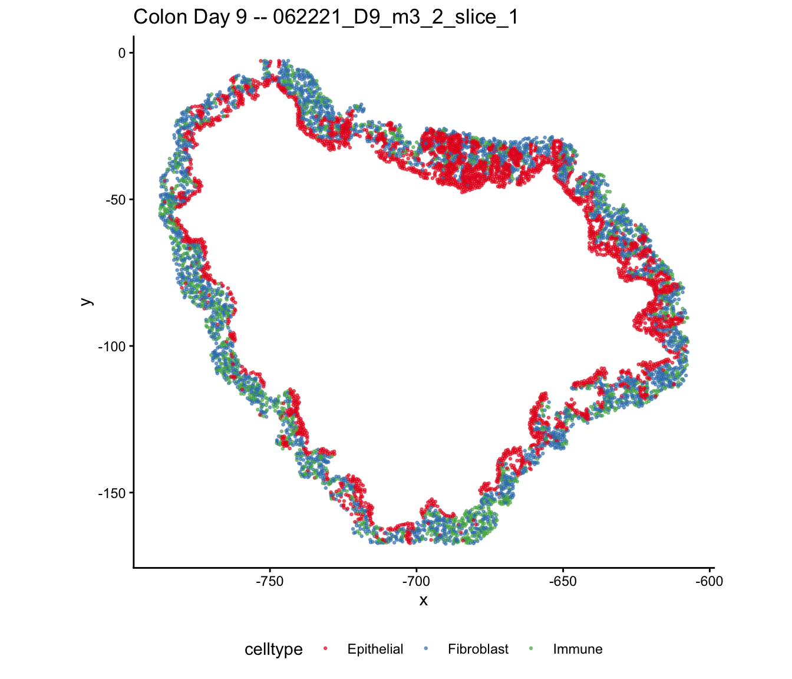
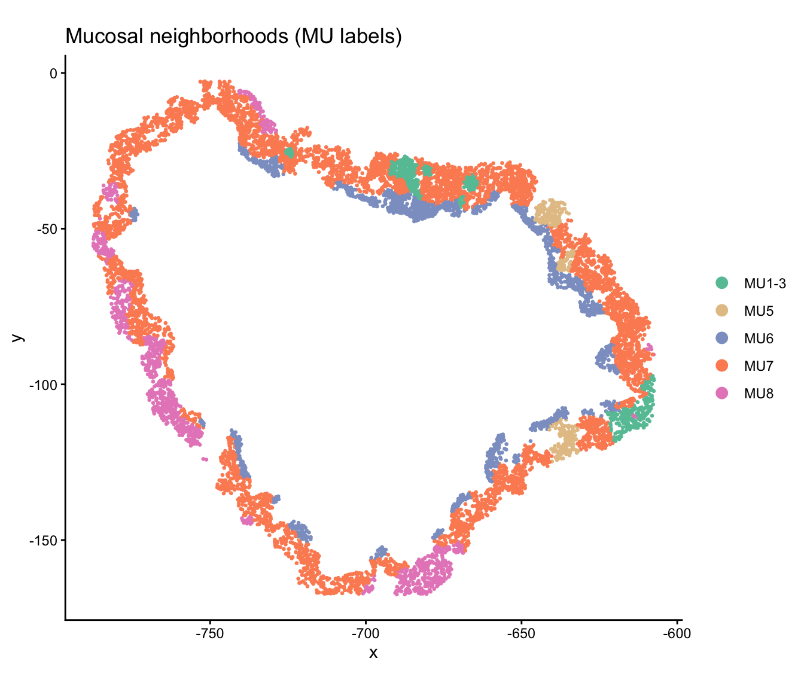
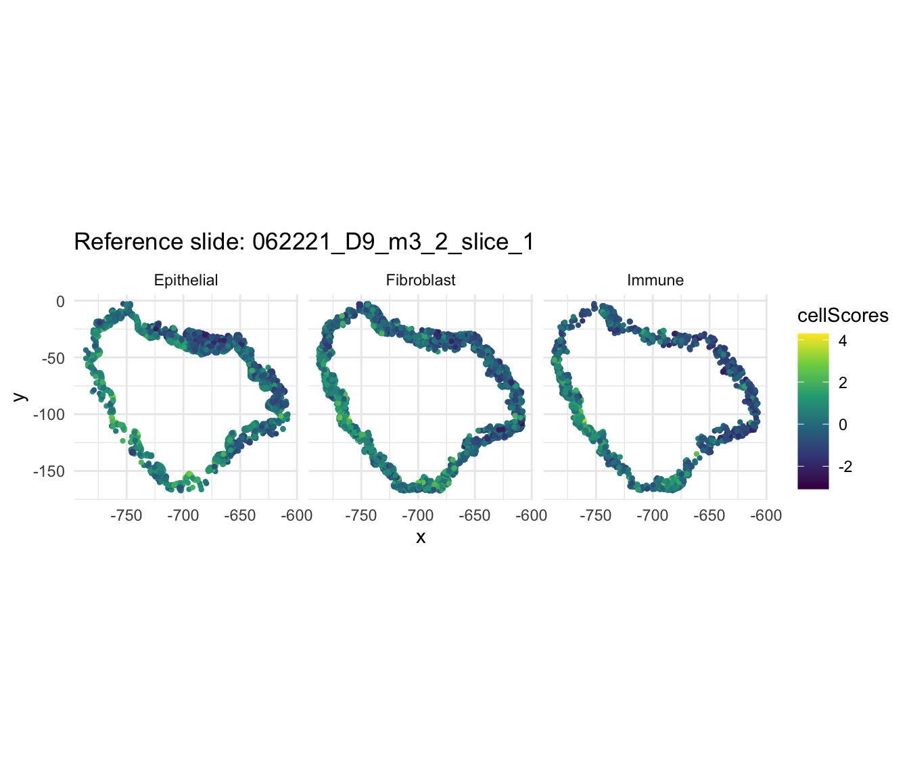
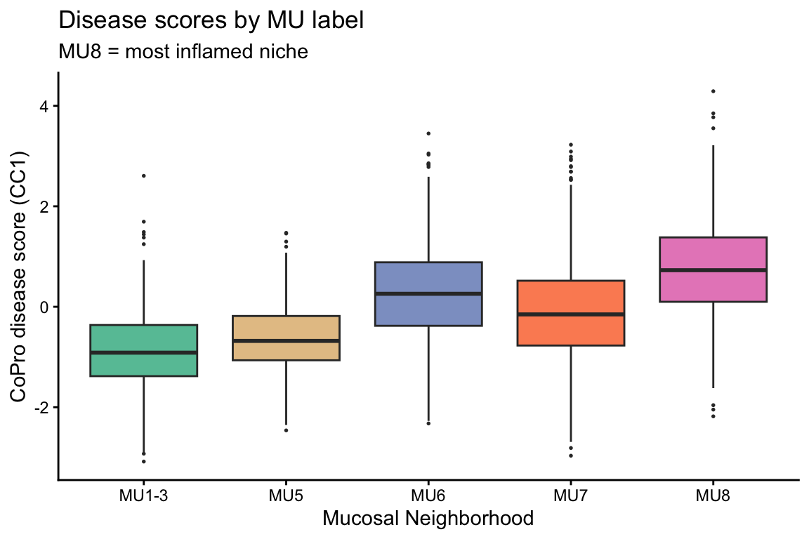
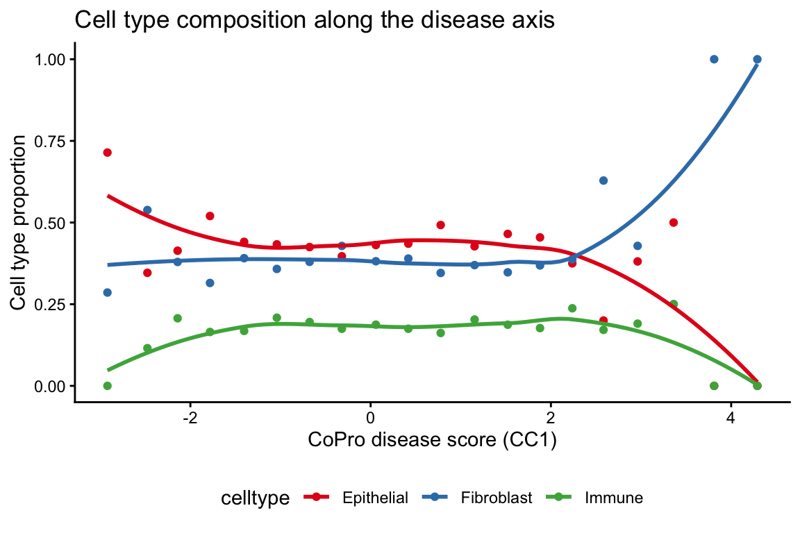
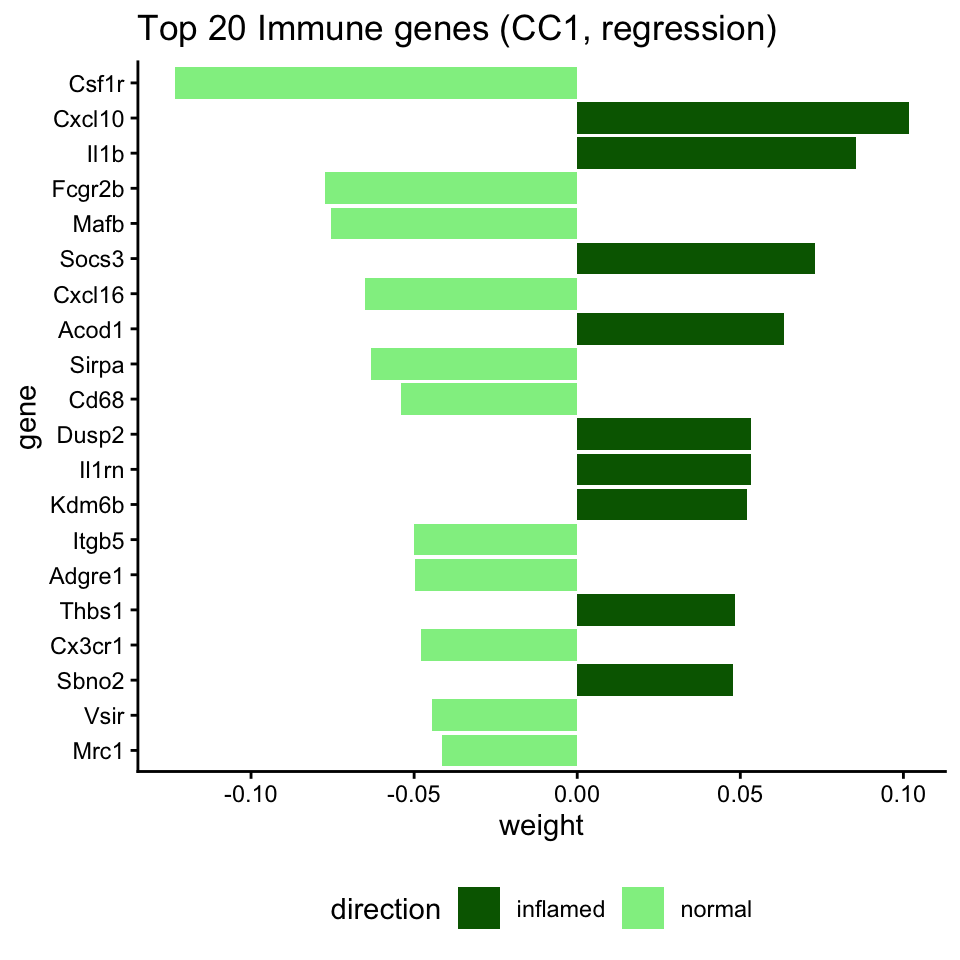
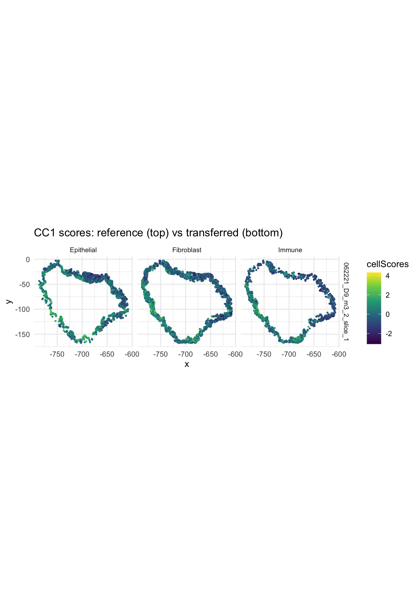
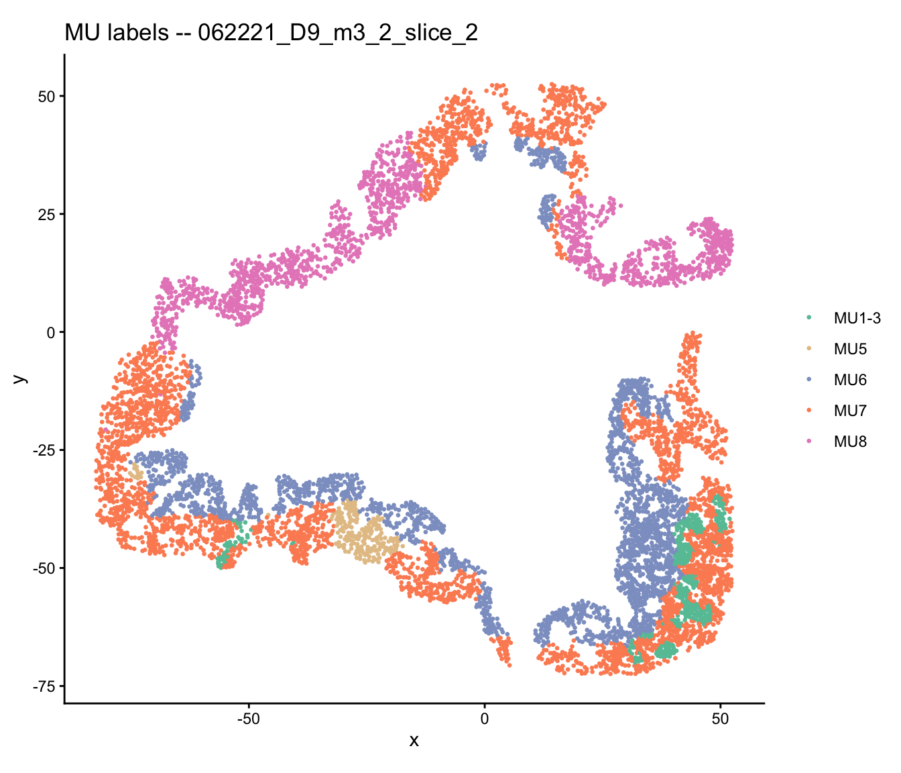

## Overview

This vignette demonstrates CoPro's **multi-slide analysis** and **score
transfer** capabilities using colon organoid Day 9 data. At Day 9,
the tissue exhibits severe inflammation with heterogeneous disease
progression across different regions. CoPro detects a **disease
progression axis** that correlates with independently derived mucosal
neighborhood (MU) labels---in particular, **MU8** marks the most
severely inflamed niche.

When multiple tissue slides are available, CoPro can:

1. Learn co-progression patterns from a **reference slide**
2. **Transfer** the learned gene weights to new slides
3. Compare co-progression patterns across biological replicates

## Load packages


``` r
library(CoPro)
library(ggplot2)
```

## Download and load data


``` r
data_path <- copro_download_data("colon_d9")
```

```
## Using cached file: /Users/zhenmiao/Library/Caches/org.R-project.R/R/CoPro/copro_colon_d9.rds
```

``` r
dat <- readRDS(data_path)

# Three slides are included
cat("Slides:", paste(dat$selectedSlides, collapse = ", "), "\n")
```

```
## Slides: 062221_D9_m3_2_slice_1, 062221_D9_m3_2_slice_2, 062221_D9_m3_2_slice_3
```

``` r
cat("Total cells:", nrow(dat$normalizedData), "\n")
```

```
## Total cells: 21436
```

``` r
table(dat$slideID)
```

```
## 
## 062221_D9_m3_2_slice_1 062221_D9_m3_2_slice_2 062221_D9_m3_2_slice_3 
##                   7242                   6627                   7567
```

## Visualize the tissue

### Cell types


``` r
plot_df <- data.frame(
  x = dat$locationData$x,
  y = dat$locationData$y,
  celltype = dat$cellTypes,
  slide = dat$slideID
)

ggplot(plot_df[plot_df$slide == dat$selectedSlides[1], ],
       aes(x = x, y = y, color = celltype)) +
  geom_point(size = 0.5, alpha = 0.6) +
  scale_color_manual(values = c("Epithelial" = "#E41A1C",
                                 "Fibroblast" = "#377EB8",
                                 "Immune" = "#4DAF4A")) +
  coord_fixed() +
  ggtitle(paste("Colon Day 9 --", dat$selectedSlides[1])) +
  theme_classic() +
  theme(legend.position = "bottom")
```



### Mucosal neighborhood (MU) labels

The tissue has been independently annotated with mucosal neighborhood
labels via Leiden clustering. **MU8** marks the most severely inflamed
niche, while MU1--3 are grouped as relatively normal crypt neighborhoods:


``` r
mu_df <- data.frame(
  x = dat$locationData$x,
  y = dat$locationData$y,
  MU = dat$metaData$Leiden_neigh,
  slide = dat$slideID
)

# Group MU labels as in the manuscript
mu_df$MU_grouped <- as.character(mu_df$MU)
mu_df$MU_grouped[mu_df$MU %in% c("MU1", "MU11")] <- "MU1-3"
mu_df <- mu_df[mu_df$MU_grouped %in% c("MU1-3", "MU5", "MU6", "MU7", "MU8"), ]
mu_df$MU_grouped <- factor(mu_df$MU_grouped,
                            levels = c("MU1-3", "MU5", "MU6", "MU7", "MU8"))

mu_colors <- c("MU1-3" = "#66C2A5", "MU5" = "#E5C494",
               "MU6" = "#8DA0CB", "MU7" = "#FC8D62", "MU8" = "#E78AC3")

ggplot(mu_df[mu_df$slide == dat$selectedSlides[1], ],
       aes(x = x, y = y, color = MU_grouped)) +
  geom_point(size = 0.5) +
  scale_color_manual(values = mu_colors) +
  coord_fixed() +
  ggtitle("Mucosal neighborhoods (MU labels)") +
  theme_classic() +
  theme(legend.title = element_blank(), legend.position = "right") +
  guides(color = guide_legend(override.aes = list(size = 3)))
```



## Strategy: Reference + target slides

We use the first slide as the **reference** to learn co-progression
patterns, then transfer scores to the other two slides.


``` r
ref_slide <- dat$selectedSlides[1]
tar_slides <- dat$selectedSlides[2:3]

# Indices for reference and target
ref_idx <- dat$slideID == ref_slide
tar1_idx <- dat$slideID == tar_slides[1]
tar2_idx <- dat$slideID == tar_slides[2]
```

## Step 1: Run CoPro on the reference slide


``` r
cell_types <- c("Epithelial", "Fibroblast", "Immune")

# Create reference CoPro object
ref_obj <- newCoProSingle(
  normalizedData = dat$normalizedData[ref_idx, ],
  locationData = dat$locationData[ref_idx, ],
  metaData = dat$metaData[ref_idx, ],
  cellTypes = dat$cellTypes[ref_idx]
)
ref_obj <- subsetData(ref_obj, cellTypesOfInterest = cell_types)

# Run pipeline
ref_obj <- computePCA(ref_obj, nPCA = 40, center = TRUE, scale. = TRUE)
```

```
## Input is dense (matrixarray), performing irlba pca...
## Input is dense (matrixarray), performing irlba pca...
## Input is dense (matrixarray), performing irlba pca...
```

``` r
ref_obj <- computeDistance(ref_obj, distType = "Euclidean2D")
```

```
## normalizeDistance = TRUE: low-percentile distance will be scaled to 0.01.
```

```
##         0%        25%        50%        75%       100% 
##   1.559086  54.812663  95.648432 126.009495 191.917943 
##         0%        25%        50%        75%       100% 
##   1.723399  61.128716 100.304344 127.403172 191.878277 
##         0%        25%        50%        75%       100% 
##   1.033183  59.470179 102.405454 133.908593 194.179085
```

```
## Distance normalization scaling factor: 0.00967883
```

``` r
sigma_choice <- c(0.005, 0.01, 0.02, 0.05, 0.1)
ref_obj <- computeKernelMatrix(ref_obj, sigmaValues = sigma_choice)
```

```
## Computing pairwise kernel matrix for 3 cell types
## current sigma value is 0.005 
## current sigma value is 0.01 
## current sigma value is 0.02 
## current sigma value is 0.05 
## current sigma value is 0.1
```

``` r
ref_obj <- runSkrCCA(ref_obj, scalePCs = TRUE, maxIter = 500, nCC = 2)
```

```
## Running skrCCA [1/5] for sigma = 0.005 ...
```

```
## [1] "Convergence reached at 13 iterations (Max diff = 2.633e-06 )"
## [1] "Convergence reached at 40 iterations (Max diff = 8.175e-06 )"
```

```
## Running skrCCA [2/5] for sigma = 0.01 ...
```

```
## [1] "Convergence reached at 10 iterations (Max diff = 6.270e-06 )"
## [1] "Convergence reached at 10 iterations (Max diff = 5.534e-06 )"
```

```
## Running skrCCA [3/5] for sigma = 0.02 ...
```

```
## [1] "Convergence reached at 9 iterations (Max diff = 6.718e-06 )"
## [1] "Convergence reached at 9 iterations (Max diff = 6.414e-06 )"
```

```
## Running skrCCA [4/5] for sigma = 0.05 ...
```

```
## [1] "Convergence reached at 8 iterations (Max diff = 2.083e-06 )"
## [1] "Convergence reached at 7 iterations (Max diff = 5.368e-06 )"
```

```
## Running skrCCA [5/5] for sigma = 0.1 ...
```

```
## [1] "Convergence reached at 7 iterations (Max diff = 2.468e-06 )"
## [1] "Convergence reached at 6 iterations (Max diff = 3.710e-06 )"
```

```
## skrCCA finished 5 sigma value(s) in 2.9 s.
```

```
## Optimization succeeded for 5 sigma value(s): sigma_0.005, sigma_0.01, sigma_0.02, sigma_0.05, sigma_0.1
```

``` r
ref_obj <- computeNormalizedCorrelation(ref_obj)
```

```
## Calculating spectral norms, this may take a while.
```

```
## Finished calculating spectral norms.
```

``` r
ref_obj <- computeGeneAndCellScores(ref_obj)
ref_obj <- computeRegressionGeneScores(ref_obj)
```

```
## Computed regression gene scores for sigma=0.005, cellType='Epithelial'
```

```
## Computed regression gene scores for sigma=0.005, cellType='Fibroblast'
```

```
## Computed regression gene scores for sigma=0.005, cellType='Immune'
```

```
## Computed regression gene scores for sigma=0.01, cellType='Epithelial'
```

```
## Computed regression gene scores for sigma=0.01, cellType='Fibroblast'
```

```
## Computed regression gene scores for sigma=0.01, cellType='Immune'
```

```
## Computed regression gene scores for sigma=0.02, cellType='Epithelial'
```

```
## Computed regression gene scores for sigma=0.02, cellType='Fibroblast'
```

```
## Computed regression gene scores for sigma=0.02, cellType='Immune'
```

```
## Computed regression gene scores for sigma=0.05, cellType='Epithelial'
```

```
## Computed regression gene scores for sigma=0.05, cellType='Fibroblast'
```

```
## Computed regression gene scores for sigma=0.05, cellType='Immune'
```

```
## Computed regression gene scores for sigma=0.1, cellType='Epithelial'
```

```
## Computed regression gene scores for sigma=0.1, cellType='Fibroblast'
```

```
## Computed regression gene scores for sigma=0.1, cellType='Immune'
```

### Reference slide results


``` r
sigma_opt <- 0.01  # adjust based on normalized correlation

cs_ref <- getCellScoresInSitu(ref_obj, sigmaValueChoice = sigma_opt)

ggplot(cs_ref) +
  geom_point(aes(x = x, y = y, color = cellScores), size = 0.8) +
  scale_color_viridis_c() +
  facet_wrap(~ cellTypesSub) +
  coord_fixed() +
  ggtitle(paste("Reference slide:", ref_slide)) +
  theme_minimal()
```



### Disease axis vs MU labels

The CoPro disease axis should correlate with MU labels, with **MU8**
cells showing the highest scores:


``` r
ref_meta <- ref_obj@metaDataSub
ref_meta$cell_score <- ref_meta[, paste0("cellScore_sigma_", sigma_opt,
                                          "_cc_index_1")]

# Assign grouped MU labels
ref_meta$MU_grouped <- as.character(ref_meta$Leiden_neigh)
ref_meta$MU_grouped[ref_meta$MU_grouped %in% c("MU1", "MU11")] <- "MU1-3"
ref_meta <- ref_meta[ref_meta$MU_grouped %in%
                      c("MU1-3", "MU5", "MU6", "MU7", "MU8"), ]
ref_meta$MU_grouped <- factor(ref_meta$MU_grouped,
                               levels = c("MU1-3", "MU5", "MU6", "MU7", "MU8"))

ggplot(ref_meta, aes(x = MU_grouped, y = cell_score, fill = MU_grouped)) +
  geom_boxplot(outlier.size = 0.3) +
  scale_fill_manual(values = mu_colors, guide = "none") +
  labs(x = "Mucosal Neighborhood", y = "CoPro disease score (CC1)",
       title = "Disease scores by MU label",
       subtitle = "MU8 = most inflamed niche") +
  theme_classic()
```



### Cell type proportions along the disease axis

As disease severity increases, the cell type composition shifts---immune
cell proportion increases while epithelial proportion decreases:


``` r
ref_meta_all <- ref_obj@metaDataSub
ref_meta_all$cell_score <- ref_meta_all[, paste0("cellScore_sigma_",
                                                   sigma_opt, "_cc_index_1")]

# Bin cells by disease score
ref_meta_all$score_bin <- cut(ref_meta_all$cell_score, breaks = 20)

# Calculate proportions
prop_df <- do.call(rbind, lapply(split(ref_meta_all, ref_meta_all$score_bin),
  function(x) {
    data.frame(
      score_mid = mean(x$cell_score, na.rm = TRUE),
      Epithelial = mean(x$Tier1 == "Epithelial"),
      Fibroblast = mean(x$Tier1 == "Fibroblast"),
      Immune = mean(x$Tier1 == "Immune")
    )
  }
))
prop_long <- reshape(prop_df, direction = "long",
                     varying = c("Epithelial", "Fibroblast", "Immune"),
                     v.names = "proportion", timevar = "celltype",
                     times = c("Epithelial", "Fibroblast", "Immune"))

ggplot(prop_long, aes(x = score_mid, y = proportion, color = celltype)) +
  geom_point() +
  geom_smooth(method = "loess", se = FALSE) +
  scale_color_manual(values = c("Epithelial" = "#E41A1C",
                                 "Fibroblast" = "#377EB8",
                                 "Immune" = "#4DAF4A")) +
  labs(x = "CoPro disease score (CC1)", y = "Cell type proportion",
       title = "Cell type composition along the disease axis") +
  theme_classic() +
  theme(legend.position = "bottom")
```

```
## `geom_smooth()` using formula = 'y ~ x'
```



### Top genes associated with the disease axis


``` r
# Immune genes on the disease axis
key_imm <- paste0("geneScores|sigma", sigma_opt, "|Immune")
gs_imm <- ref_obj@geneScoresRegression[[key_imm]]
gs_imm_cc1 <- gs_imm[, 1]

top_imm <- head(sort(abs(gs_imm_cc1), decreasing = TRUE), 20)
top_imm_df <- data.frame(
  gene = factor(names(top_imm), levels = rev(names(top_imm))),
  weight = gs_imm_cc1[names(top_imm)]
)
top_imm_df$direction <- ifelse(top_imm_df$weight > 0, "inflamed", "normal")

ggplot(top_imm_df, aes(x = gene, y = weight, fill = direction)) +
  geom_col() +
  coord_flip() +
  scale_fill_manual(values = c("inflamed" = "darkgreen",
                                "normal" = "lightgreen")) +
  ggtitle("Top 20 Immune genes (CC1, regression)") +
  theme_classic() +
  theme(legend.position = "bottom")
```



## Step 2: Create target CoPro objects


``` r
# Target slide 1
tar1_obj <- newCoProSingle(
  normalizedData = dat$normalizedData[tar1_idx, ],
  locationData = dat$locationData[tar1_idx, ],
  metaData = dat$metaData[tar1_idx, ],
  cellTypes = dat$cellTypes[tar1_idx]
)
tar1_obj <- subsetData(tar1_obj, cellTypesOfInterest = cell_types)
tar1_obj <- computePCA(tar1_obj, nPCA = 40, center = TRUE, scale. = TRUE)
```

```
## Input is dense (matrixarray), performing irlba pca...
## Input is dense (matrixarray), performing irlba pca...
## Input is dense (matrixarray), performing irlba pca...
```

``` r
tar1_obj <- computeDistance(tar1_obj, distType = "Euclidean2D")
```

```
## normalizeDistance = TRUE: low-percentile distance will be scaled to 0.01.
```

```
##         0%        25%        50%        75%       100% 
##   1.547908  40.150567  71.639135  99.196604 145.064234 
##         0%        25%        50%        75%       100% 
##   1.839067  46.588659  74.794733 100.618483 144.602279 
##         0%        25%        50%        75%       100% 
##   1.077755  44.939240  73.568954  97.010170 146.985239
```

```
## Distance normalization scaling factor: 0.00927854
```

``` r
tar1_obj <- computeKernelMatrix(tar1_obj, sigmaValues = sigma_choice)
```

```
## Computing pairwise kernel matrix for 3 cell types
## current sigma value is 0.005 
## current sigma value is 0.01 
## current sigma value is 0.02 
## current sigma value is 0.05 
## current sigma value is 0.1
```

``` r
# Target slide 2
tar2_obj <- newCoProSingle(
  normalizedData = dat$normalizedData[tar2_idx, ],
  locationData = dat$locationData[tar2_idx, ],
  metaData = dat$metaData[tar2_idx, ],
  cellTypes = dat$cellTypes[tar2_idx]
)
tar2_obj <- subsetData(tar2_obj, cellTypesOfInterest = cell_types)
tar2_obj <- computePCA(tar2_obj, nPCA = 40, center = TRUE, scale. = TRUE)
```

```
## Input is dense (matrixarray), performing irlba pca...
## Input is dense (matrixarray), performing irlba pca...
## Input is dense (matrixarray), performing irlba pca...
```

``` r
tar2_obj <- computeDistance(tar2_obj, distType = "Euclidean2D")
```

```
## normalizeDistance = TRUE: low-percentile distance will be scaled to 0.01.
```

```
##        0%       25%       50%       75%      100% 
##   1.65134  41.19449  71.21469  94.13571 147.60112 
##         0%        25%        50%        75%       100% 
##   2.021933  50.297768  74.971212  97.972906 148.666374 
##         0%        25%        50%        75%       100% 
##   1.162089  43.393514  70.036161  92.718582 149.327113
```

```
## Distance normalization scaling factor: 0.0086052
```

``` r
tar2_obj <- computeKernelMatrix(tar2_obj, sigmaValues = sigma_choice)
```

```
## Computing pairwise kernel matrix for 3 cell types
## current sigma value is 0.005 
## current sigma value is 0.01 
## current sigma value is 0.02 
## current sigma value is 0.05 
## current sigma value is 0.1
```

## Step 3: Transfer scores

Transfer the learned gene weights from the reference to each target slide:


``` r
# Transfer to target 1
tar1_scores <- getTransferCellScores(
  ref_obj = ref_obj,
  tar_obj = tar1_obj,
  sigma_choice = sigma_opt,
  gene_score_type = "regression"
)
```

```
## Using regression-based gene weights for transfer
## transferring gene scores for cell type Epithelial
```

```
## Processing feature 94/940
```

```
## Processing feature 188/940
```

```
## Processing feature 282/940
```

```
## Processing feature 376/940
```

```
## Processing feature 470/940
```

```
## Processing feature 564/940
```

```
## Processing feature 658/940
```

```
## Processing feature 752/940
```

```
## Processing feature 846/940
```

```
## Processing feature 940/940
```

```
## retaining 940 genes for CC_1 with threshold 0 
## retaining 940 genes for CC_2 with threshold 0 
## transferring gene scores for cell type Fibroblast
```

```
## Processing feature 94/940
```

```
## Processing feature 188/940
```

```
## Processing feature 282/940
```

```
## Processing feature 376/940
```

```
## Processing feature 470/940
```

```
## Processing feature 564/940
```

```
## Processing feature 658/940
```

```
## Processing feature 752/940
```

```
## Processing feature 846/940
```

```
## Processing feature 940/940
```

```
## retaining 940 genes for CC_1 with threshold 0 
## retaining 940 genes for CC_2 with threshold 0 
## transferring gene scores for cell type Immune
```

```
## Processing feature 94/940
```

```
## Processing feature 188/940
```

```
## Processing feature 282/940
```

```
## Processing feature 376/940
```

```
## Processing feature 470/940
```

```
## Processing feature 564/940
```

```
## Processing feature 658/940
```

```
## Processing feature 752/940
```

```
## Processing feature 846/940
```

```
## Processing feature 940/940
```

```
## retaining 940 genes for CC_1 with threshold 0 
## retaining 940 genes for CC_2 with threshold 0
```

``` r
# Transfer to target 2
tar2_scores <- getTransferCellScores(
  ref_obj = ref_obj,
  tar_obj = tar2_obj,
  sigma_choice = sigma_opt,
  gene_score_type = "regression"
)
```

```
## Using regression-based gene weights for transfer
## transferring gene scores for cell type Epithelial
```

```
## Processing feature 94/940
```

```
## Processing feature 188/940
```

```
## Processing feature 282/940
```

```
## Processing feature 376/940
```

```
## Processing feature 470/940
```

```
## Processing feature 564/940
```

```
## Processing feature 658/940
```

```
## Processing feature 752/940
```

```
## Processing feature 846/940
```

```
## Processing feature 940/940
```

```
## retaining 940 genes for CC_1 with threshold 0 
## retaining 940 genes for CC_2 with threshold 0 
## transferring gene scores for cell type Fibroblast
```

```
## Processing feature 94/940
```

```
## Processing feature 188/940
```

```
## Processing feature 282/940
```

```
## Processing feature 376/940
```

```
## Processing feature 470/940
```

```
## Processing feature 564/940
```

```
## Processing feature 658/940
```

```
## Processing feature 752/940
```

```
## Processing feature 846/940
```

```
## Processing feature 940/940
```

```
## retaining 940 genes for CC_1 with threshold 0 
## retaining 940 genes for CC_2 with threshold 0 
## transferring gene scores for cell type Immune
```

```
## Processing feature 94/940
```

```
## Processing feature 188/940
```

```
## Processing feature 282/940
```

```
## Processing feature 376/940
```

```
## Processing feature 470/940
```

```
## Processing feature 564/940
```

```
## Processing feature 658/940
```

```
## Processing feature 752/940
```

```
## Processing feature 846/940
```

```
## Processing feature 940/940
```

```
## retaining 940 genes for CC_1 with threshold 0 
## retaining 940 genes for CC_2 with threshold 0
```

## Step 4: Visualize transferred scores


``` r
# Build data frames for target slides from transferred scores
build_transfer_df <- function(tar_dat, tar_scores, slide_name, sigma) {
  rows <- list()
  for (ct in cell_types) {
    ct_key <- paste0("geneScores|sigma", sigma, "|", ct)
    if (ct_key %in% names(tar_scores)) {
      ct_idx <- tar_dat$cellTypes == ct
      rows[[ct]] <- data.frame(
        x = tar_dat$locationData$x[ct_idx],
        y = tar_dat$locationData$y[ct_idx],
        cellScores = tar_scores[[ct_key]][, 1],
        cellTypesSub = ct,
        slide = slide_name
      )
    }
  }
  do.call(rbind, rows)
}

# Build target data using the original dat split by slide indices
tar1_dat <- list(
  locationData = dat$locationData[tar1_idx, ],
  cellTypes = dat$cellTypes[tar1_idx]
)
tar2_dat <- list(
  locationData = dat$locationData[tar2_idx, ],
  cellTypes = dat$cellTypes[tar2_idx]
)

tar1_cs <- build_transfer_df(tar1_dat, tar1_scores, tar_slides[1], sigma_opt)
tar2_cs <- build_transfer_df(tar2_dat, tar2_scores, tar_slides[2], sigma_opt)

# Add slide label to reference
cs_ref$slide <- ref_slide

all_cs <- rbind(
  cs_ref[, c("x", "y", "cellScores", "cellTypesSub", "slide")],
  tar1_cs,
  tar2_cs
)

ggplot(all_cs) +
  geom_point(aes(x = x, y = y, color = cellScores), size = 0.5) +
  scale_color_viridis_c() +
  facet_grid(slide ~ cellTypesSub) +
  coord_fixed() +
  ggtitle("CC1 scores: reference (top) vs transferred (bottom)") +
  theme_minimal() +
  theme(strip.text = element_text(size = 8))
```



## Step 5: Transferred scores vs MU labels on target slides

Check whether the transferred disease scores also separate MU labels.
Here we show the reference slide MU boxplot (already computed above)
alongside the MU labels in spatial context for a target slide:


``` r
# Show MU labels spatially on target slide 1
tar1_mu <- data.frame(
  x = dat$locationData$x[tar1_idx],
  y = dat$locationData$y[tar1_idx],
  MU = dat$metaData$Leiden_neigh[tar1_idx]
)
tar1_mu$MU_grouped <- as.character(tar1_mu$MU)
tar1_mu$MU_grouped[tar1_mu$MU_grouped %in% c("MU1", "MU11")] <- "MU1-3"
tar1_mu <- tar1_mu[tar1_mu$MU_grouped %in%
                    c("MU1-3", "MU5", "MU6", "MU7", "MU8"), ]
tar1_mu$MU_grouped <- factor(tar1_mu$MU_grouped,
                              levels = c("MU1-3", "MU5", "MU6", "MU7", "MU8"))

ggplot(tar1_mu, aes(x = x, y = y, color = MU_grouped)) +
  geom_point(size = 0.5) +
  scale_color_manual(values = mu_colors) +
  coord_fixed() +
  ggtitle(paste("MU labels --", tar_slides[1])) +
  theme_classic() +
  theme(legend.title = element_blank())
```



## Step 6: Assess transfer consistency

Compare the normalized correlation between the reference and transferred
slides to assess whether the co-progression pattern is consistent:


``` r
tar1_ncorr <- getTransferNormCorr(
  tar_obj = tar1_obj,
  transfer_cell_scores = tar1_scores,
  sigma_choice = sigma_opt
)
```

```
## Calculating spectral norms, this may take a while.
```

```
## Finished calculating spectral norms.
```

``` r
tar2_ncorr <- getTransferNormCorr(
  tar_obj = tar2_obj,
  transfer_cell_scores = tar2_scores,
  sigma_choice = sigma_opt
)
```

```
## Calculating spectral norms, this may take a while.
## Finished calculating spectral norms.
```

``` r
cat("Reference norm. corr.:\n")
```

```
## Reference norm. corr.:
```

``` r
ref_ncorr <- getNormCorr(ref_obj)
print(ref_ncorr[ref_ncorr$sigmaValues == sigma_opt, ])
```

```
##              sigmaValues  cellType1  cellType2 CC_index normalizedCorrelation
## sigma_0.01.1        0.01 Epithelial Fibroblast        1           0.134793330
## sigma_0.01.2        0.01 Epithelial     Immune        1           0.117235228
## sigma_0.01.3        0.01 Fibroblast     Immune        1           0.280624491
## sigma_0.01.4        0.01 Epithelial Fibroblast        2           0.158483841
## sigma_0.01.5        0.01 Epithelial     Immune        2          -0.004677438
## sigma_0.01.6        0.01 Fibroblast     Immune        2           0.110138028
##                               ct12
## sigma_0.01.1 Epithelial-Fibroblast
## sigma_0.01.2     Epithelial-Immune
## sigma_0.01.3     Fibroblast-Immune
## sigma_0.01.4 Epithelial-Fibroblast
## sigma_0.01.5     Epithelial-Immune
## sigma_0.01.6     Fibroblast-Immune
```

``` r
cat("\nTarget 1 transferred norm. corr.:\n")
```

```
## 
## Target 1 transferred norm. corr.:
```

``` r
print(tar1_ncorr)
```

```
## $sigma_0.01
##   sigmaValue  cellType1  cellType2 CC_index normalizedCorrelation
## 1       0.01 Epithelial Fibroblast        1            0.11110715
## 2       0.01 Epithelial Fibroblast        2            0.07360373
## 3       0.01 Epithelial     Immune        1            0.10573664
## 4       0.01 Epithelial     Immune        2           -0.07005138
## 5       0.01 Fibroblast     Immune        1            0.29851305
## 6       0.01 Fibroblast     Immune        2            0.10033667
```

``` r
cat("\nTarget 2 transferred norm. corr.:\n")
```

```
## 
## Target 2 transferred norm. corr.:
```

``` r
print(tar2_ncorr)
```

```
## $sigma_0.01
##   sigmaValue  cellType1  cellType2 CC_index normalizedCorrelation
## 1       0.01 Epithelial Fibroblast        1            0.06226162
## 2       0.01 Epithelial Fibroblast        2            0.08658079
## 3       0.01 Epithelial     Immune        1            0.07693568
## 4       0.01 Epithelial     Immune        2           -0.02331750
## 5       0.01 Fibroblast     Immune        1            0.26801035
## 6       0.01 Fibroblast     Immune        2            0.09242119
```

High transferred normalized correlations indicate that the co-progression
pattern learned from the reference generalizes well to independent slides.

## Alternative: Multi-slide CoPro

For joint analysis across all slides simultaneously, use `newCoProMulti`:


``` r
multi_obj <- newCoProMulti(
  normalizedData = dat$normalizedData,
  locationData = dat$locationData,
  metaData = dat$metaData,
  cellTypes = dat$cellTypes,
  slideID = dat$slideID
)
multi_obj <- subsetData(multi_obj, cellTypesOfInterest = cell_types)

# The rest of the pipeline is identical
multi_obj <- computePCA(multi_obj, nPCA = 40, center = TRUE, scale. = TRUE)
```

```
## Performing PCA for cell type: Epithelial
```

```
## Data centered and/or scaled
```

```
## PCA computed for cell type: Epithelial
```

```
## Performing PCA for cell type: Fibroblast
```

```
## Data centered and/or scaled
```

```
## PCA computed for cell type: Fibroblast
```

```
## Performing PCA for cell type: Immune
```

```
## Data centered and/or scaled
```

```
## PCA computed for cell type: Immune
```

``` r
multi_obj <- computeDistance(multi_obj, distType = "Euclidean2D")
```

```
## normalizeDistance = TRUE: low-percentile distance will be normalized across all slides and scaled to 0.01.
```

```
## Computing pairwise distances for slide: 062221_D9_m3_2_slice_3
```

```
## Slide: 062221_D9_m3_2_slice_3, Pair: Epithelial - Fibroblast
```

```
##        0%       25%       50%       75%      100% 
##   1.65134  41.19449  71.21469  94.13571 147.60112
```

```
## Slide: 062221_D9_m3_2_slice_3, Pair: Epithelial - Immune
```

```
##         0%        25%        50%        75%       100% 
##   2.021933  50.297768  74.971212  97.972906 148.666374
```

```
## Slide: 062221_D9_m3_2_slice_3, Pair: Fibroblast - Immune
```

```
##         0%        25%        50%        75%       100% 
##   1.162089  43.393514  70.036161  92.718582 149.327113
```

```
## Computing pairwise distances for slide: 062221_D9_m3_2_slice_2
```

```
## Slide: 062221_D9_m3_2_slice_2, Pair: Epithelial - Fibroblast
```

```
##         0%        25%        50%        75%       100% 
##   1.547908  40.150567  71.639135  99.196604 145.064234
```

```
## Slide: 062221_D9_m3_2_slice_2, Pair: Epithelial - Immune
```

```
##         0%        25%        50%        75%       100% 
##   1.839067  46.588659  74.794733 100.618483 144.602279
```

```
## Slide: 062221_D9_m3_2_slice_2, Pair: Fibroblast - Immune
```

```
##         0%        25%        50%        75%       100% 
##   1.077755  44.939240  73.568954  97.010170 146.985239
```

```
## Computing pairwise distances for slide: 062221_D9_m3_2_slice_1
```

```
## Slide: 062221_D9_m3_2_slice_1, Pair: Epithelial - Fibroblast
```

```
##         0%        25%        50%        75%       100% 
##   1.559086  54.812663  95.648432 126.009495 191.917943
```

```
## Slide: 062221_D9_m3_2_slice_1, Pair: Epithelial - Immune
```

```
##         0%        25%        50%        75%       100% 
##   1.723399  61.128716 100.304344 127.403172 191.878277
```

```
## Slide: 062221_D9_m3_2_slice_1, Pair: Fibroblast - Immune
```

```
##         0%        25%        50%        75%       100% 
##   1.033183  59.470179 102.405454 133.908593 194.179085
```

```
## Global distance scaling factor: 0.00967883
```

``` r
multi_obj <- computeKernelMatrix(multi_obj, sigmaValues = sigma_choice)
```

```
## Computing pairwise kernel matrix for 3 cell types across 3 slides
## current sigma value is 0.005 
## current sigma value is 0.01 
## current sigma value is 0.02 
## current sigma value is 0.05 
## current sigma value is 0.1
```

``` r
multi_obj <- runSkrCCA(multi_obj, scalePCs = TRUE, maxIter = 500, nCC = 2)
```

```
## Running skrCCA [1/5] for sigma = 0.005 ...
```

```
## Convergence reached at 8 iterations (Max diff = 2.798e-06 )
```

```
## [1] "Convergence reached at 22 iterations (Max diff = 7.514e-06 )"
```

```
## Running skrCCA [2/5] for sigma = 0.01 ...
```

```
## Convergence reached at 8 iterations (Max diff = 3.313e-06 )
```

```
## [1] "Convergence reached at 74 iterations (Max diff = 9.432e-06 )"
```

```
## Running skrCCA [3/5] for sigma = 0.02 ...
```

```
## Convergence reached at 7 iterations (Max diff = 5.994e-06 )
```

```
## [1] "Convergence reached at 31 iterations (Max diff = 7.752e-06 )"
```

```
## Running skrCCA [4/5] for sigma = 0.05 ...
```

```
## Convergence reached at 6 iterations (Max diff = 7.485e-06 )
```

```
## [1] "Convergence reached at 26 iterations (Max diff = 7.233e-06 )"
```

```
## Running skrCCA [5/5] for sigma = 0.1 ...
```

```
## Convergence reached at 9 iterations (Max diff = 3.941e-06 )
```

```
## [1] "Convergence reached at 20 iterations (Max diff = 8.643e-06 )"
```

```
## skrCCA finished 5 sigma value(s) in 8.1 s.
```

```
## Optimization succeeded for 5 sigma value(s): sigma_0.005, sigma_0.01, sigma_0.02, sigma_0.05, sigma_0.1
```

``` r
multi_obj <- computeNormalizedCorrelation(multi_obj)
```

```
## Calculating spectral norms (can take time)...
```

```
## Finished calculating spectral norms.
```

``` r
multi_obj <- computeGeneAndCellScores(multi_obj)
```

The multi-slide approach optimizes CCA weights jointly across all slides,
while the transfer approach trains on one slide and evaluates generalization.
Both are useful depending on your analytical question.

## Session info


``` r
sessionInfo()
```

```
## R version 4.5.2 (2025-10-31)
## Platform: aarch64-apple-darwin20
## Running under: macOS Tahoe 26.1
## 
## Matrix products: default
## BLAS:   /System/Library/Frameworks/Accelerate.framework/Versions/A/Frameworks/vecLib.framework/Versions/A/libBLAS.dylib 
## LAPACK: /Library/Frameworks/R.framework/Versions/4.5-arm64/Resources/lib/libRlapack.dylib;  LAPACK version 3.12.1
## 
## locale:
## [1] en_US.UTF-8/en_US.UTF-8/en_US.UTF-8/C/en_US.UTF-8/en_US.UTF-8
## 
## time zone: America/Los_Angeles
## tzcode source: internal
## 
## attached base packages:
## [1] stats     graphics  grDevices utils     datasets  methods   base     
## 
## other attached packages:
## [1] ggplot2_4.0.1  CoPro_1.1.0    testthat_3.3.2
## 
## loaded via a namespace (and not attached):
##  [1] generics_0.1.4     renv_1.1.7         lattice_0.22-9     magrittr_2.0.4    
##  [5] evaluate_1.0.5     grid_4.5.2         RColorBrewer_1.1-3 pkgload_1.4.1     
##  [9] fastmap_1.2.0      maps_3.4.3         rprojroot_2.1.1    Matrix_1.7-5      
## [13] pkgbuild_1.4.8     sessioninfo_1.2.3  brio_1.1.5         mgcv_1.9-4        
## [17] purrr_1.2.1        spam_2.11-3        viridisLite_0.4.2  scales_1.4.0      
## [21] isoband_0.3.0      cli_3.6.5          rlang_1.1.7        splines_4.5.2     
## [25] ellipsis_0.3.2     remotes_2.5.0      withr_3.0.2        cachem_1.1.0      
## [29] yaml_2.3.12        devtools_2.4.6     otel_0.2.0         tools_4.5.2       
## [33] parallel_4.5.2     memoise_2.0.1      dplyr_1.1.4        vctrs_0.7.1       
## [37] R6_2.6.1           matrixStats_1.5.0  lifecycle_1.0.5    fs_1.6.6          
## [41] MASS_7.3-65        usethis_3.2.1      irlba_2.3.7        pkgconfig_2.0.3   
## [45] desc_1.4.3         pillar_1.11.1      gtable_0.3.6       glue_1.8.0        
## [49] Rcpp_1.1.1         fields_17.1        xfun_0.56          tibble_3.3.1      
## [53] tidyselect_1.2.1   rstudioapi_0.18.0  knitr_1.51         farver_2.1.2      
## [57] nlme_3.1-169       labeling_0.4.3     dotCall64_1.2      compiler_4.5.2    
## [61] S7_0.2.1
```
