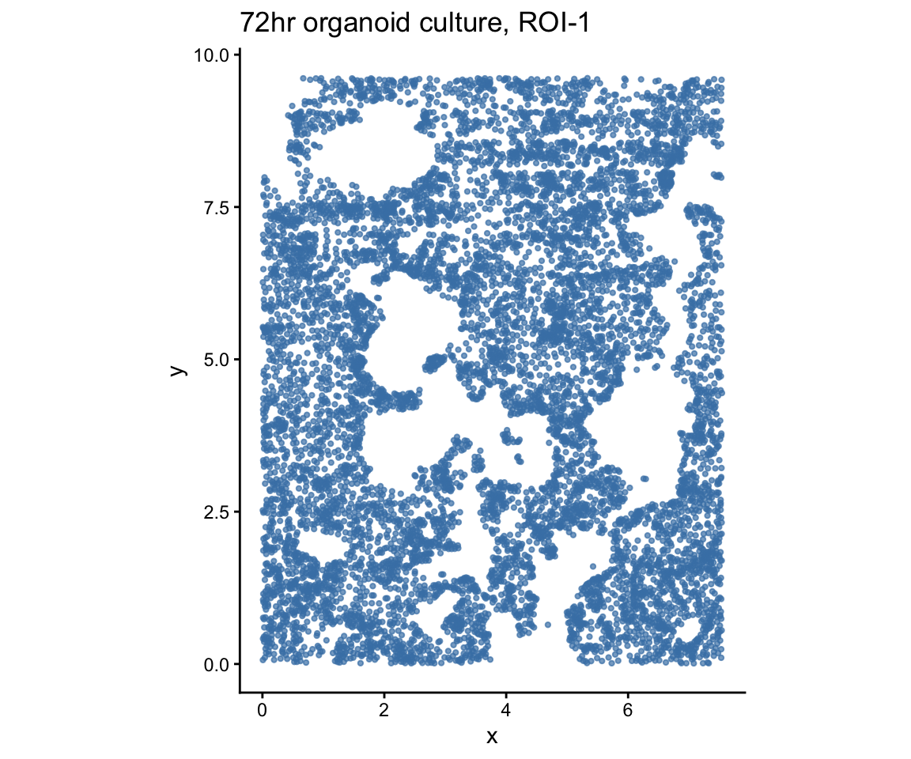
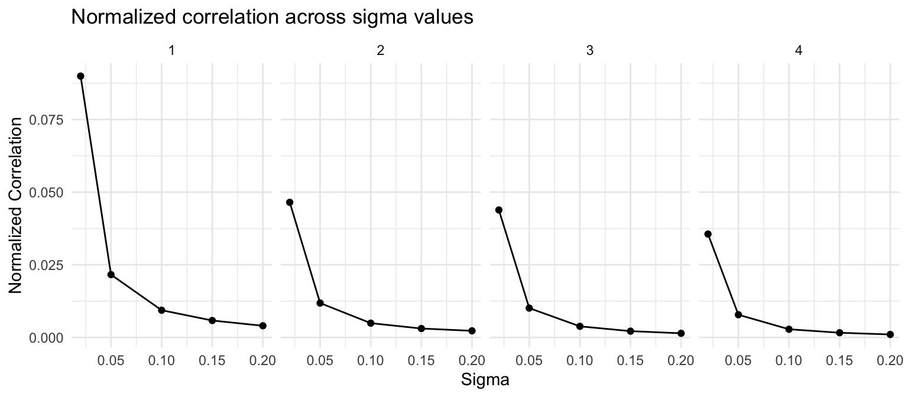
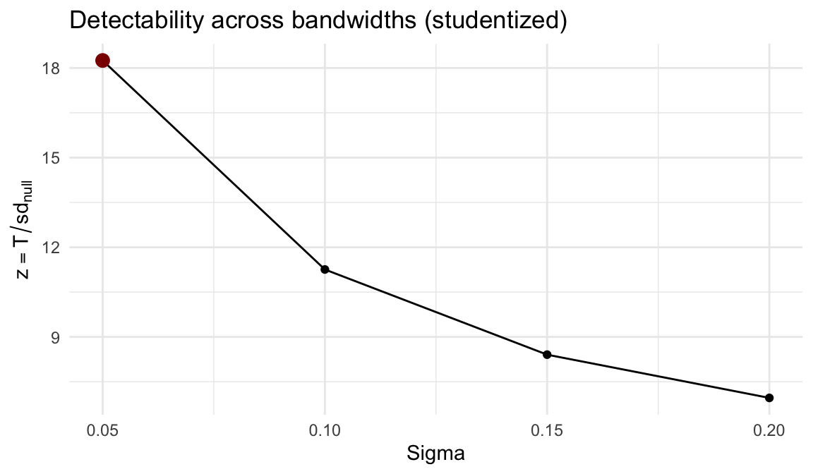
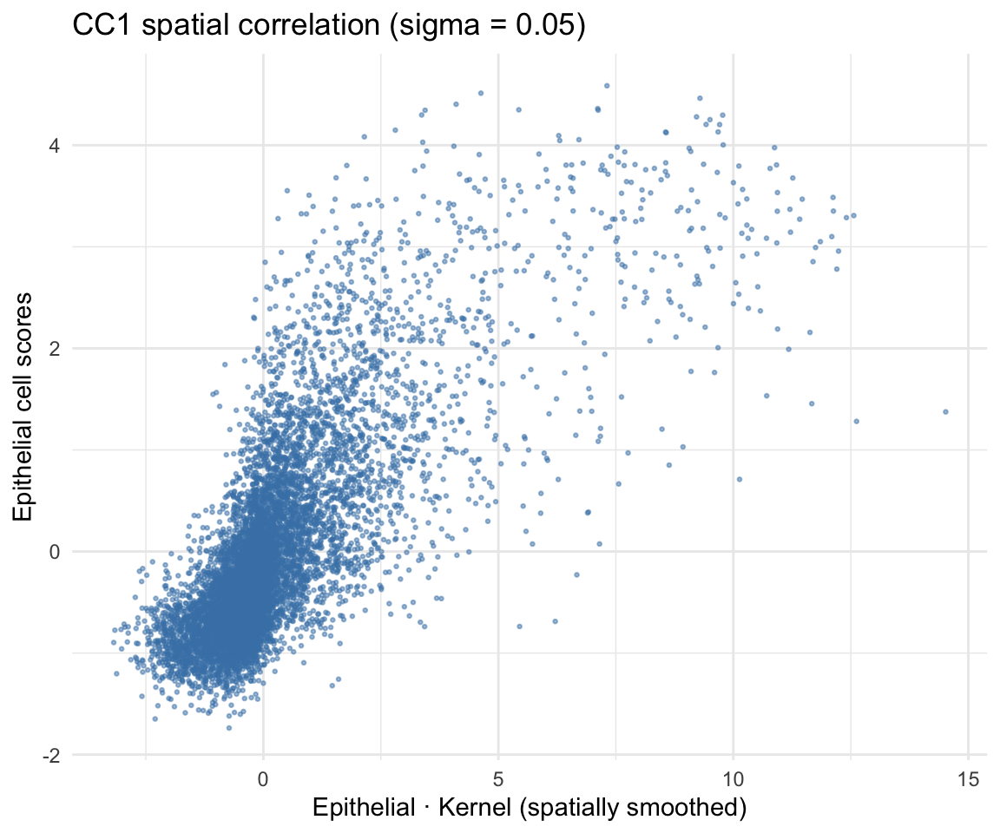
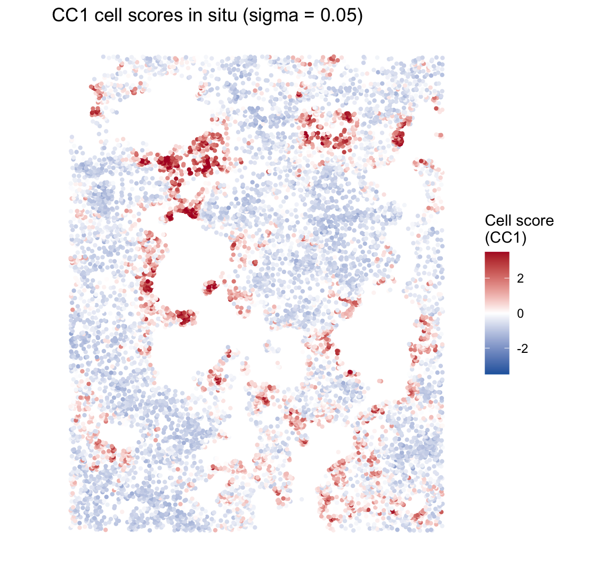
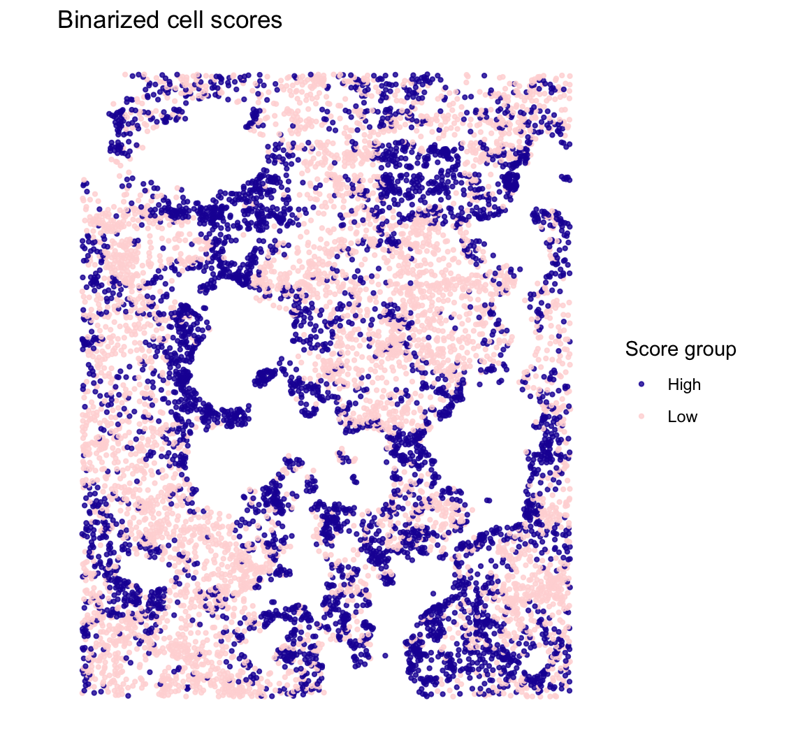
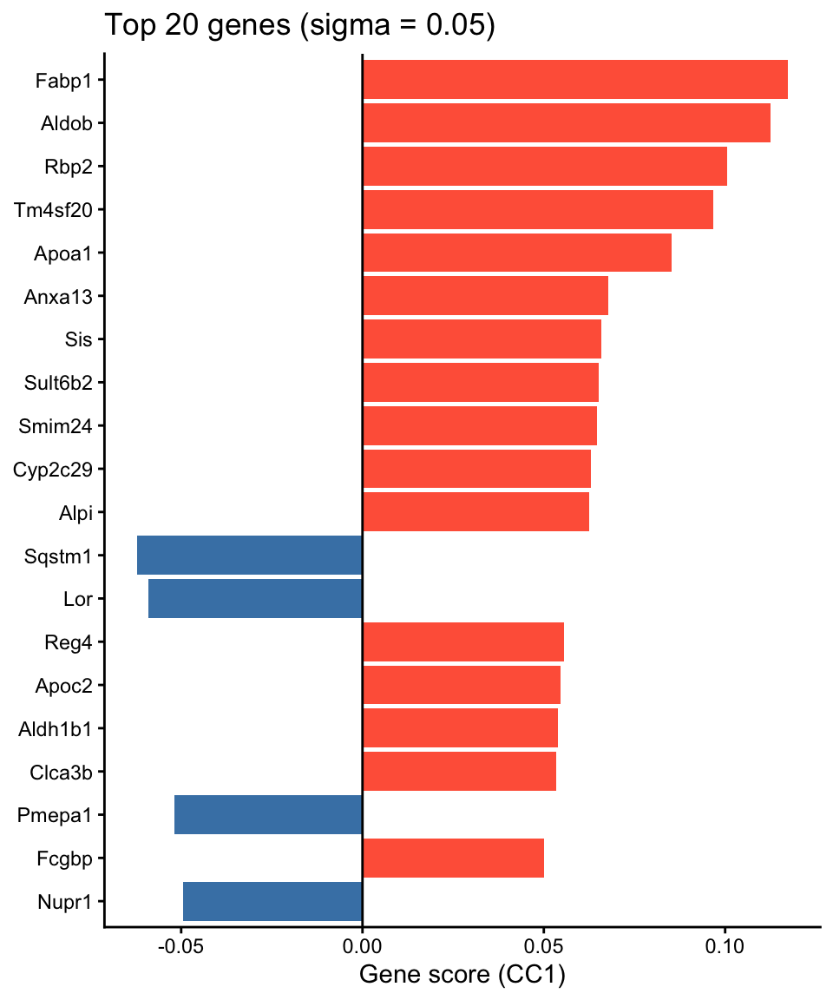

## Overview

This vignette demonstrates how CoPro detects **within-cell-type spatial
patterns** using a single cell type. We analyze a 72-hour intestinal
organoid culture imaged by seqFISH, where all cells are epithelial. CoPro
identifies spatially organized gene programs---self-organization patterns
that emerge within a single population.

**What CoPro finds here:** The spatial co-progression of epithelial cells
captures the crypt--villus axis of the organoid---cells along the same
developmental trajectory cluster spatially.

## Load packages


``` r
library(CoPro)
library(ggplot2)
```

## Download and load data


``` r
data_path <- copro_download_data("organoid")
dat <- readRDS(data_path)

cat("Cells:", nrow(dat$normalizedData), "\n")
```

```
## Cells: 9140
```

``` r
cat("Genes:", ncol(dat$normalizedData), "\n")
```

```
## Genes: 140
```

The dataset contains:

- `normalizedData`: expression matrix (cells x genes), capped at 95th
  percentile, DESeq2 size-factor normalized, log1p-transformed
- `locationData`: spatial coordinates (pixels / 5000)
- `metaData`: cell attributes
- `cellTypes`: all cells labeled as "Epithelial"

## Visualize tissue layout


``` r
plot_df <- data.frame(
  x = dat$locationData$x,
  y = dat$locationData$y
)

ggplot(plot_df, aes(x = x, y = y)) +
  geom_point(color = "steelblue", size = 0.8, alpha = 0.7) +
  coord_fixed() +
  ggtitle("72hr organoid culture, ROI-1") +
  xlab("x") + ylab("y") +
  theme_classic()
```



## Create CoPro object


``` r
obj <- newCoProSingle(
  normalizedData = dat$normalizedData,
  locationData = dat$locationData,
  metaData = dat$metaData,
  cellTypes = dat$cellTypes
)

obj <- subsetData(obj, cellTypesOfInterest = "Epithelial")
```

## Run the CoPro pipeline


``` r
# PCA
obj <- computePCA(obj, nPCA = 15, center = TRUE, scale. = TRUE)

# Spatial distance (no normalization for this dataset)
obj <- computeDistance(obj, distType = "Euclidean2D",
                       normalizeDistance = FALSE)

# Test multiple sigma values
sigma_choice <- c(0.01, 0.02, 0.05, 0.1, 0.15, 0.2)
obj <- computeKernelMatrix(obj, sigmaValues = sigma_choice,
                            upperQuantile = 0.85,
                            normalizeKernel = FALSE,
                            lowerLimit = 5e-7)
```

```
## Warning in .computeSparseKernelFloat32Core(object, sigmaValues, lowerLimit, :
## Float32 kernel Epithelial -> Epithelial at sigma=0.01 is too sparse (16048
## represented entries).
```

``` r
# Sparse kernel CCA
obj <- runSkrCCA(obj, scalePCs = TRUE, maxIter = 500, nCC = 4)

# Normalized correlation and scores
obj <- computeNormalizedCorrelation(obj, tol = 1e-3)
```

```
## Warning: The whitening operator R has an all-zero diagonal (a stored
## self-kernel). A correlation operator has R_ii = 1; with a zero diagonal
## trace(R) = 0, so R has negative eigenvalues, R^(1/2) does not exist, and the
## whitened-Frobenius denominator is not a norm. The zero diagonal is correct in
## the numerator's kernel and wrong here. Use normalizer = "variogram", or
## "kernel", which restores the unit diagonal.
```

``` r
obj <- computeGeneAndCellScores(obj)
```

## Select the bandwidth

The normalized correlation varies with sigma, and `obj@sigmaValueChoice`
records where it is largest:


``` r
ncorr <- getNormCorr(obj)

ggplot(ncorr, aes(x = sigmaValues, y = normalizedCorrelation)) +
  geom_point() +
  geom_line() +
  facet_wrap(~ CC_index, nrow = 1) +
  xlab("Sigma") +
  ylab("Normalized Correlation") +
  ggtitle("Normalized correlation across sigma values") +
  theme_minimal()
```



That curve is not a safe basis for choosing sigma, because the quantity it
plots does not have the same meaning at every bandwidth. The normalized
correlation divides the co-progression statistic by a norm of the kernel, and
no available denominator holds the *null* level of that ratio constant across
sigma: the shipped un-whitened norm ignores the cells' own spatial
autocorrelation and drifts one way, whitened variants need a within-type
correlation operator that the data do not pin down. Comparing the curve across
sigma therefore compares numbers with different floors, and its peak is pulled
toward whichever bandwidth has the highest floor rather than the strongest
signal.

This bites hardest in exactly the within-type setting of this vignette, where
the natural whitening operator is the stored self-kernel --- which carries a
zero diagonal, so it is not a correlation operator and its square root does not
exist.

`selectSigmaByPermutation()` measures the floor instead of modelling it. At each
bandwidth it compares the observed statistic to its own permutation null, built
by rigidly shifting the tissue against itself (a wrap-around shift preserves the
cells' own spatial structure while destroying the alignment being tested), and
selects the bandwidth maximizing the studentized statistic
`z = T / sd_null`. Because one pass of draws evaluates every bandwidth, the same
draws also give the null distribution of `max z`, so the reported p-value already
accounts for having scanned the grid.


``` r
set.seed(1)
sel <- selectSigmaByPermutation(obj, nPermu = 199, maxCells = 2000,
                                verbose = FALSE)
```

```
## Warning: Selected bandwidth 0.05 sits at the low end of the scanned grid, so
## the most detectable scale may lie outside it. Widen sigmaValues (see
## detectSigmaRange()) and re-run before reporting this bandwidth.
```

``` r
sel
```

```
## CoPro bandwidth selection (studentized max-T permutation)
##   selected sigma : 0.05
##   max-T p-value  : 0.005  (B = 199, floor 0.005, greater)
##   z at optimum   : 18.251
##   plateau        : 0.05, 0.10, 0.15, 0.20  (pAdjusted <= 0.05)
##   sigma  cellType1  cellType2 statistic    nullSD         z pAdjusted
## 1  0.05 Epithelial Epithelial  1547.507   84.7925 18.250518     0.005
## 2  0.10 Epithelial Epithelial  4239.722  376.6358 11.256821     0.005
## 3  0.15 Epithelial Epithelial  7128.146  847.9161  8.406664     0.005
## 4  0.20 Epithelial Epithelial 10151.623 1458.7440  6.959153     0.005
```


``` r
ggplot(sel$perSigma, aes(x = sigma, y = z)) +
  geom_line() +
  geom_point() +
  geom_point(data = subset(sel$perSigma, sigma == sel$sigmaValueChoice),
             color = "darkred", size = 3) +
  xlab("Sigma") +
  ylab(expression(z == T / sd[null])) +
  ggtitle("Detectability across bandwidths (studentized)") +
  theme_minimal()
```




``` r
sigma_opt <- sel$sigmaValueChoice
cat("Permutation-selected sigma:", sigma_opt, "\n")
```

```
## Permutation-selected sigma: 0.05
```

``` r
cat("Largest-normalized-correlation sigma:", obj@sigmaValueChoice, "\n")
```

```
## Largest-normalized-correlation sigma: 0.02
```

Two things in that output are worth reading carefully.

The scan does not cover the whole grid. Candidates below the median
nearest-neighbour spacing are dropped by default (`minSigma = "spacing"`),
because a Gaussian kernel narrower than one cell spacing has almost no mass off
the diagonal: the statistic rests on a handful of pairs and the null understates
its own floor, so `z` climbs as sigma shrinks and the argmax simply rails at
whichever tiny bandwidth is on offer. Pass `minSigma = NULL` to see that
behaviour.

The warning is doing its job. `z` decreases monotonically across every retained
bandwidth, so the selected value sits at the low end of the grid --- the scan
found the edge, not an interior optimum. The selected 0.05 is about 1.3 cell
spacings, which is a plausible scale for this tissue and matches what this
fixed-direction statistic returns on other datasets, but the grid here is a
hardcoded one, and a bandwidth chosen at a boundary should be widened and
re-run before it is reported. `detectSigmaRange()` builds a grid from the data
instead of by hand.

Finally, `z` is typically flat-topped, so sigma is only weakly identified: read
`sel$plateau` as the band of scales at which co-progression is detectable and
treat the selected value as a representative point inside it, checking that the
gene programs below are stable across the band rather than tied to one number.

## Correlation plot

For a within-type model, the objective is to find cell scores that are
spatially correlated: cells close in space (as measured by the kernel)
should have similar scores. The kernel-smoothed scores (K * scores) vs
raw cell scores should show a positive correlation:


``` r
df_corr <- getCorrOneType(obj,
  sigmaValueChoice = sigma_opt,
  cellTypeA = "Epithelial",
  ccIndex = 1
)

ggplot(df_corr) +
  geom_point(aes(x = AK, y = B), size = 0.5, alpha = 0.5,
             color = "steelblue") +
  xlab("Epithelial · Kernel (spatially smoothed)") +
  ylab("Epithelial cell scores") +
  ggtitle(paste0("CC1 spatial correlation (sigma = ", sigma_opt, ")")) +
  theme_minimal()
```



## Cell scores in situ

### Continuous scores


``` r
cs <- getCellScoresInSitu(obj, sigmaValueChoice = sigma_opt)

# Clamp color scale for contrast
q99 <- quantile(abs(cs$cellScores), 0.99)

ggplot(cs) +
  geom_point(aes(x = x, y = y, color = cellScores), size = 0.8) +
  scale_color_gradient2(low = "#2166ac", mid = "white", high = "#b2182b",
                        midpoint = 0,
                        limits = c(-q99, q99),
                        oob = scales::squish,
                        name = "Cell score\n(CC1)") +
  coord_fixed() +
  ggtitle(paste0("CC1 cell scores in situ (sigma = ", sigma_opt, ")")) +
  theme_classic() +
  theme(axis.line = element_blank(), axis.text = element_blank(),
        axis.ticks = element_blank(), axis.title = element_blank())
```



### Binarized scores

Binarizing at the median highlights the two spatial groups---high vs
low scoring cells, revealing the organoid's spatial compartments:


``` r
cs$group <- ifelse(cs$cellScores > median(cs$cellScores), "High", "Low")

ggplot(cs) +
  geom_point(aes(x = x, y = y, color = group), size = 0.8, alpha = 0.8) +
  scale_color_manual(values = c("High" = "#1e17a4", "Low" = "#ffd8d8"),
                     name = "Score group") +
  coord_fixed() +
  ggtitle("Binarized cell scores") +
  theme_classic() +
  theme(axis.line = element_blank(), axis.text = element_blank(),
        axis.ticks = element_blank(), axis.title = element_blank())
```



The spatial pattern reveals the self-organization of the organoid
epithelium---cells are continuously ordered along a spatial gradient
that reflects their position within the organoid structure.

## Top genes associated with spatial progression

Gene scores reflect how strongly each gene contributes to the spatial
co-progression axis:


``` r
key <- paste0("geneScores|sigma", sigma_opt, "|Epithelial")
gs <- obj@geneScores[[key]][, 1]

top_idx <- head(order(abs(gs), decreasing = TRUE), 20)
top_df <- data.frame(
  gene = factor(names(gs)[top_idx],
                levels = rev(names(gs)[top_idx])),
  score = gs[top_idx]
)
top_df$direction <- ifelse(top_df$score > 0, "positive", "negative")

ggplot(top_df, aes(x = gene, y = score, fill = direction)) +
  geom_col() +
  coord_flip() +
  scale_fill_manual(values = c("positive" = "tomato",
                                "negative" = "steelblue"),
                    guide = "none") +
  geom_hline(yintercept = 0, linewidth = 0.5) +
  labs(x = NULL, y = "Gene score (CC1)") +
  ggtitle(paste0("Top 20 genes (sigma = ", sigma_opt, ")")) +
  theme_classic()
```



## Data citation

Organoid data from: Heyman Y, Erez M, Burnham P, Nitzan M, Raj A.
*Self-Organization Through Local Cell-Cell Communication Drives
Intestinal Epithelial Zonation.* bioRxiv 2025.11.14.688372;
doi: [10.1101/2025.11.14.688372](https://doi.org/10.1101/2025.11.14.688372)

## Session info


``` r
sessionInfo()
```

```
## R version 4.5.2 (2025-10-31)
## Platform: aarch64-apple-darwin20
## Running under: macOS Tahoe 26.1
## 
## Matrix products: default
## BLAS:   /System/Library/Frameworks/Accelerate.framework/Versions/A/Frameworks/vecLib.framework/Versions/A/libBLAS.dylib 
## LAPACK: /Library/Frameworks/R.framework/Versions/4.5-arm64/Resources/lib/libRlapack.dylib;  LAPACK version 3.12.1
## 
## locale:
## [1] en_US.UTF-8/en_US.UTF-8/en_US.UTF-8/C/en_US.UTF-8/en_US.UTF-8
## 
## time zone: America/Los_Angeles
## tzcode source: internal
## 
## attached base packages:
## [1] stats     graphics  grDevices utils     datasets  methods   base     
## 
## other attached packages:
## [1] ggplot2_4.0.2  CoPro_1.3.0    testthat_3.3.2
## 
## loaded via a namespace (and not attached):
##  [1] generics_0.1.4     lattice_0.22-9     magrittr_2.0.5     evaluate_1.0.5    
##  [5] grid_4.5.2         RColorBrewer_1.1-3 pkgload_1.5.1      fastmap_1.2.0     
##  [9] maps_3.4.3         rprojroot_2.1.1    Matrix_1.7-5       pkgbuild_1.4.8    
## [13] sessioninfo_1.2.3  brio_1.1.5         purrr_1.2.1        spam_2.11-3       
## [17] viridisLite_0.4.3  scales_1.4.0       cli_3.6.5          rlang_1.2.0       
## [21] ellipsis_0.3.3     withr_3.0.2        cachem_1.1.0       devtools_2.5.0    
## [25] otel_0.2.0         tools_4.5.2        parallel_4.5.2     memoise_2.0.1     
## [29] dplyr_1.2.1        vctrs_0.7.2        R6_2.6.1           matrixStats_1.5.0 
## [33] lifecycle_1.0.5    fs_2.0.1           usethis_3.2.1      irlba_2.3.7       
## [37] pkgconfig_2.0.3    desc_1.4.3         pillar_1.11.1      gtable_0.3.6      
## [41] glue_1.8.0         Rcpp_1.1.1         fields_17.1        xfun_0.57         
## [45] tibble_3.3.1       tidyselect_1.2.1   rstudioapi_0.18.0  knitr_1.51        
## [49] farver_2.1.2       labeling_0.4.3     dotCall64_1.2      compiler_4.5.2    
## [53] S7_0.2.1
```
